# BITWISE APPLICATION

# Table Of Contents

- [BitWise Website Overview](#bitwise-website-overview)
  - [Live Project](#live-project)
  - [BitWise API](#bitwise-api)
  - [Backened Repo](#backend-repo)
  - [Project Introduction](#project-introduction)
- [Responsive Review](#responsive-review)
  - [Am I Responsive?](#am-i-responsive)
- [Project Planning](#project-planning)
  - [Project Scoping](#project-scoping)
  - [Website Objectives](#website-objectives)
  - [User Stories](#user-stories)
  - [Priority Matrix](#priority-matrix)
  - [Agile Methodology](#agile-methodology)
- [User Experience (UX)](#user-experience-ux)
  - [Website Design](#website-design)
  - [Wireframes]()
- [Features]()
- [Further Development](#further-development)
  - [Tidy Up](#tidy-up)
  - [Updates Relient On Backend](#updates-relient-on-backend)
- [Technologies Used](#technologies-used)
  - [Languages Used](#languages-used)
  - [Libraries Used](#libraries-used)
  - [Developer Tools](#developer-tools)
- [Testing]()
  - [Testing Document]()
  - [Further Testing]()
  - [Development Bugs]()
  - [Key Learns]()
- [Deployment]()
  - [Deployment Document]()
- [Credits]()
  - [Development Resources]()
  - [Media and Content Resources]()
  - [Acknowledgements]()

 

# BitWise Website Overview

## [Live Project](https://bit-wise-front-end.vercel.app/)

## [BitWise API](https://bitwise-code-blog.herokuapp.com/)

## [Backened Repo](https://github.com/Joe-Collins-1986/BitWise-DRF)

## Project Introduction

**Note:** For the purpose of this project a fictitious client has been generated to provide scope for testing my Frontend development utilising HTML, CSS, JavaScript and JSX through the use of React.

For more information on the API development for this site visit my [BitWise Backend Repo](https://github.com/Joe-Collins-1986/BitWise-DRF)

This website has been designed to provide programmers of all experience levels a platform to share articles with each other relating to specific programming languages. Users will be able to follow each other as well as like and comment on each others articles. They will also be able to document their experiece levels in the various programming languages they know within their profile.

Following discussions with the client this site will initially be tailored to written articles with the potential to expand to video uploads, live streaming, and purchasable tutorials at a later date.

# Responsive Review

## Am I Responsive?

To review the responsive deisgn Web Dev Tools were used as well as manual checks on a range of devices.

In addition to this the site was run through the following [website](https://ui.dev/amiresponsive?url=https://bit-wise-front-end.vercel.app/).

    
Register

    
Login

    
Home

    
Feed

    
Article

    
Add Article

    
Profiles

    
Profile

    
Update Profile

    
Password Update

    
Item Not Found

    
404 Page

# Project Planning

## Project Scoping

Some aspects of the planning of this site were relient on the API development and are addressed to some degree in some of the inital mindmapping documents.

However, if you wish to see more of the API planning including the Entity Relationship Diagram please visit the Backend Redo [here](https://github.com/Joe-Collins-1986/BitWise-DRF)

    
Problem Statement

 
The client wishes to develop a social sharing platform targeted towards the programming community.

The developer worked with the client and focus groups consisting of programmers with varying levels of experience to establish the following problem statement. This was then used to establish some basic considerations which could be taken forward into a mind mapping session.

 

If you have a LucidChart account, you can also view this Problem Statement [here](https://lucid.app/lucidspark/ddcc77ae-81e5-48bb-a143-1d8d08517e84/edit?page=0_0&invitationId=inv_33957d7f-3414-4f5b-afb7-62686062836a#).

---

    
Mind Map

 
The below image provides an initial mind-map into the features which might be appropriate for the BitWise site to address the problem statement and help establish user stories.

 

If you have a LucidChart account, you can also view this Mind-Map [here](https://lucid.app/lucidspark/92bb6c34-c508-4ed3-81f9-8e426a018834/edit?viewport_loc=-424%2C-51%2C1937%2C2060%2C0_0&invitationId=inv_e1afcf88-79d6-418d-b020-bca52437b6bf).

---

    
Mind Map - Enhancement Feature 1

 
Following completion of the core functionality an additional mind map was generated to consider the additonal function of allowing users to recommend articles.

 

If you have a LucidChart account, you can also view this Mind-Map [here](https://lucid.app/lucidspark/34d434b2-010e-4246-ac39-269c2211bb0e/edit?viewport_loc=-462%2C-256%2C2039%2C2139%2C0_0&invitationId=inv_678e0c52-d0b2-432c-980d-6db61438c1e7).

---

    
Mind Map - Enhancement Feature 2

 
Following completion of the recommended article functionality an additional mind map was generated to consider the additonal function of allowing users to add multiple links to an article.

 

If you have a LucidChart account, you can also view this Mind-Map [here](https://lucid.app/lucidspark/1137056a-e0e7-43be-9649-326ac726632b/edit?viewport_loc=-510%2C-81%2C1856%2C1942%2C0_0&invitationId=inv_65d9edd0-81f1-443d-845b-b797ab20628a).

---

## Website Objectives

    
Client Goals

 
The client wants a simple and engaging website that is easy to use and will result in users returning to the site.

- Sleek yet simple UX design.
- Easy to use functionality.
- Responsive for any device size to encourage mobile use as well as desktop use.
- Encourages the development of a friendly programming community helping each other through the sharing of knowledge.
- Provide a base site to later introduce article recomendations, video sharing, streaming, transaction functionality for premium content.

---

    
Visitor Goals

 
The visitor should have a clear understanding of what the website purpose is and the site functions should encourage regular use.

- Immediately engaged by the UX design.
- Understand the purpose of the site.
- Simple intuitive menu navigation.
- Intuitive content and links.
- Ability to write and view programming articles.
- Opportunity to feedback on articles via comments and likes.
- Ability to filter articles to meet needs.
- Able to follow profiles.
- Ability to filter profiles to meet needs.
- Can provide profile info including competancy and experiance in programming languages.
- Readable and aesthetically pleasing on all devices.
- Able to recommend articles.
- Can add multiple links to articles.

---

## User Stories

All User Stories are detailed on my GitHub account as issues [here](https://github.com/Joe-Collins-1986/BitWise-Front-End/issues?q=is%3Aissue+is%3Aclosed). 

These also breakdown:

- Tasks required for each User Story completion.
- Acceptance Criteria for each User Story.

    
Example

### Summary of User Stories

    
NavBar

    
 

- [Link](https://github.com/Joe-Collins-1986/BitWise-Front-End/issues/1): As a **user** I can **always view the Navbar regardless of which page I am on or where I am on that page** so that **I can navigate the site efficiently.**
- [Link](https://github.com/Joe-Collins-1986/BitWise-Front-End/issues/2): As a **user** I can **switch the application between light and dark mode** so that **the aesthetics and readability better suit my needs**.
- [Link](https://github.com/Joe-Collins-1986/BitWise-Front-End/issues/3): As a **user** I can **only view the links in the Navbar that I have access to** so that **I understand immediately what options are available to me**.

---

    
Routing

 

- [Link](https://github.com/Joe-Collins-1986/BitWise-Front-End/issues/4): As a **user** I can **navigate to various page components without a page refresh** so that **I have a better user experience**.
- [Link](https://github.com/Joe-Collins-1986/BitWise-Front-End/issues/5): As a **user** I will be taken **to an error page if the page component fails to render or does not exist** so that **I understand what went wrong**.

---

    
Authentication

 

- [Link](https://github.com/Joe-Collins-1986/BitWise-Front-End/issues/6): As a **user** can **register an account** so that my **account details are stored, a profile is set up for me and I can login to the site**.
- [Link](https://github.com/Joe-Collins-1986/BitWise-Front-End/issues/7): As a **user** I can **login to my registered account** so that **I can use the sites full functionality**.
- [Link](https://github.com/Joe-Collins-1986/BitWise-Front-End/issues/8): As a **user** I can **logout of my account** so that **I can keep my account safe from others accessing it in my absence**.
- [Link](https://github.com/Joe-Collins-1986/BitWise-Front-End/issues/9): As a **user** I can **stay logged into my account for up to 24h** so that **I do not have to continuously have to log back in while using the site**.

---

    
Articles

 

- [Link](https://github.com/Joe-Collins-1986/BitWise-Front-End/issues/10): As a **user** I can **create articles** so that **I can share my knowledge with others on the site.**
- [Link](https://github.com/Joe-Collins-1986/BitWise-Front-End/issues/11): As a **user** I can **view all articles on the home page** so that **I can browse for content that might interest me.**
- [Link](https://github.com/Joe-Collins-1986/BitWise-Front-End/issues/12): As a **user** I can **like other people posts** so that **I can show my approval.**
- [Link](https://github.com/Joe-Collins-1986/BitWise-Front-End/issues/13): As a **user** I can **filter articles** so that **I can find the ones that meet my desired criteria.**
- [Link](https://github.com/Joe-Collins-1986/BitWise-Front-End/issues/14): As a **user** I can **continuously scroll on the grid component** so that **I can see all available articles.**
- [Link](https://github.com/Joe-Collins-1986/BitWise-Front-End/issues/15): As a **user** I can **edit my own articles** so that **I can update info or correct mistakes where required.**
- [Link](https://github.com/Joe-Collins-1986/BitWise-Front-End/issues/16): As a **user** I can **delete my own articles** so that **I can remove articles I am no longer happy with.**

---

    
Comments

 

- [Link](https://github.com/Joe-Collins-1986/BitWise-Front-End/issues/17): As a **user** I can **create comments on an article** so that **I can share my thoughts on it.**
- [Link](https://github.com/Joe-Collins-1986/BitWise-Front-End/issues/18): As a **user** I can **view comments that have been added to an article** so that **I can see what other people have posted.**
- [Link](https://github.com/Joe-Collins-1986/BitWise-Front-End/issues/19): As a **user** I can **delete my own comments** so that **I can remove information I no longer wish to share with the site audience.**
- [Link](https://github.com/Joe-Collins-1986/BitWise-Front-End/issues/20): As a **user** I can **edit my own comments** so that **I can fix mistakes I made in my original posts.**

---

    
Profiles

 

- [Link](https://github.com/Joe-Collins-1986/BitWise-Front-End/issues/21): As a **user** I can **view a list of article author profiles** so that **I can see who is making contributions.**
- [Link](https://github.com/Joe-Collins-1986/BitWise-Front-End/issues/22): As a **user** I can **filter and order the list of profiles** so that **I can locate the ones most interesting to me.**
- [Link](https://github.com/Joe-Collins-1986/BitWise-Front-End/issues/23): As a **user** I can **follow or unfollow profiles** so that **my feed page represents articles that interest me.**
- [Link](https://github.com/Joe-Collins-1986/BitWise-Front-End/issues/24): As a **user** I can **edit my own profile data** so that **I can reflect new information.**
- [Link](https://github.com/Joe-Collins-1986/BitWise-Front-End/issues/25): As a **user** I can **update my login password** so that **I can improve security if required.**

---

    
Languages

 

- [Link](https://github.com/Joe-Collins-1986/BitWise-Front-End/issues/26): As a **user** I can **view all the languages a profile author is experienced in** so that **I can follow people who are most relevant to my interests.**
- [Link](https://github.com/Joe-Collins-1986/BitWise-Front-End/issues/27): As a **user** I can **add languages that I am experienced in to my profile** so that **I can encourage others to follow me if they are interested in languages I know.**
- [Link](https://github.com/Joe-Collins-1986/BitWise-Front-End/issues/28): As a **user** I can **update languages that have added to my profile** so that **I can update my level of experience or correct mistakes.**
- [Link](https://github.com/Joe-Collins-1986/BitWise-Front-End/issues/29): As a **user** I can **delete languages that have added to my profile** so that **I can remove info I am not happy with.**

---

    
Recommend Articles

 

- [Link](https://github.com/Joe-Collins-1986/BitWise-Front-End/issues/30): As a **user** I can **view all the recommended articles other users have sent to me** so that **I can access them directly from my profile.**
- [Link](https://github.com/Joe-Collins-1986/BitWise-Front-End/issues/31): As a **user** I can **recommended articles to other users** so that **I can share interesting articles.**
- [Link](https://github.com/Joe-Collins-1986/BitWise-Front-End/issues/32): As a **user** I can **remove recommendations from my profile** so that **I am left with only articles I am interested in.**

---

    
Article Links

 

- [Link](https://github.com/Joe-Collins-1986/BitWise-Front-End/issues/33): As a **user** I can **view all the links related to an article** so that **I can access them directly from the article.**
- [Link](https://github.com/Joe-Collins-1986/BitWise-Front-End/issues/34): As a **user** I can **add links to an article I wrote** so that **I can provide useful resource to the audience.**
- [Link](https://github.com/Joe-Collins-1986/BitWise-Front-End/issues/35): As a **user** I can **delete links on an article I wrote** so that **I can remove link I no longer want associated with the article.**
- [Link](https://github.com/Joe-Collins-1986/BitWise-Front-End/issues/36): As a **user** I can **edit links on an article I wrote** so that **I can fix inaccuracies.**

---

## Priority Matrix

The below graphs map out the feasibility of the frontend features considered against the user value they provide to help establish the priority they have as part of the build.

    
Priority Matrix

 

---

If you have a LucidChart account, you can also view this priority matrix [here](https://lucid.app/lucidspark/406a3984-0347-45eb-8e45-a5e3f08144ba/edit?viewport_loc=-2166%2C-751%2C3880%2C5038%2C0_0&invitationId=inv_cb50c34a-94ea-4124-99fa-ac9da55318a3).

## Agile Methodology

An Agile methodology was applied to the development and implementation of this project.

The project development was run in multiple iterations/sprints each targeting a number of User Stories.

Each User Story was moved out of a backlog and assigned to the iteration with a priority label (Must Have, Should Have, Could Have).

To manage the Agile iterations the Projects function within GitHub was used, pulling User Stories into a KanBan Board. (Links to each project iteration detailed in the iteration breakdown below.)

**Note:** It should be noted that the priority label was in relation to it's prioriry within the iteration, not the project as a whole.

    
Iteration 1

 

For Iteration 1 the key focus was to develop.

- General page layout.
- Navigation
- Routing
- Authorisation

For site of the project in GitHub detailing the completed User Stories in Iteration 1 please click [here](https://github.com/users/Joe-Collins-1986/projects/10).

---

    
Iteration 2

 

For Iteration 2 the key focus was to develop CRUD for Articles and set the ability to like them:

- Add
- View
- Like
- Update
- Delete

In addition to this some Comment user stories were also added in due to early completion of userstories within this iteration.

For site of the project in GitHub detailing the completed User Stories in Iteration 2 please click [here](https://github.com/users/Joe-Collins-1986/projects/11).

---

    
Iteration 3

 

For Iteration 3 the key focus was to develop finish of the comments functionality and address viewing and editing Profiles:

- Finishing comments with edit
- Adding profile lists
- Following profiles
- Filtering profiles
- Updating profiles

For site of the project in GitHub detailing the completed User Stories in Iteration 3 please click [here](https://github.com/users/Joe-Collins-1986/projects/12).

---

    
Iteration 4

 

For Iteration 4 the key focus was to finalise Profile updates with password reset and build CRUD functionality for Languages:

- Finish profile with password reset.
- CRUD functionality for languages.

For site of the project in GitHub detailing the completed User Stories in Iteration 4 please click [here](https://github.com/users/Joe-Collins-1986/projects/13).

---

    
Iteration 5

 

Iteration 5 was added after all the other core functionality was built with the intension of adding functions to enhance the site. The key focus was to add functionality to allow users to recommend articles to each other(and themselves) as well as a funcition to allow users to add multiple links to their articles as opposed to just a single github link:

- CRD functionality for recommendations.
- CRUD functionality for links.

For site of the project in GitHub detailing the completed User Stories in Iteration 5 please click [here](https://github.com/users/Joe-Collins-1986/projects/16).

---

# User Experience (UX)

## Website Design

After discussions with the client and reviewing the available React styling libraries a decision was reached to adopt Charkra UI as the components lined up nicely with the aesthetic the client wished to achieve.

    
Colour Scheme

 
Client requested the site to be built from shades of grey with a bold purple for emphasising key elements. This consideration was made to not pull focus or negatively impact the readability of the site due to its information nature.

In addition to this the client requested that there be a dark and light mode to better tailor to user preferences and give a codeing aesthetic.

The achieve this look Chakra Theme was applied to allow a switch from light to dark mode. Then a purple theme was interwoven with the standard theme to hightlight key elements and add a dynamic exiciting look to the site.

The themes utilise the same colors but reverse the shade on the dark mode switch.

- Main colours:

- Highlighing purple:

In addition to this a red was applied wo certain buttons to indicate a level of risk:

---

    
Typography

 
After extending the Chakra Theme to test various fonts and styles it was deemed appropriate to revert to the default typography which was easy to read and styled nicely against the Dark/Light theme.

---

    
Imagery

 
Imagery was kept intentionally sparce in this site being used in a limited capacity to offset forms.

The images used where taken from unsplash:

- [Add Article](https://unsplash.com/photos/npxXWgQ33ZQ)
- [Update Profile](https://unsplash.com/photos/IcclLmLQuw8)
- [Password Reset](https://unsplash.com/photos/3wPJxh-piRw)

The icons for this project were taken from React-Icons:

- [React-Icons](https://react-icons.github.io/react-icons/)

---

    
Logo

 
The client is currently working on developing a logo that suits their needs. Until the is achieved they have requested that a simple coding sybol of some sort be used as a placeholder for prototyping the site.

After review the following icon was seleted from React-Icons

[Logo](https://react-icons.github.io/react-icons/search?q=RiCodeBoxFill)

---

## Wireframes

You can view the wireframes using this [Figma Link](https://www.figma.com/file/bViM8lmSanrjYBaFzLCzkm/BirWize-%2C?type=whiteboard&node-id=0%3A1&t=VJReX3c3OvMzXxcs-1)

   
Wireframe Screenshots

Register: 
 

---

Login: 
 

---

Home/Feed: 
 

---

Article: 
 

---

Profiles: 
 

---

Profile: 
 

---

Update Profile: 
 

---

Update Password: 
 

---

Article Not Found: 
 

---

Profile Not Found: 
 

---

404 Page 
 

   

---

**Note:** The structure and wireframes are only to act as a concept and are subject to change as the website development evolves in collaboration with the client.

# Site Features

Each section below will detail their specific function.

## Dark/Light Mode

Dark and Light mode options have been applied to all pages via the Colour Switch in the NavBar.

      
Dark Mode Screenshot Example

    

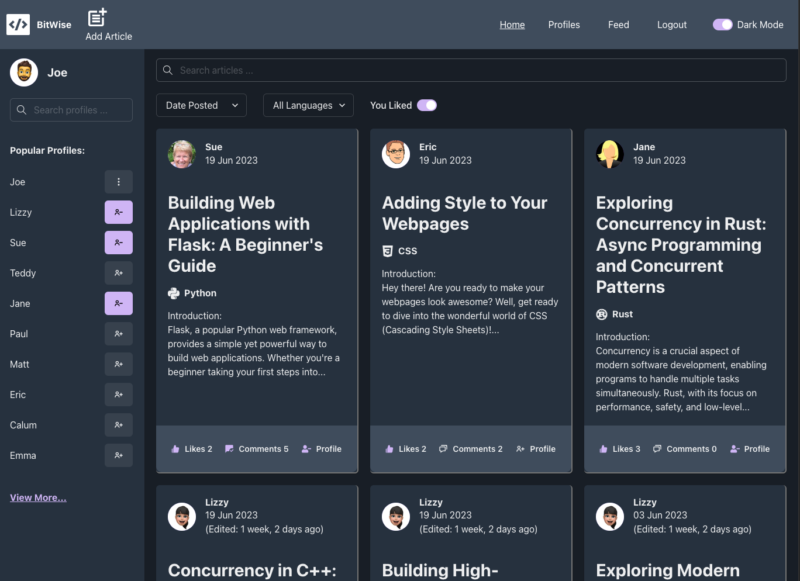 

      
Light Mode Screenshot Example

    

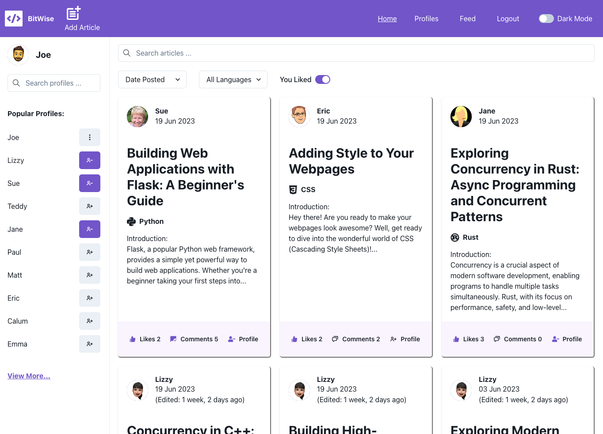 

 

All screenshots detailed in the features section of this Readme file have been taken in Dark Mode.

---

## Sign Up

Sign up is its own page. It utilizes the the [form validation feature]() to allow the user to gererate a profile with a username and password. This page is not accessible to logged in users and will redirect them if the user were to use the url to try to access it.

On successfull or failed registration a notification will be generated using the [notification feature]().

      
Sign Up Screenshots

    

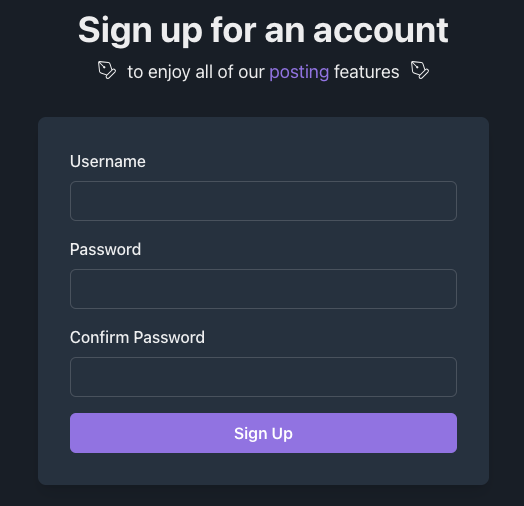 

 

---

## Login

Login is its own page. It utilizes the the [form validation feature]() to allow the user to access the profile they created on the sign up page with their username and password. This page is not accessible to logged in users and will redirect them if the user were to the url to try to access it.

On successfull or failed login a notification will be generated using the [notification feature]().

      
Login Screenshots

    

 

 

---

## Logout

Logout is a feature that logs the user out when it is selected.

A confirmation popup was considered however due to the fact that there is no real negative impact to the user by logging out this was dismissed and only added to features where the impact would be more substancial.

On loggout the user stays on the same page assuming it is available to logged out users (e.g. feed). If the user is on a page that a logged out user can't access it will redirect to the home page.

      
Login Screenshots

    

 

 

---

## NavBar

The navbar has been fixed to the top of the page to allow the user easy access to all key pages.

A color switch is provided as part of the navbar to allow users to change the colour scheme from light to dark.

      
Colour Switch Screenshots

    

**Dark Mode:** 
 

**Light Mode:** 
 

 

The navbar page links have been provided as text only (with the exception of create article and the logo). This was an intensional decision. These links were tested with icons but feedback indicated this looked to cluttered and was not as intuative. The current page is indicated with an underline as is the hover. Despite slight duplication where one page is visited and another is hovered over this was deemed the best visual and caused no confusion with the test users.

The navbar has conditional formating to only show links relevent to the user based on their logged in status. It also shows less on smaller screens to not extend past available space and impact the sites responsive design.

      
Not Logged In Screenshots

    

**Large Screen:** 
 

**Medium Screen:** 
 

**Small Screen:** 
 

**Extra Small Screen:** 
 

**Hamburger Menu:** 
 

      
Logged In Screenshots

    

**Large Screen:** 
 

**Medium Screen:** 
 

**Small Screen:** 
 

**Extra Small Screen:** 
 

**Hamburger Menu:** 
 

---

## Sidebar

### Responsive

The Sidebar is a responsive element that only appears on large screens.

      
Sidebar Small Screen Screenshot

    

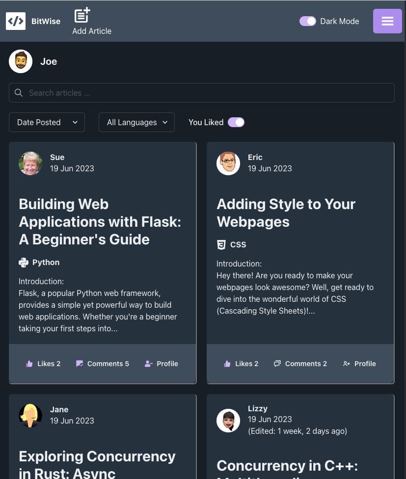 

      
Sidebar Large Screen Screenshot

    

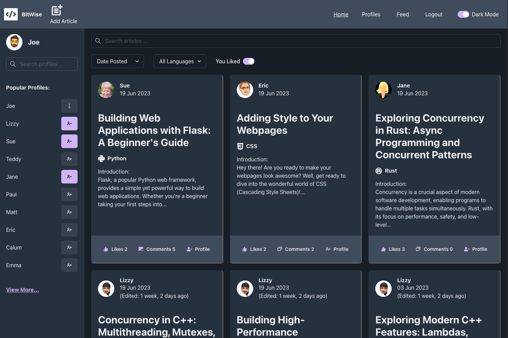 

 

### Sidebar Logged In Avatar

The [Logged In Avatar feature](#logged-in-avatar) appears at the top of the sidebar when present for logged in users.

### Load Sidebar Profiles

When the sidebar is loaded it obtains the 10 most followed profiles and displays them in order. These will display with the users profile avatar and will act as links to the users individual profile page.

This is followed by a View More... link that directs the user to the profiles page.

      
Sidebar More Than 10 Profiles Screenshot

    

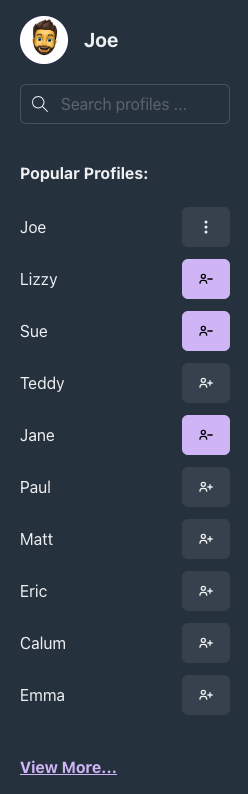 

 

If there are not more than 10 profiles registered on the site the View More... link will not appear.

      
Sidebar Only 10 Profiles Screenshot

    

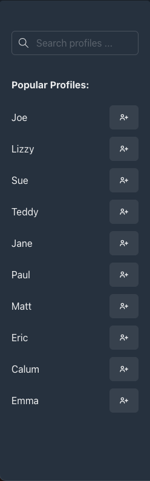 

 

Whilst the profiles are loading a spinner will display to show the user that the site is obtaining information.

      
Sidebar Spinner Screenshot

    

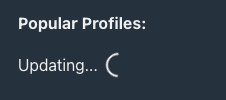 

 

### Sidebar Profile Search

A search bar has been added to the sidebar to allow users to search profiles which may not be present on the oringinal 10 displayed.

      
Search J Screenshot

    

 

      
Search Joe Screenshot

    

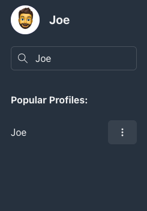 

 

### Sidebar Follow

The sidebar profiles will have an icon to the right of the profile name and avatar that will allow a user to follow them if they are logged in.

If the user is not logged in they will get a pop up message telling them to login first.

      
Login To Follow Screenshot

    

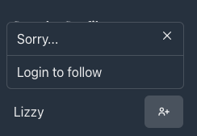 

 

If the user is logged in the icon will update to show they are now following the selected profile. This will update the state to show immediatly and will also update the state in the profiles page and individual profile page without the requirement to refresh.

      
Follow - Update Profiles Page Screenshot

    

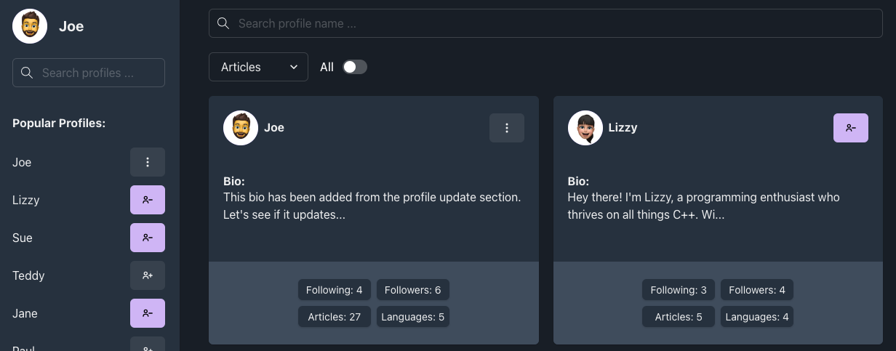 

      
Follow - Update Individual Profile Page Screenshot

    

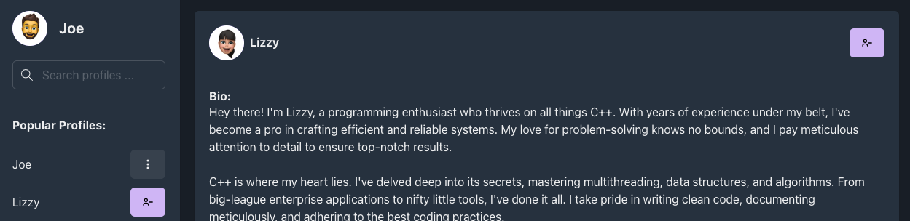 

 

If a user selects an already followed profile it will unfollow and update the states in the profiles page and individial profile page accordingly.

      
Unfollow - Update Profiles Page Screenshot

    

 

      
Unfollow - Update Individual Profile Page Screenshot

    

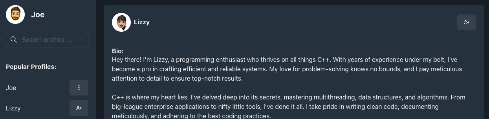 

 

When a profile is followed or unfollowed the article pages will update their components. This requires a loading period however it was important to do as it could effect the search criteria being applied. For example this would add the profiles of the folled individual to the feed.

On successfull or failed following attempts a notification will be generated using the [notification feature]().

### Sidebar Profile Edit

If the currently logged in user has their profile displaying in the sidebar they will be given the opportunity to updated their profile information and/or password by selecting the icon next to their name.

      
Update Profile Screenshot

    

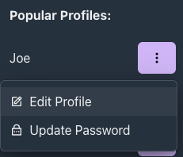 

 

---

## Logged In Avatar

When a user logs in they will be presented with their avatar in the top tef corner of whatever page they are on. This provides a quick way of checking who they are logged in as and a easy way to navigate to their profile as this acts as a link.

On small screens this will appear in the body element of the page. On large screens it will appear at the top of the sidebar.

      
Not Logged In Screenshot

    

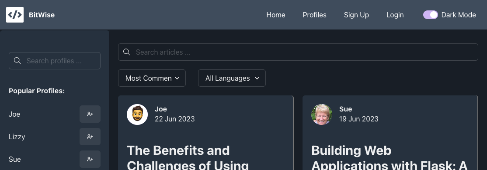 

      
Logged In Large Screenshot

    

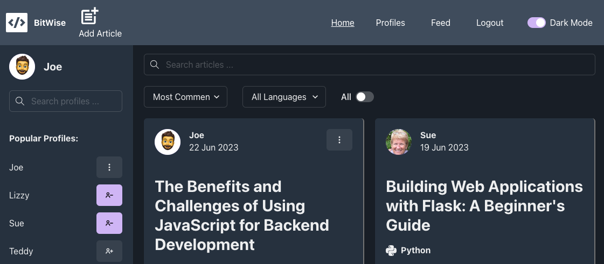 

      
Logged In Small Screenshot

    

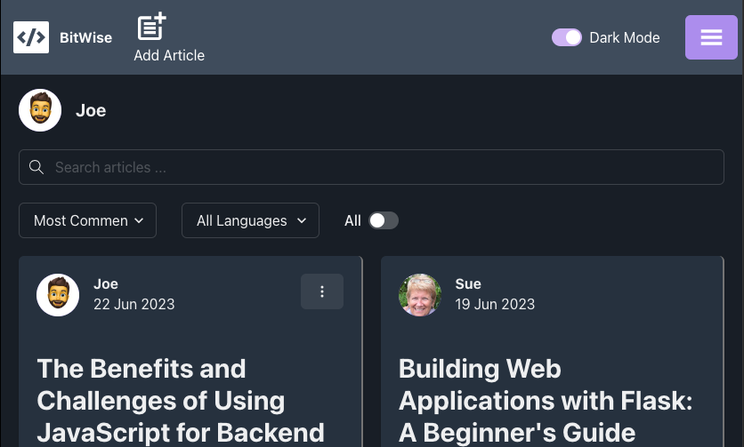 

 

---

## Article Search Bar

The article search bar is deisgned to help the user quickly and easy retrieve articles where they know the title or name of the author.

### This is applied to the home page.

      
Home Article Search Screenshot

    

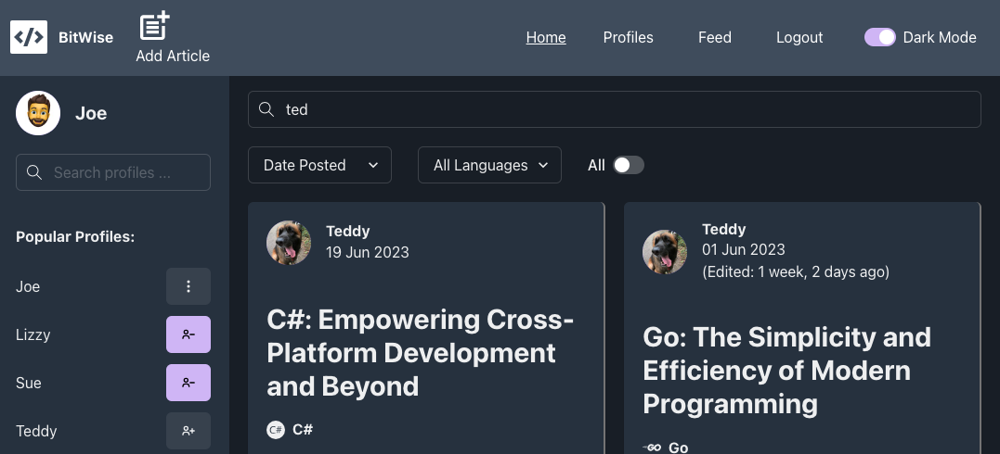 

 

### This is applied to the feed page.

**Note** In the feed search the same filter is used but the current user does not follow Teddy and no articles have ted in the title so no reulsts are returned. This is because all article searches on the feed page are restricted to those followed by the current user.

      
Feed Article Search Screenshot

    

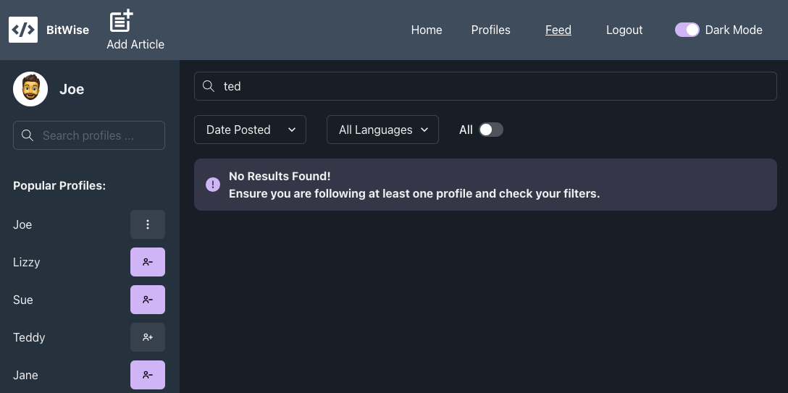

 

### This is applied to the article page.

**Note** In the article page all article searches are restricted to those written by the profile owner.

      
Article Page Article Search Screenshot

    

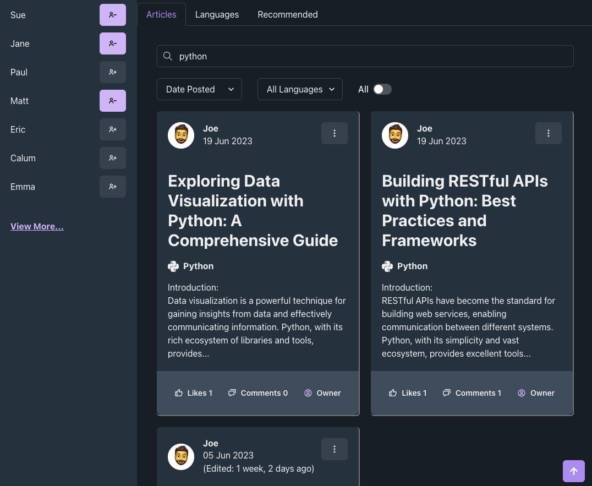

 

# Further Development

## Tidy Up

- Given more time I would ensure that were possibe hooks and components were consilidated for file reduction.
- Introduce ReactQuery to:
  - manage manage and cache data for better performance.
  - simplify context.
  - reform prop drilling that is currently present.
- Add additional automated testing to front end.

## Updates Relient On Backend

- Add restriction option to the articles which the author could apply. This would restrict users who are not following the author from reading the articles.
- Add video uploads as well as articles - storing to AWS.
- Potential for live streaming - would require third party integration with a service such as Wowza, Vimeo, YouTube Live, etc.
- Add a payment method so authors can make restricted content for purchase only.

    

# Technologies Used

## Languages Used

- HTML
- CSS
- JavaScript
- JSX

## Libraries Used

| Package                         | Description                                                         |
| ------------------------------- | ------------------------------------------------------------------- |
| chakra-ui/react                 | UI component library for React applications.                        |
| axios                           | Promise-based HTTP client for making API requests in JavaScript.    |
| react                           | JavaScript library for building user interfaces.                    |
| react-dom                       | Entry point for rendering React components in the DOM.              |
| react-icons                     | Library for including popular icon sets in React applications.      |
| react-infinite-scroll-component | Component for creating infinite scrolling in React applications.    |
| react-router-dom                | Routing library for React applications.                             |
| vite                            | Fast development server and build tool for modern web applications. |

## Developer Tools

| Tool                | Description                                                                           |
| ------------------- | ------------------------------------------------------------------------------------- |
| Git                 | Used for version control and to push code to GitHub.                                  |
| GitHub              | Used to store, share, and publish code as well as host live websites.                 |
| Figma               | Used to plan out the website format and design.                                       |
| Web Developer       | Used to analyze HTML, CSS, JavaScript, and JSX output and make necessary corrections. |
| tabletomarkdown.com | Used to quickly convert data to Markdown tables for the TESTING.md document.          |
| Heroku              | Hosting platform for deploying API sites.                                             |
| Vercel              | Hosting platform for deploying websites.                                              |

    

# Testing

## Testing Document

Testing documentation found [here](TESTING.md).

## Further Testing

- Tested across Google Chrome, Safari, Microsoft Edge, Fire Fox browsers on both Mac and Windows.
- Viewed on a variety of devices using Web Developer Tools as well as several live desktop, iPad and mobile devices.
- Each page tested by developer and friends to ensure functionality worked as expected.
- Issued to Slack community to review and provide feedback on.

## Development Bugs

   

      
BT Email

    
   
   On testing of the website it was identified that due to BT's strict spam policies users with a BT email address did not always receive their reset password emails.

If this site was to be push commercially BT have a contact for businesses to register with them and allow emails to be sent without restriction.

All other email proviers tested received reset password emails without issue.

---

   

   

      
Parallax Effect On Home Screen

    

On testing it was identified by multiple users accross a range of devices that the parallax image on the home page was not loading correctly.

On reviewing the Lighthouse score for this it became apparent that this was due to the image size and resolution. To resolve this issue the image was converted to a webp format.

Users confirmed this resolved the issue and Lighthouse gave good performance scores to confirm.

**Note:** There was one instance where the image still failed to load correctly. This was run on a mac using Parallels to validate a microsoft machine usage in Edge. However, on request 2 users ran the website on seperate microsoft machines using Edge and no issue occured.

---

   

   

      
Image Orientation

    

In development it was identified that certain images were rotating when they where uploaded to the AWS account.

To resolve this issue I updated the settings.py to manage the image orientation:

      DJANGORESIZED_DEFAULT_NORMALIZE_ROTATION = False

---

   

   

      
Line Break

    
   
   In development when reviewing the site update posts it became apparent that line breaks were not being implemented into the posts.

    

To resolve this a |linebreaksbr was added to the required fields. This was implemented accross the entire site:

      
{{ update.content|linebreaksbr }}

    

---

   

   

      
Tags Duplication

    
   
   In testing it was identified that tags were case sensitive and that this was causing duplication of the same tags.

    

    

To resolve this issue I converted the tags to uppercase where the exclude duplication code could take effect for these instances:

      def form_valid(self, form):
         country = get_object_or_404(Country, pk=self.kwargs['pk'])
         form.instance.author = self.request.user
         form.instance.country = country

         tag_names = form.cleaned_data.get('tags')
         if tag_names:
            for i, tag_name in enumerate(tag_names):
                  tag, created = Tag.objects.get_or_create(name=tag_name.upper())
                  tag_names[i] = tag.name

         response = super().form_valid(form)

         tags = form.instance.tags.all()
         if not tags.exists():
            no_tags = Tag.objects.get_or_create(name='NO TAGS')[0]
            form.instance.tags.add(no_tags)

         return response

    

---

   

   

      
Pagination

    
   
   In testing it was identified that when pagination was used on a filtered page it would reset the filter. This is because it was assigned its own value to the end of the URL which was being used to define the filter criteria.

To resolve i added a variable (search_query) into the view to get the value of the search criteria (q) and then passed this back to the template as context.

This variable could then be applied to the end of the pagination href to navigate back and forth but retain the search criteria:

      <a class="page-link" href="?page={{ diary_posts.next_page_number }}&q={{search_query}}" aria-label="Next Page">

---

   

   

      
Filter By Topic

    
   
   In testing it was identified that when filtering by topic in the Site Updates the spacing in the topic names was causing HTML validation errors:

To resolve this I applied |urlencode to remove URL spacing.

      <a href="?q={{ topic.topic_catagory|urlencode }}" aria-label="filter to topic selected">{{ topic }}</a>

---

   

   

      
Admin CORS Console Errors

    
   
   When using the Django Admin pages it was identified that CORS errors were being displayed on the console. This was due to the CORS policy I had set on my AWS account.

I updated the policy and this removed the errors.

---

   

   

      
Long Username

    
   
   During final testing it was identified that is a user used a extremely long username it would negatively impact the formatting for the home page, comments and profile.

A long term solution to this issue would be to override the Django User model to restrict the username character allowance. However, at this stage in the delopment I did not want to impact the existing models. As a result I insead updated the CSS with word-wrap: break-word. This stopped long usernames exceeding their containers.

Home Update:

Profile Update:

Comment Update:

---

   

## Key Learns

This project proved to be by far the most challenging and exciting project I have completed. Django did not come naturally to me and my understanding needed to be developed and enhanced by a number of really great online resources (see credits).

I had an almost endless list of things I learned from this project ranging from basic Django functionality to implementation strategies.

Below list some of the key factors I would try to improve upon for my next project.

- As I developed my Django knowledge, I became more capable of writing smaller blocks of more efficient code. Given more time I would revisit earlier blocks of code to refine them further and improve their readability.
- At times in this project, I showed an inconsistency of methods used to achieve the same tasks. Although these methods worked as expected, I would aim to be more consistent in future.
- Throughout the project I gained a better understanding of class-based views vs function views. I frequently used class-based views where in some instances the development might have been better served and simplified using function-based views.
- In some of my code, especially the earlier functions I tried to achieve too many things with a single function. In future I would use the html blocks to write more concise, tailored, and reusable code.
- I need to be more efficient with the use of CSS. In future projects I will look to break the required components down into reusable elements for styling.

    

# Deployment

## Deployment Document

Deployment doumentation found [here](DEPLOYMENT.md).

    

# Credits

## Development Resources

The following sources acted as guidance for understanding. No code was taken directly for use in this project:

- [Dennis Ivy](https://www.youtube.com/@DennisIvy) – Youtube Instructor – Helped develop basic Django functionality knowledge.
- [Corey Schafer](https://www.youtube.com/@coreyms) – Youtube Instructor – Helped develop basic Django functionality knowledge.
- [thenewboston](https://www.youtube.com/@thenewboston) – Youtube Instructor – Helped develop basic Django functionality knowledge.
- [B Learning Club](https://www.youtube.com/watch?v=zwBKm8xp9V0&t=6s) – Youtube tutorial video – Helped develop understanding of Django taggit usability.
- [developedbyed](https://www.youtube.com/watch?v=Nt70Ld0dJCM) - Youtube tutorial video – How to build Parallax image effect.
- Code Institute Slack Community Support – Aided in the testing of the project and discussions regarding issues and features.
- Code Institute Tutor Support – Code Institute for queries on issues I required clarification on.
- Stack Overflow used for generalised queries during development.

## Media and Content Resources

- Images - See Website Design Imagery for links to the image/icon sites used within this project [here](#website-design).
- Map SVG – The original SVG map was taken and tailored from the following source [here](https://simplemaps.com/resources/svg-world).
- Countries JSON – The JSON used to populate the Country Info was taken from [here](https://gist.github.com/keeguon/2310008?permalink_comment_id=4255990#gistcomment-4255990).

## Acknowledgements

- Thank to my Mentor (Spencer Barriball) for his feedback and guidance.
- To all my friends and family that have taken the time to test this site and listen to me rant.
- The Code Institute Slack community for helping with any and all queries.
