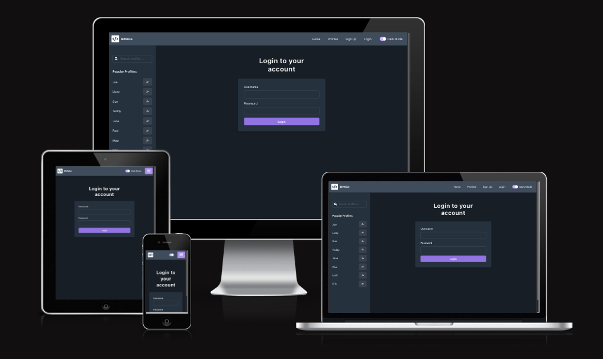
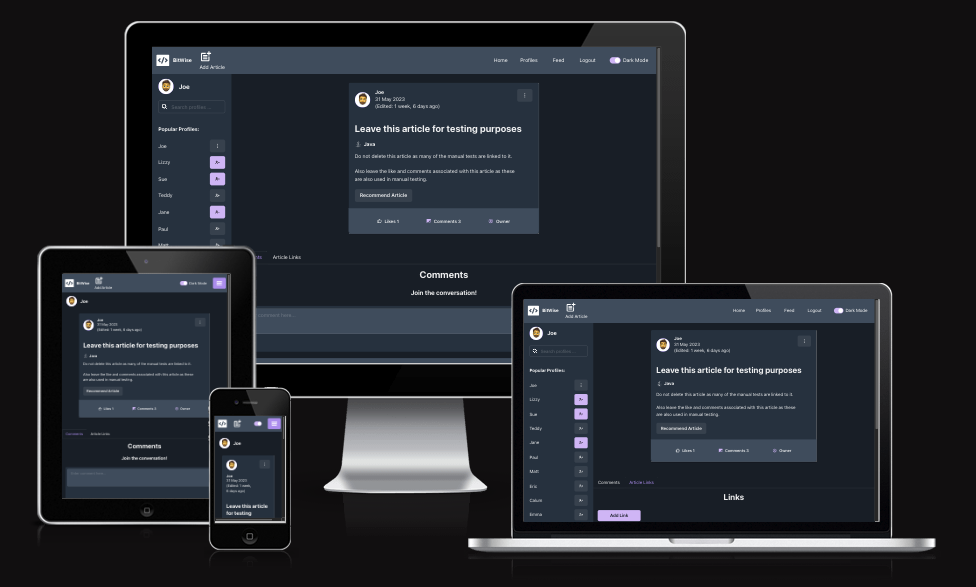
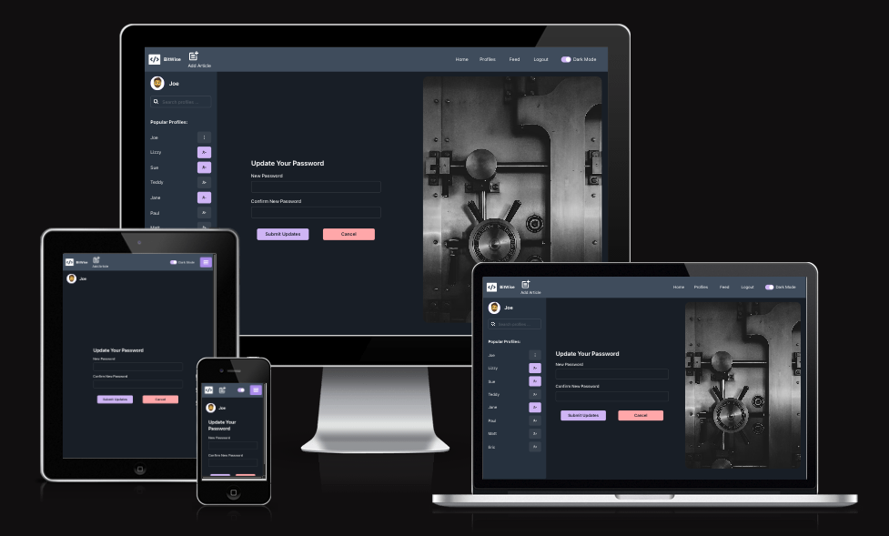
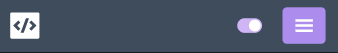
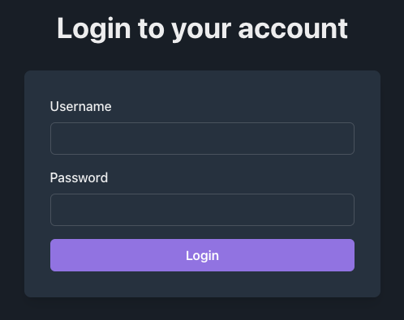

# BITWISE APPLICATION

# Table Of Contents

- [BitWise Website Overview](#bitwise-website-overview)
  - [Live Project](#live-project)
  - [BitWise API](#bitwise-api)
  - [Backened Repo](#backend-repo)
  - [Project Introduction](#project-introduction)
- [Responsive Review](#responsive-review)
  - [Am I Responsive?](#am-i-responsive)
- [Project Planning](#project-planning)
  - [Project Scoping](#project-scoping)
  - [Website Objectives](#website-objectives)
  - [User Stories](#user-stories)
  - [Priority Matrix](#priority-matrix)
  - [Agile Methodology](#agile-methodology)
- [User Experience (UX)](#user-experience-ux)
  - [Website Design](#website-design)
  - [Wireframes]()
- [Features]()
- [Further Development](#further-development)
  - [Tidy Up](#tidy-up)
  - [Updates Relient On Backend](#updates-relient-on-backend)
- [Technologies Used](#technologies-used)
  - [Languages Used](#languages-used)
  - [Libraries Used](#libraries-used)
  - [Developer Tools](#developer-tools)
- [Testing]()
  - [Testing Document]()
  - [Further Testing]()
  - [Development Bugs]()
  - [Key Learns]()
- [Deployment]()
  - [Deployment Document]()
- [Credits]()
  - [Development Resources]()
  - [Media and Content Resources]()
  - [Acknowledgements]()

 

# BitWise Website Overview

## [Live Project](https://bit-wise-front-end.vercel.app/)

## [BitWise API](https://bitwise-code-blog.herokuapp.com/)

## [Backened Repo](https://github.com/Joe-Collins-1986/BitWise-DRF)

## Project Introduction

**Note:** For the purpose of this project a fictitious client has been generated to provide scope for testing my Frontend development utilising HTML, CSS, JavaScript and JSX through the use of React.

For more information on the API development for this site visit my [BitWise Backend Repo](https://github.com/Joe-Collins-1986/BitWise-DRF)

This website has been designed to provide programmers of all experience levels a platform to share articles with each other relating to specific programming languages. Users will be able to follow each other as well as like and comment on each others articles. They will also be able to document their experiece levels in the various programming languages they know within their profile.

Following discussions with the client this site will initially be tailored to written articles with the potential to expand to video uploads, live streaming, and purchasable tutorials at a later date.

# Responsive Review

## Am I Responsive?

To review the responsive deisgn Web Dev Tools were used as well as manual checks on a range of devices.

In addition to this the site was run through the following [website](https://ui.dev/amiresponsive?url=https://bit-wise-front-end.vercel.app/).

    
Register

    
Login

    
Home

    
Feed

    
Article

    
Add Article

    
Profiles

    
Profile

    
Update Profile

    
Password Update

    
Item Not Found

    
404 Page

# Project Planning

## Project Scoping

Some aspects of the planning of this site were relient on the API development and are addressed to some degree in some of the inital mindmapping documents.

However, if you wish to see more of the API planning including the Entity Relationship Diagram please visit the Backend Redo [here](https://github.com/Joe-Collins-1986/BitWise-DRF)

    
Problem Statement

 
The client wishes to develop a social sharing platform targeted towards the programming community.

The developer worked with the client and focus groups consisting of programmers with varying levels of experience to establish the following problem statement. This was then used to establish some basic considerations which could be taken forward into a mind mapping session.

 

If you have a LucidChart account, you can also view this Problem Statement [here](https://lucid.app/lucidspark/ddcc77ae-81e5-48bb-a143-1d8d08517e84/edit?page=0_0&invitationId=inv_33957d7f-3414-4f5b-afb7-62686062836a#).

---

    
Mind Map

 
The below image provides an initial mind-map into the features which might be appropriate for the BitWise site to address the problem statement and help establish user stories.

 

If you have a LucidChart account, you can also view this Mind-Map [here](https://lucid.app/lucidspark/92bb6c34-c508-4ed3-81f9-8e426a018834/edit?viewport_loc=-424%2C-51%2C1937%2C2060%2C0_0&invitationId=inv_e1afcf88-79d6-418d-b020-bca52437b6bf).

---

    
Mind Map - Enhancment Feature 1

 
Following completion of the core functionality an additional mind map was generated to consider the additonal function of allowing users to recommend articles.

 

If you have a LucidChart account, you can also view this Mind-Map [here](https://lucid.app/lucidspark/34d434b2-010e-4246-ac39-269c2211bb0e/edit?viewport_loc=-462%2C-256%2C2039%2C2139%2C0_0&invitationId=inv_678e0c52-d0b2-432c-980d-6db61438c1e7).

---

    
Mind Map - Enhancment Feature 2

 
Following completion of the recommended article functionality an additional mind map was generated to consider the additonal function of allowing users to add multiple links to an article.

 

If you have a LucidChart account, you can also view this Mind-Map [here](https://lucid.app/lucidspark/1137056a-e0e7-43be-9649-326ac726632b/edit?viewport_loc=-510%2C-81%2C1856%2C1942%2C0_0&invitationId=inv_65d9edd0-81f1-443d-845b-b797ab20628a).

---

## Website Objectives

    
Client Goals

 
The client wants a simple and engaging website that is easy to use and will result in users returning to the site.

- Sleek yet simple UX design.
- Easy to use functionality.
- Responsive for any device size to encourage mobile use as well as desktop use.
- Encourages the development of a friendly programming community helping each other through the sharing of knowledge.
- Provide a base site to later introduce article recomendations, video sharing, streaming, transaction functionality for premium content.

---

    
Visitor Goals

 
The visitor should have a clear understanding of what the website purpose is and the site functions should encourage regular use.

- Immediately engaged by the UX design.
- Understand the purpose of the site.
- Simple intuitive menu navigation.
- Intuitive content and links.
- Ability to write and view programming articles.
- Opportunity to feedback on articles via comments and likes.
- Ability to filter articles to meet needs.
- Able to follow profiles.
- Ability to filter profiles to meet needs.
- Can provide profile info including competancy and experiance in programming languages.
- Readable and aesthetically pleasing on all devices.

---

## User Stories

All User Stories are detailed on my GitHub account as issues [here](https://github.com/Joe-Collins-1986/BitWise-Front-End/issues?q=is%3Aissue+is%3Aclosed). 

These also breakdown:

- Tasks required for each User Story completion.
- Acceptance Criteria for each User Story.

    
Example

### Summary of User Stories

    
NavBar

    
 

- [Link](https://github.com/Joe-Collins-1986/BitWise-Front-End/issues/1): As a **user** I can **always view the Navbar regardless of which page I am on or where I am on that page** so that **I can navigate the site efficiently.**
- [Link](https://github.com/Joe-Collins-1986/BitWise-Front-End/issues/2): As a **user** I can **switch the application between light and dark mode** so that **the aesthetics and readability better suit my needs**.
- [Link](https://github.com/Joe-Collins-1986/BitWise-Front-End/issues/3): As a **user** I can **only view the links in the Navbar that I have access to** so that **I understand immediately what options are available to me**.

---

    
Routing

 

- [Link](https://github.com/Joe-Collins-1986/BitWise-Front-End/issues/4): As a **user** I can **navigate to various page components without a page refresh** so that **I have a better user experience**.
- [Link](https://github.com/Joe-Collins-1986/BitWise-Front-End/issues/5): As a **user** I will be taken **to an error page if the page component fails to render or does not exist** so that **I understand what went wrong**.

---

    
Authentication

 

- [Link](https://github.com/Joe-Collins-1986/BitWise-Front-End/issues/6): As a **user** can **register an account** so that my **account details are stored, a profile is set up for me and I can login to the site**.
- [Link](https://github.com/Joe-Collins-1986/BitWise-Front-End/issues/7): As a **user** I can **login to my registered account** so that **I can use the sites full functionality**.
- [Link](https://github.com/Joe-Collins-1986/BitWise-Front-End/issues/8): As a **user** I can **logout of my account** so that **I can keep my account safe from others accessing it in my absence**.
- [Link](https://github.com/Joe-Collins-1986/BitWise-Front-End/issues/9): As a **user** I can **stay logged into my account for up to 24h** so that **I do not have to continuously have to log back in while using the site**.

---

    
Articles

 

- [Link](https://github.com/Joe-Collins-1986/BitWise-Front-End/issues/10): As a **user** I can **create articles** so that **I can share my knowledge with others on the site.**
- [Link](https://github.com/Joe-Collins-1986/BitWise-Front-End/issues/11): As a **user** I can **view all articles on the home page** so that **I can browse for content that might interest me.**
- [Link](https://github.com/Joe-Collins-1986/BitWise-Front-End/issues/12): As a **user** I can **like other people posts** so that **I can show my approval.**
- [Link](https://github.com/Joe-Collins-1986/BitWise-Front-End/issues/13): As a **user** I can **filter articles** so that **I can find the ones that meet my desired criteria.**
- [Link](https://github.com/Joe-Collins-1986/BitWise-Front-End/issues/14): As a **user** I can **continuously scroll on the grid component** so that **I can see all available articles.**
- [Link](https://github.com/Joe-Collins-1986/BitWise-Front-End/issues/15): As a **user** I can **edit my own articles** so that **I can update info or correct mistakes where required.**
- [Link](https://github.com/Joe-Collins-1986/BitWise-Front-End/issues/16): As a **user** I can **delete my own articles** so that **I can remove articles I am no longer happy with.**

---

    
Comments

 

- [Link](https://github.com/Joe-Collins-1986/BitWise-Front-End/issues/17): As a **user** I can **create comments on an article** so that **I can share my thoughts on it.**
- [Link](https://github.com/Joe-Collins-1986/BitWise-Front-End/issues/18): As a **user** I can **view comments that have been added to an article** so that **I can see what other people have posted.**
- [Link](https://github.com/Joe-Collins-1986/BitWise-Front-End/issues/19): As a **user** I can **delete my own comments** so that **I can remove information I no longer wish to share with the site audience.**
- [Link](https://github.com/Joe-Collins-1986/BitWise-Front-End/issues/20): As a **user** I can **edit my own comments** so that **I can fix mistakes I made in my original posts.**

---

    
Profiles

 

- [Link](https://github.com/Joe-Collins-1986/BitWise-Front-End/issues/21): As a **user** I can **view a list of article author profiles** so that **I can see who is making contributions.**
- [Link](https://github.com/Joe-Collins-1986/BitWise-Front-End/issues/22): As a **user** I can **filter and order the list of profiles** so that **I can locate the ones most interesting to me.**
- [Link](https://github.com/Joe-Collins-1986/BitWise-Front-End/issues/23): As a **user** I can **follow or unfollow profiles** so that **my feed page represents articles that interest me.**
- [Link](https://github.com/Joe-Collins-1986/BitWise-Front-End/issues/24): As a **user** I can **edit my own profile data** so that **I can reflect new information.**
- [Link](https://github.com/Joe-Collins-1986/BitWise-Front-End/issues/25): As a **user** I can **update my login password** so that **I can improve security if required.**

---

    
Languages

 

- [Link](https://github.com/Joe-Collins-1986/BitWise-Front-End/issues/26): As a **user** I can **view all the languages a profile author is experienced in** so that **I can follow people who are most relevant to my interests.**
- [Link](https://github.com/Joe-Collins-1986/BitWise-Front-End/issues/27): As a **user** I can **add languages that I am experienced in to my profile** so that **I can encourage others to follow me if they are interested in languages I know.**
- [Link](https://github.com/Joe-Collins-1986/BitWise-Front-End/issues/28): As a **user** I can **update languages that have added to my profile** so that **I can update my level of experience or correct mistakes.**
- [Link](https://github.com/Joe-Collins-1986/BitWise-Front-End/issues/29): As a **user** I can **delete languages that have added to my profile** so that **I can remove info I am not happy with.**

---

## Priority Matrix

The below graphs map out the feasibility of the frontend features considered against the user value they provide to help establish the priority they have as part of the build.

    
Priority Matrix

 

---

If you have a LucidChart account, you can also view this priority matrix [here](https://lucid.app/lucidspark/406a3984-0347-45eb-8e45-a5e3f08144ba/edit?viewport_loc=-2215%2C904%2C4713%2C2850%2C0_0&invitationId=inv_cb50c34a-94ea-4124-99fa-ac9da55318a3).

## Agile Methodology

An Agile methodology was applied to the development and implementation of this project.

The project development was run in multiple iterations/sprints each targeting a number of User Stories.

Each User Story was moved out of a backlog and assigned to the iteration with a priority label (Must Have, Should Have, Could Have).

To manage the Agile iterations the Projects function within GitHub was used, pulling User Stories into a KanBan Board. (Links to each project iteration detailed in the iteration breakdown below.)

**Note:** It should be noted that the priority label was in relation to it's prioriry within the iteration, not the project as a whole.

    
Iteration 1

 

For Iteration 1 the key focus was to develop.

- General page layout.
- Navigation
- Routing
- Authorisation

For site of the project in GitHub detailing the completed User Stories in Iteration 1 please click [here](https://github.com/users/Joe-Collins-1986/projects/10).

---

    
Iteration 2

 

For Iteration 2 the key focus was to develop CRUD for Articles and set the ability to like them:

- Add
- View
- Like
- Update
- Delete

In addition to this some Comment user stories were also added in due to early completion of userstories within this iteration.

For site of the project in GitHub detailing the completed User Stories in Iteration 2 please click [here](https://github.com/users/Joe-Collins-1986/projects/11).

---

    
Iteration 3

 

For Iteration 3 the key focus was to develop finish of the comments functionality and address viewing and editing Profiles:

- Finishing comments with edit
- Adding profile lists
- Following profiles
- Filtering profiles
- Updating profiles

For site of the project in GitHub detailing the completed User Stories in Iteration 3 please click [here](https://github.com/users/Joe-Collins-1986/projects/12).

---

    
Iteration 4

 

For Iteration 4 the key focus was to finalise Profile updates with password reset and build CRUD functionality for Languages:

- Finish profile with password reset.
- CRUD functionality for languages.

For site of the project in GitHub detailing the completed User Stories in Iteration 4 please click [here](https://github.com/users/Joe-Collins-1986/projects/13).

---

# User Experience (UX)

## Website Design

After discussions with the client and reviewing the available React styling libraries a decision was reached to adopt Charkra UI as the components lined up nicely with the aesthetic the client wished to achieve.

    
Colour Scheme

 
Client requested the site to be built from shades of grey with a bold purple for emphasising key elements. This consideration was made to not pull focus or negatively impact the readability of the site due to its information nature.

In addition to this the client requested that there be a dark and light mode to better tailor to user preferences and give a codeing aesthetic.

The achieve this look Chakra Theme was applied to allow a switch from light to dark mode. Then a purple theme was interwoven with the standard theme to hightlight key elements and add a dynamic exiciting look to the site.

The themes utilise the same colors but reverse the shade on the dark mode switch.

- Main colours:

- Highlighing purple:

In addition to this a red was applied wo certain buttons to indicate a level of risk:

---

    
Typography

 
After extending the Chakra Theme to test various fonts and styles it was deemed appropriate to revert to the default typography which was easy to read and styled nicely against the Dark/Light theme.

---

    
Imagery

 
Imagery was kept intentionally sparce in this site being used in a limited capacity to offset forms.

The images used where taken from unsplash:

- [Add Article](https://unsplash.com/photos/npxXWgQ33ZQ)
- [Update Profile](https://unsplash.com/photos/IcclLmLQuw8)
- [Password Reset](https://unsplash.com/photos/3wPJxh-piRw)

The icons for this project were taken from React-Icons:

- [React-Icons](https://react-icons.github.io/react-icons/)

---

    
Logo

 
The client is currently working on developing a logo that suits their needs. Until the is achieved they have requested that a simple coding sybol of some sort be used as a placeholder for prototyping the site.

After review the following icon was seleted from React-Icons

[Logo](https://react-icons.github.io/react-icons/search?q=RiCodeBoxFill)

---

## Wireframes

You can view the wireframes using this [Figma Link](https://www.figma.com/file/bViM8lmSanrjYBaFzLCzkm/BirWize-%2C?type=whiteboard&node-id=0%3A1&t=VJReX3c3OvMzXxcs-1)

   
Wireframe Screenshots

Register: 
 

---

Login: 
 

---

Home/Feed: 
 

---

Article: 
 

---

Profiles: 
 

---

Profile: 
 

---

Update Profile: 
 

---

Update Password: 
 

---

Article Not Found: 
 

---

Profile Not Found: 
 

---

404 Page 
 

   

---

**Note:** The structure and wireframes are only to act as a concept and are subject to change as the website development evolves in collaboration with the client.

# Site Features

Each section below will detail their specific function.

## NavBar

The navbar has been fixed to the top of the page to allow the user easy access to all key pages.

A color switch is provided as part of the navbar to allow users to change the colour scheme from light to dark.

      
Colour Switch Screenshots

    

**Dark Mode:** 
 

**Light Mode:** 
 

 

The navbar page links have been provided as text only (with the exception of create article and the logo). This was an intensional decision. These links were tested with icons but feedback indicated this looked to cluttered and was not as intuative. The current page is indicated with an underline as is the hover. Despite slight duplication where one page is visited and another is hovered over this was deemed the best visual and caused no confusion with the test users.

The navbar has conditional formating to only show links relevent to the user based on their logged in status. It also shows less on smaller screens to not extend past available space and impact the sites responsive design.

      
Not Logged In Screenshots

    

**Large Screen:** 
 

**Medium Screen:** 
 

**Small Screen:** 
 

**Extra Small Screen:** 
 

**Hamburger Menu:** 
 

      
Not Logged In Screenshots

    

**Large Screen:** 
 

**Medium Screen:** 
 

**Small Screen:** 
 

**Extra Small Screen:** 
 

**Hamburger Menu:** 
 

---

## Register

New Users will have the option to Register an account. This page can be accessed either via the Navbar menu or by selecting the Sign Up option presented on the Login page when users first access the site (this link will be shown on the Login feature).

On valid Registration the user will be taken straight to the home page without having to re-login.

 

Django validation checks will be carried out on the registration form as with all future forms referenced in this Readme file.

 

 

---

#### Login

If the user has a registered account they will be able to login to the site using the login page.

This page will also offer links to sign up and password reset. The password reset function will be covered below.

 

If the user tries to access site areas where login is required they will be directed to the following login page.

 

After completing the login they will automatically be redirected to the page they were initially trying to access.

 

As with registration Djago will manage the standard form validation.

 

---

#### Password Reset

The user will be given the opportunity to reset their password in case they forget it or want to change it for security purposes. The link to resetting the password is found on the login page.

On this page the user will be asked to enter their email to initiate the process. Standard Django form validation is used for confirming the email.

 

Once a valid email is input the user will get a confirmation that an email has been sent.

 

The user will then receive an email taking them to a password reset form.

 

After following the email link the user will be asked to input a password and confirm it. This password will have a Django password validation applied to it to ensure it is secure enough to use.

 

Following a successful password reset the user will recieve the following confirmation page.

 

---

#### Logout

The user can logout of the site by simply selecting the logout option on the Navbar menu.

---

#### Summary Site Updates

The client wanted users to be able to see a summary of the most recent site updates at a glance and didn't want this to be restricted to signed in users. The logic for this is that the site updates and site news articles could be a good way of incentivising new users to register.

To this end, the 3 most recent site update posts are always presented at the bottom of the Login, Register, Password Reset and Home pages.

Non logged in users can also select the 'see all updates' button to be taken to a page with all the site updates. However only signed in users will be able to navigate to any one specific site update in order to place comments.

 

---

   

      
Home Features

    

#### Parallax Home Screen

To create an engaging initial introduction to the site a Parallax effect was applied to the home page image. However to meet the asthetic requirements of the client this meant removing the inner scroll bar. As a result a downward facing arrow was applied to the screen to direct users to scroll down incase it was not immediately apparent. This arrow was given some simple JS flashing animation to make the page more interesting.
 

 

---

#### Home Planner Introduction

Further down the home page there is a little introduction to some of the features the site offers as part of the planner.

 

---

   

   

      
Profile Features

    

#### Create Profile

On registration a skeleton profile will be automatically generated for each user.

 

---

#### Profile Page

This page will allow users to view their site details as well as give them an opportunity to note down any travel objectives they may have.

In addition to this if the user has recorded any countries they wish to visit on the planner then links to these country info pages will be available to the user via their profile page.

 

---

#### Update Profile

Users will be able to update their details and travel objectives via the update Profile page.

They can also add an avatar or photo of themselves and update the Profile page background from a list of potential options.

 

---

   

   

      
Planner Features

    

#### Map Country Selection

From the map on the planner page the user can navigate to a country info page relating to that country. From here the user will be able to access a number of other application features which will be detailed below. One of these features will enable the user to mark the country to visited or wish list. Having done this the map will be updated to reflect the wish list and visited countries in different colours.

 

**Note:** The SVG used to show this map was taken from https://simplemaps.com/resources/svg-world and then tailored to the clients requirements. The client agreed that initial roll out should be tailored to Europe rather than the world.

---

#### Map Country Hover

Due to the size of the map it was not aesthetically pleasing to add names to each country via the svg file. However, the client wanted to ensure that users could locate the countries they were looking for and therefore JS was used to add a hover function to the map which would should the country name that the mouse is over. This country name can be seen in the top right corner.
 

---

#### Dropdown Country Selection

Due to the fact that many people using this site would be on mobile devices or tablets and would not have hover functionality available to them the client also requested that a dropdown be added in alphabetical order so that users can select the country that way if they wish.

In additon to this if a user has a country marked as 'wish list' or 'visited' additional dropdown fields will appear.
 

---

#### Pie Chart

To provide an easy to see visually appealing method of displaying how many countries the user has visited and wishes to visit npm Chart.js was used to present the information in a pie chart.

However, on a small screen test users indicated that this was distracting them from the key focus of the page(navigation) and therefore this is only visible on large screen sizes.

 

---

#### Legend

A Bootstrap Modal was used and tailored to the requirement of displaying a legend for mobile devices so as not to take up space from the map.

 

---

#### Country Info Header

To create a interesting and aesthetically pleasing country info page an image (taken from unsplash) and a flag (taken from https://www.iconfinder.com/flag-icons?price=free) was added to each country object.

This was then called dependant on the country pk that was used in the url.

A Back to Map icon was also added. Following user testing the concenses was that the image was intuative enough not to require text, this was also acceptable due to the fact that a user could also select Planner from the Navbar to return to the map.

 

---

#### Country Info

To initially set up the countries with basic information a json was obtained from https://gist.github.com/keeguon/2310008?permalink_comment_id=4255990#gistcomment-4255990.

From here unwanted data/countries were removed and any required additional fields were added. This was then looped through to generate all the required country objects.

 

---

#### Country Visited

Users can mark the countries they have visited or countries they wish to visit via the form on the Country Info page.

As stated in the map section above this will update the svg map to show the visited and wish list countries. In addition to this any wish list countries will also appear in the users profile page.

 

---

#### To-Do Lists

Users can use this feature to create, update or delete task lists. These lists are not the tasks themselves but rather a list of tasks that the user can add.

 

 

 

After discussions with the client and test users it was decided that the delete function would not require confirmation due to the simplicity of the lists. Therefore it deletes the list immediatly on selection.

To access the list itself to add and manage task items the user can select the list anchor. This will be detailed in the task manager feature section.

---

#### Diary Link

Users can access their personal diaries related to the country they are on via the diary link available.

 

---

   

   

      
Task Manager Features

    

#### Add Tasks

Users can create tasks within the selected list via the form available to them.

 

---

#### Close Tasks

Once tasks have been completed users can mark them as closed. These will change colour and move them below the open tasks.

 

---

#### Delete Tasks

If a user wishes they can delete a task entirely. As with the lists the test users and client opted for no confirmation for this deletion.

 

---

#### Re-open Tasks

Users will have the ability to re-open closed tasks if they wish. These tasks will return to their original styling and move back above the closed items.

 

---

   

   

      
Diary Features

    

#### Add Diary Post

Once users have navigated to their specific country diary they will be able to add diary posts via the 'Add Diary Post' button.

Each post will allow the user to enter:

- Content: Detailing their travel experiences
- Image: This is an optional field the user can input if they wish. The image will be resized and stored to the client/site owner's AWS account.
- Tags: The user can add multiple tags to a post if they wish which can later be used to help filter searches. If no Tag is added a 'NO TAGS' tag will be applied automatically. The user does not have to be case sensitive with the tag enteries as these are all converted to uppercase.
- Experience: The user can select from a range of experience options. These will display on the post as emojis and can be selected to filter posts to that experience rating. This field is not manadatory and can be left 'Not Rated'.

---

#### Update Diary Post

If the user wishes to amend a post they have made they can select the update diary option.

**Note:** The diary post date will not be effected by this update. Due to the nature of a diary it is more critical to show the date of post over the amendment date.

---

#### Delete Diary Post

If the user wishes to delete a post they are not happy with they can select delete. Unlike the Task Manager this will required a delete confirmation as more detail is added to diary posts and therefore the impact of accidental deletion is higher.

---

#### Pagination

Pagination is set to only show 2 posts per page. This was experimented with test users and they felt this was a good amount per page due to the large amount of content that cound be added to each post.

---

#### Filter

Users will be able to filter the posts they wish to see using a range of options.

They can type into the search bar and it will return any posts where the content or tags include what they have typed.

The user can select the tags on the post itself to filter to the tag they have selected. Or they can navigate to the tag page via the 'Search Tags' button. This will list out all the tags that have been created and list them in order of their populatity. These can be selected and it will filter the posts to the tag selected.

The user can select the experience emoji on the post itself to filter to the experience they have selected.

The user can refresh the page to remove all filtering via the refresh page button next to the search posts field.

**Note:** The pagination has been built to work on the filtered searches. Therefore, if there are more than 2 returned posts pagination will be applied.

---

   

   

      
Site Update Features

    

#### Site Updates Header

When the user navigates to the site updates page the header will return the total number of posts added.

 

---

#### Site Update Posts

The posts detailed on this screen are added by the site administrator. Users will not be able to add, update or delete any of these posts. However, logged in users will be able to select the post and add comments if they wish. This will be detailed later in this document.

The number of comments users have added to a post is shown at the bottom of the post next to a little comment icon.

 

---

#### Site Updates Pagination

Pagination is set to only show 5 posts per page. This was experimented with test users and they felt this was a good amount per page.

 

---

#### Site Updates Filter

The site update posts can be filtered using 2 different methods.

The user can type a string into the search field and the page will return any posts where the title, content or topic contains that string.

 

The user can also open the filter tab built with JS to show all the topics with the number of posts assigned to each and select these to filter the posts.

 

**Note:** The pagination has been built to work on the filterd searches. Therefore, if there are more than 5 returned posts pagination will be applied.

---

#### Add Comment To Post

Once a logged in user selects a post they will be directed to a page where they can add comments and view other user comments related to that post.

On a large screen the add comment form is directly on the page. This allows users to enter a title, comment and optionally an image.

 

If the user is using a small screen they can access the add comment form via the 'Add Comment' button.

 

 

---

#### Comment Linked To User

If a user views a comment that has been added by another user thay will not be able to update or delete it and the update and delete buttons will not appear on the comment for them.

 

However, if they are the comment owner the update and delete buttons are available.

 

!**Note:** Once a comment has been added the administrator has the ability to respond to it. This is so that if actions are required based on the comment the administrator can update the site users.

---

#### Update Comment

If a user wishes they can update their own comments. This will add an updated field to the comment to show when it was last amended.

 

---

#### Delete Comment

If a user wishes they can delete their own comments. This will take them to a confirmation page to check they do not delete comments in error.

 

---

   

   

      
CRUD Notifications

    

#### Django Messaging

Whenever a user creates, edits or deletes an object in the database they will receive a notification informing them that their action has been successful.

This notification will only show for 3 seconds so as not to negatively impact the user experience.

Success Notification:

---

   

   

      
Error Pages

    

#### Error Information

Users will be provided with tailored pages when they experience errors.

Page not found:

 

Page not permitted:

 

Server Issue:

 

---

   

   

      
Admin

    

#### Admin Navbar

If an Superuser logs in to the site they will be shown an additional option on the navbar directing them to the Django administration area.

 

 

---

#### Admin Models

As part of the build for this project it has been useful to have access to all the models in the Admin section of the site. Following the clients approval most of these models will be removed leaving only the Site Update models and the Profile model.

These will be used by admin to add site update posts, add new or remove post categories and respond to user comments. The Profile will also allow the administrators to aide users regarding their site details once an appropriate Identification and Verifiication process is agreed.

 

---

#### Admin Posts

Admin will be given the task of posting about site updates and news. This will be completed directly from the administaton area.

 

Summernote was installed to give the admin team more flexibility in how they posted the site updates and the specific fonts were added to the Summernote config. However, on review it was agreed that it would be more consistent to use standard inputs and formatthem using HTML and CSS via the templates.

As a result Summernote was removed from the admin.py files, settings and requirements.txt.

---

#### Admin Post Categories

Each site update post will be assigned a category to help users filter results. The admin team will have the ability to add and remove categories if required.

 

---

#### Admin Comment Responses

When a user comments on an update it will assign the object a Comment Status of Review Required. This will allow the admin team to filter any comments made by the user and mark them to Reviewed once they have looked them over. These can then be filtered out on future reviews.

To this end a filter has been applied to the 'Comment Status'.

 

When an administrator reviews the comment they will have the ability to respond to it. This will them appear in the comment for all to see.

 

---

   

    

# Further Development

## Tidy Up

- Given more time I would ensure that were possibe hooks and components were consilidated for file reduction.
- Introduce ReactQuery to:
  - manage manage and cache data for better performance.
  - simplify context.
  - reform prop drilling that is currently present.
- Add additional automated testing to front end.

## Updates Relient On Backend

- Add a recommended section to the Profile. Users to be able to recommend articles to other users which would appear in their profile next to languages. This would be achieved by creating a model linking the articles to profiles.
- Add restriction option to the articles which the author could apply. This would restrict users who are not following the author from reading the articles.
- Add video uploads as well as articles - storing to AWS.
- Potential for live streaming - would require third party integration with a service such as Wowza, Vimeo, YouTube Live, etc.
- Add a payment method so authors can make restricted content for purchase only.

    

# Technologies Used

## Languages Used

- HTML
- CSS
- JavaScript
- JSX

## Libraries Used

| Package                         | Description                                                         |
| ------------------------------- | ------------------------------------------------------------------- |
| chakra-ui/react                 | UI component library for React applications.                        |
| axios                           | Promise-based HTTP client for making API requests in JavaScript.    |
| react                           | JavaScript library for building user interfaces.                    |
| react-dom                       | Entry point for rendering React components in the DOM.              |
| react-icons                     | Library for including popular icon sets in React applications.      |
| react-infinite-scroll-component | Component for creating infinite scrolling in React applications.    |
| react-router-dom                | Routing library for React applications.                             |
| vite                            | Fast development server and build tool for modern web applications. |

## Developer Tools

| Tool                | Description                                                                           |
| ------------------- | ------------------------------------------------------------------------------------- |
| Git                 | Used for version control and to push code to GitHub.                                  |
| GitHub              | Used to store, share, and publish code as well as host live websites.                 |
| Figma               | Used to plan out the website format and design.                                       |
| Web Developer       | Used to analyze HTML, CSS, JavaScript, and JSX output and make necessary corrections. |
| tabletomarkdown.com | Used to quickly convert data to Markdown tables for the TESTING.md document.          |
| Heroku              | Hosting platform for deploying API sites.                                             |
| Vercel              | Hosting platform for deploying websites.                                              |

    

# Testing

## Testing Document

Testing documentation found [here](TESTING.md).

## Further Testing

- Tested across Google Chrome, Safari, Microsoft Edge, Fire Fox browsers on both Mac and Windows.
- Viewed on a variety of devices using Web Developer Tools as well as several live desktop, iPad and mobile devices.
- Each page tested by developer and friends to ensure functionality worked as expected.
- Issued to Slack community to review and provide feedback on.

## Development Bugs

   

      
BT Email

    
   
   On testing of the website it was identified that due to BT's strict spam policies users with a BT email address did not always receive their reset password emails.

If this site was to be push commercially BT have a contact for businesses to register with them and allow emails to be sent without restriction.

All other email proviers tested received reset password emails without issue.

---

   

   

      
Parallax Effect On Home Screen

    

On testing it was identified by multiple users accross a range of devices that the parallax image on the home page was not loading correctly.

On reviewing the Lighthouse score for this it became apparent that this was due to the image size and resolution. To resolve this issue the image was converted to a webp format.

Users confirmed this resolved the issue and Lighthouse gave good performance scores to confirm.

**Note:** There was one instance where the image still failed to load correctly. This was run on a mac using Parallels to validate a microsoft machine usage in Edge. However, on request 2 users ran the website on seperate microsoft machines using Edge and no issue occured.

---

   

   

      
Image Orientation

    

In development it was identified that certain images were rotating when they where uploaded to the AWS account.

To resolve this issue I updated the settings.py to manage the image orientation:

      DJANGORESIZED_DEFAULT_NORMALIZE_ROTATION = False

---

   

   

      
Line Break

    
   
   In development when reviewing the site update posts it became apparent that line breaks were not being implemented into the posts.

    

To resolve this a |linebreaksbr was added to the required fields. This was implemented accross the entire site:

      
{{ update.content|linebreaksbr }}

    

---

   

   

      
Tags Duplication

    
   
   In testing it was identified that tags were case sensitive and that this was causing duplication of the same tags.

    

    

To resolve this issue I converted the tags to uppercase where the exclude duplication code could take effect for these instances:

      def form_valid(self, form):
         country = get_object_or_404(Country, pk=self.kwargs['pk'])
         form.instance.author = self.request.user
         form.instance.country = country

         tag_names = form.cleaned_data.get('tags')
         if tag_names:
            for i, tag_name in enumerate(tag_names):
                  tag, created = Tag.objects.get_or_create(name=tag_name.upper())
                  tag_names[i] = tag.name

         response = super().form_valid(form)

         tags = form.instance.tags.all()
         if not tags.exists():
            no_tags = Tag.objects.get_or_create(name='NO TAGS')[0]
            form.instance.tags.add(no_tags)

         return response

    

---

   

   

      
Pagination

    
   
   In testing it was identified that when pagination was used on a filtered page it would reset the filter. This is because it was assigned its own value to the end of the URL which was being used to define the filter criteria.

To resolve i added a variable (search_query) into the view to get the value of the search criteria (q) and then passed this back to the template as context.

This variable could then be applied to the end of the pagination href to navigate back and forth but retain the search criteria:

      <a class="page-link" href="?page={{ diary_posts.next_page_number }}&q={{search_query}}" aria-label="Next Page">

---

   

   

      
Filter By Topic

    
   
   In testing it was identified that when filtering by topic in the Site Updates the spacing in the topic names was causing HTML validation errors:

To resolve this I applied |urlencode to remove URL spacing.

      <a href="?q={{ topic.topic_catagory|urlencode }}" aria-label="filter to topic selected">{{ topic }}</a>

---

   

   

      
Admin CORS Console Errors

    
   
   When using the Django Admin pages it was identified that CORS errors were being displayed on the console. This was due to the CORS policy I had set on my AWS account.

I updated the policy and this removed the errors.

---

   

   

      
Long Username

    
   
   During final testing it was identified that is a user used a extremely long username it would negatively impact the formatting for the home page, comments and profile.

A long term solution to this issue would be to override the Django User model to restrict the username character allowance. However, at this stage in the delopment I did not want to impact the existing models. As a result I insead updated the CSS with word-wrap: break-word. This stopped long usernames exceeding their containers.

Home Update:

Profile Update:

Comment Update:

---

   

## Key Learns

This project proved to be by far the most challenging and exciting project I have completed. Django did not come naturally to me and my understanding needed to be developed and enhanced by a number of really great online resources (see credits).

I had an almost endless list of things I learned from this project ranging from basic Django functionality to implementation strategies.

Below list some of the key factors I would try to improve upon for my next project.

- As I developed my Django knowledge, I became more capable of writing smaller blocks of more efficient code. Given more time I would revisit earlier blocks of code to refine them further and improve their readability.
- At times in this project, I showed an inconsistency of methods used to achieve the same tasks. Although these methods worked as expected, I would aim to be more consistent in future.
- Throughout the project I gained a better understanding of class-based views vs function views. I frequently used class-based views where in some instances the development might have been better served and simplified using function-based views.
- In some of my code, especially the earlier functions I tried to achieve too many things with a single function. In future I would use the html blocks to write more concise, tailored, and reusable code.
- I need to be more efficient with the use of CSS. In future projects I will look to break the required components down into reusable elements for styling.

    

# Deployment

## Deployment Document

Deployment doumentation found [here](DEPLOYMENT.md).

    

# Credits

## Development Resources

The following sources acted as guidance for understanding. No code was taken directly for use in this project:

- [Dennis Ivy](https://www.youtube.com/@DennisIvy) – Youtube Instructor – Helped develop basic Django functionality knowledge.
- [Corey Schafer](https://www.youtube.com/@coreyms) – Youtube Instructor – Helped develop basic Django functionality knowledge.
- [thenewboston](https://www.youtube.com/@thenewboston) – Youtube Instructor – Helped develop basic Django functionality knowledge.
- [B Learning Club](https://www.youtube.com/watch?v=zwBKm8xp9V0&t=6s) – Youtube tutorial video – Helped develop understanding of Django taggit usability.
- [developedbyed](https://www.youtube.com/watch?v=Nt70Ld0dJCM) - Youtube tutorial video – How to build Parallax image effect.
- Code Institute Slack Community Support – Aided in the testing of the project and discussions regarding issues and features.
- Code Institute Tutor Support – Code Institute for queries on issues I required clarification on.
- Stack Overflow used for generalised queries during development.

## Media and Content Resources

- Images - See Website Design Imagery for links to the image/icon sites used within this project [here](#website-design).
- Map SVG – The original SVG map was taken and tailored from the following source [here](https://simplemaps.com/resources/svg-world).
- Countries JSON – The JSON used to populate the Country Info was taken from [here](https://gist.github.com/keeguon/2310008?permalink_comment_id=4255990#gistcomment-4255990).

## Acknowledgements

- Thank to my Mentor (Spencer Barriball) for his feedback and guidance.
- To all my friends and family that have taken the time to test this site and listen to me rant.
- The Code Institute Slack community for helping with any and all queries.
