# BITWISE APPLICATION

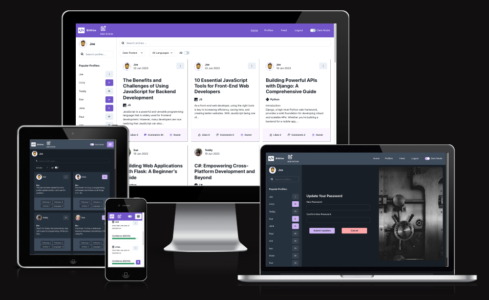

# Table Of Contents

- [BitWise Website Overview](#bitwise-website-overview)
  - [Live Project](#live-project)
  - [BitWise API](#bitwise-api)
  - [Backened Repo](#backend-repo)
  - [Project Introduction](#project-introduction)
- [Responsive Review](#responsive-review)
  - [Am I Responsive?](#am-i-responsive)
- [Project Planning](#project-planning)
  - [Project Scoping](#project-scoping)
  - [Website Objectives](#website-objectives)
  - [User Stories](#user-stories)
  - [Priority Matrix](#priority-matrix)
  - [Agile Methodology](#agile-methodology)
- [User Experience (UX)](#user-experience-ux)
  - [Website Design](#website-design)
  - [Wireframes](#wireframes)
- [Features](#site-features)
  - [Dark/Light Mode](#darklight-mode)
  - [Sign Up](#sign-up)
  - [Login](#login)
  - [Logout](#logout)
  - [NavBar](#navbar)
  - [Sidebar](#sidebar)
  - [Logged In Avatar](#logged-in-avatar)
  - [Article Search Bar](#article-search-bar)
  - [Article Order Dropdown](#article-order-dropdown)
  - [Article Language Dropdown](#article-language-dropdown)
  - [Article Liked Switch](#article-liked-switch)
  - [Profile Search Bar](#profile-search-bar)
  - [Profile Order Dropdown](#profile-order-dropdown)
  - [Profiles Following Switch](#profiles-following-switch)
  - [Grid](#grid)
  - [Skeleton](#skeleton)
  - [Infinite Scroll](#infinite-scroll)
  - [Arrow To Top](#arrow-to-top)
  - [Add Article](#add-article)
  - [Edit Article](#edit-article)
  - [Article Card](#article-card)
  - [Delete Article](#delete-article)
  - [List Comments](#list-comments)
  - [Comment Card](#comment-card)
  - [Add Comment](#add-comment)
  - [Edit Comment](#edit-comment)
  - [Delete Comment](#delete-comment)
  - [List Links](#list-links)
  - [Link Card](#link-card)
  - [Add Link](#add-link)
  - [Edit Link](#edit-link)
  - [Delete Link](#delete-link)
  - [Profile Card](#profile-card)
  - [Edit Profile Or Update Password](#edit-profile-or-update-password)
  - [List Languages](#list-languages)
  - [Language Card](#language-card)
  - [Add Language](#add-language)
  - [Edit Language](#edit-language)
  - [Delete Language](#delete-language)
  - [List Recommended Articles](#list-recommended-articles)
  - [Recommended Card](#recommended-card)
  - [Add Recommended Article](#add-recommended-article)
  - [Delete Recommendation](#delete-recommendation)
  - [Form Validation](#form-validation)
  - [Notifications](#notifications)
  - [Page Not Found (404)](#page-not-found-404)
  - [Items Not Found](#items-not-found)
- [Further Development](#further-development)
  - [Tidy Up](#tidy-up)
  - [Updates Relient On Backend](#updates-relient-on-backend)
- [Technologies Used](#technologies-used)
  - [Languages Used](#languages-used)
  - [Libraries Used](#libraries-used)
  - [Developer Tools](#developer-tools)
- [Testing]()
  - [Testing Document]()
  - [Further Testing]()
  - [Development Bugs]()
  - [Key Learns]()
- [Deployment]()
  - [Deployment Document]()
- [Credits]()
  - [Development Resources]()
  - [Media and Content Resources]()
  - [Acknowledgements]()

 

# BitWise Website Overview

## [Live Project](https://bit-wise-front-end.vercel.app/)

## [BitWise API](https://bitwise-code-blog.herokuapp.com/)

## [Backened Repo](https://github.com/Joe-Collins-1986/BitWise-DRF)

## Project Introduction

**Note:** For the purpose of this project a fictitious client has been generated to provide scope for testing my Frontend development utilising HTML, CSS, JavaScript and JSX through the use of React.

For more information on the API development for this site visit my [BitWise Backend Repo](https://github.com/Joe-Collins-1986/BitWise-DRF)

This website has been designed to provide programmers of all experience levels a platform to share articles with each other relating to specific programming languages. Users will be able to follow each other as well as like and comment on each others articles. They will also be able to document their experiece levels in the various programming languages they know within their profile.

Following discussions with the client this site will initially be tailored to written articles with the potential to expand to video uploads, live streaming, and purchasable tutorials at a later date.

# Responsive Review

## Am I Responsive?

To review the responsive deisgn Web Dev Tools were used as well as manual checks on a range of devices.

In addition to this the site was run through the following [website](https://ui.dev/amiresponsive?url=https://bit-wise-front-end.vercel.app/).

    
Register

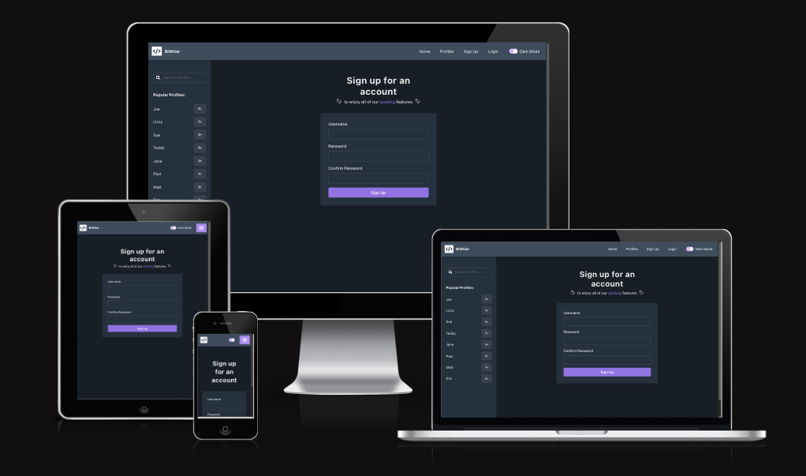

    
Login

    
Home

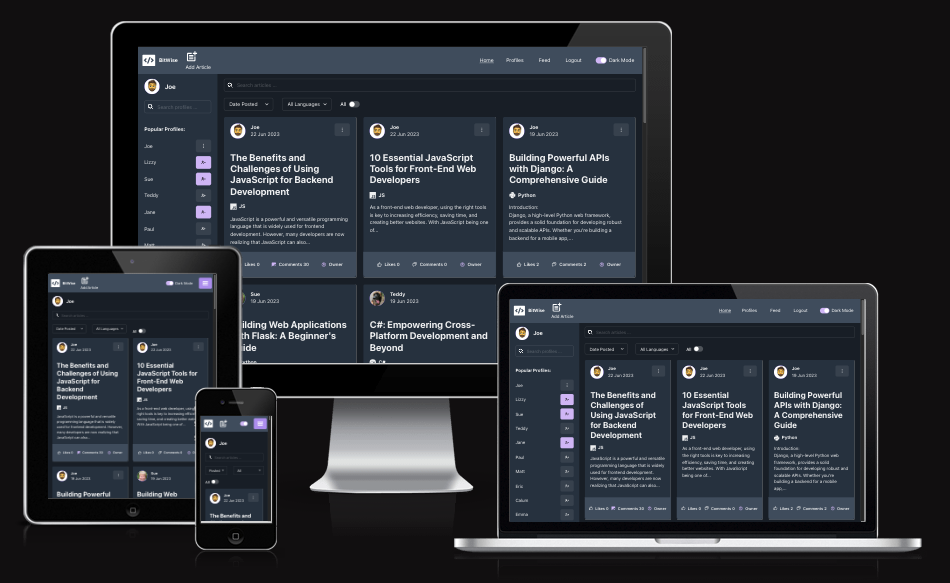

    
Feed

    
Article

    
Add Article

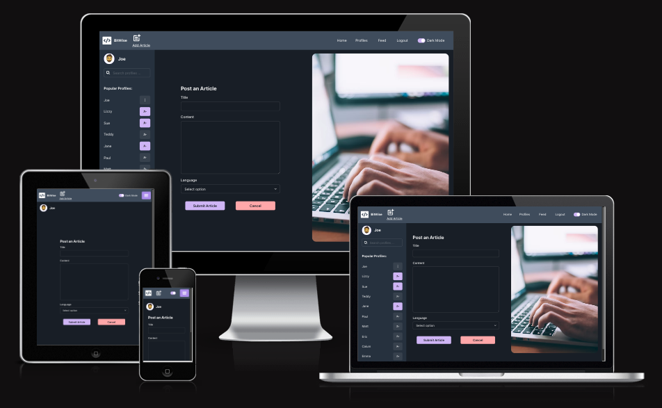

    
Profiles

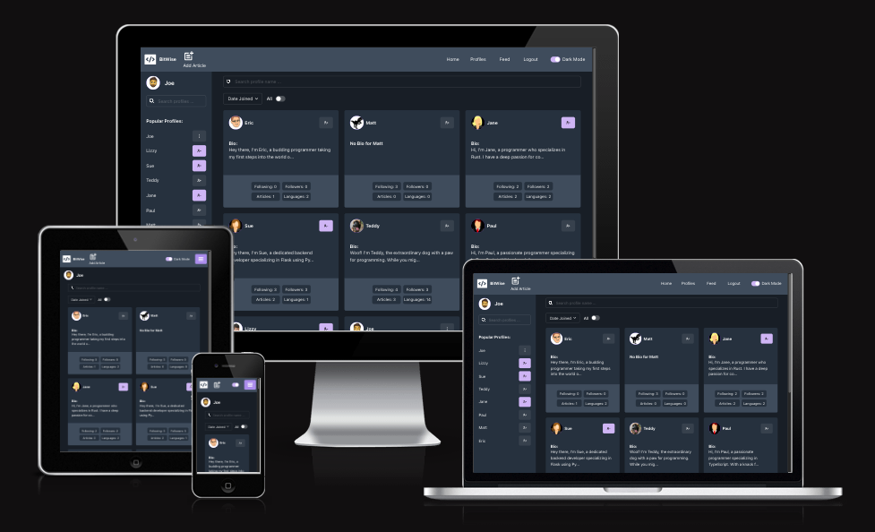

    
Profile

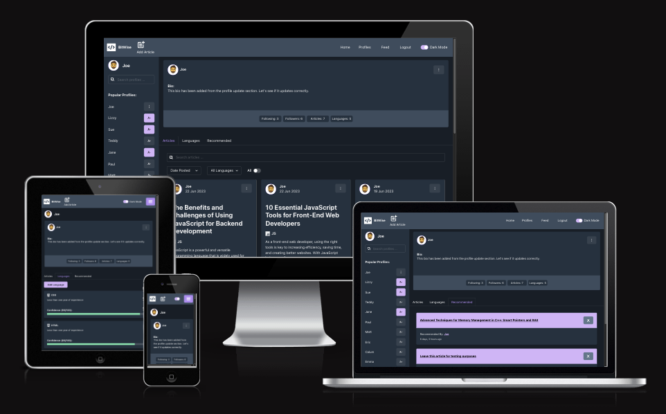

    
Update Profile

    
Password Update

    
Item Not Found

    
404 Page

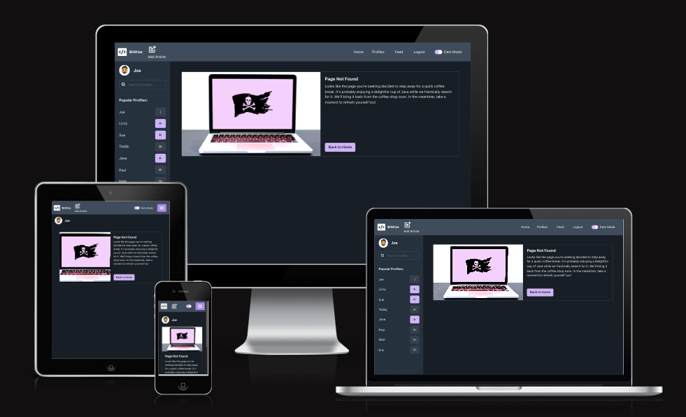

# Project Planning

## Project Scoping

Some aspects of the planning of this site were reliant on the API development and are addressed to some degree in some of the initial mindmapping documents.

However, if you wish to see more of the API planning including the Entity Relationship Diagram, please visit the Backend Redo [here](https://github.com/Joe-Collins-1986/BitWise-DRF)

    
Problem Statement

 
The client wishes to develop a social sharing platform targeted towards the programming community.

The developer worked with the client and focus groups consisting of programmers with varying levels of experience to establish the following problem statement. This was then used to establish some basic considerations which could be taken forward into a mind mapping session.

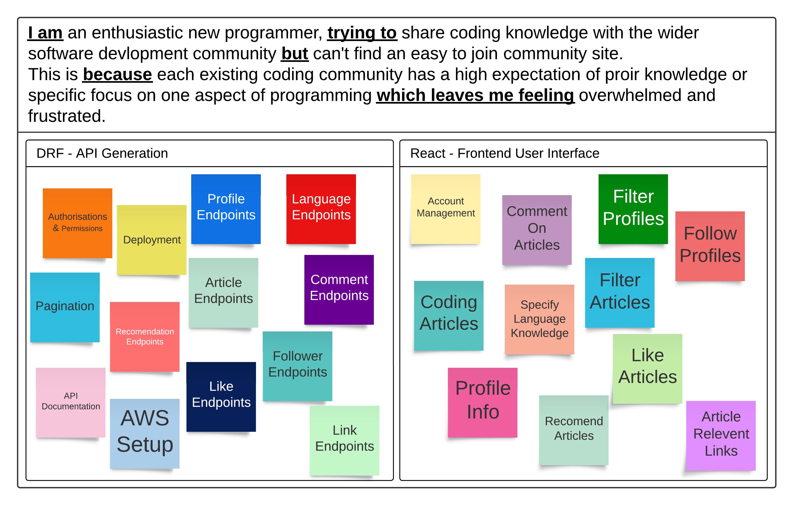
 

If you have a LucidChart account, you can also view this Problem Statement [here](https://lucid.app/lucidspark/ddcc77ae-81e5-48bb-a143-1d8d08517e84/edit?page=0_0&invitationId=inv_33957d7f-3414-4f5b-afb7-62686062836a#).

---

    
Mind Map

 
The below image provides an initial mind-map into the features which might be appropriate for the BitWise site to address the problem statement and help establish user stories.

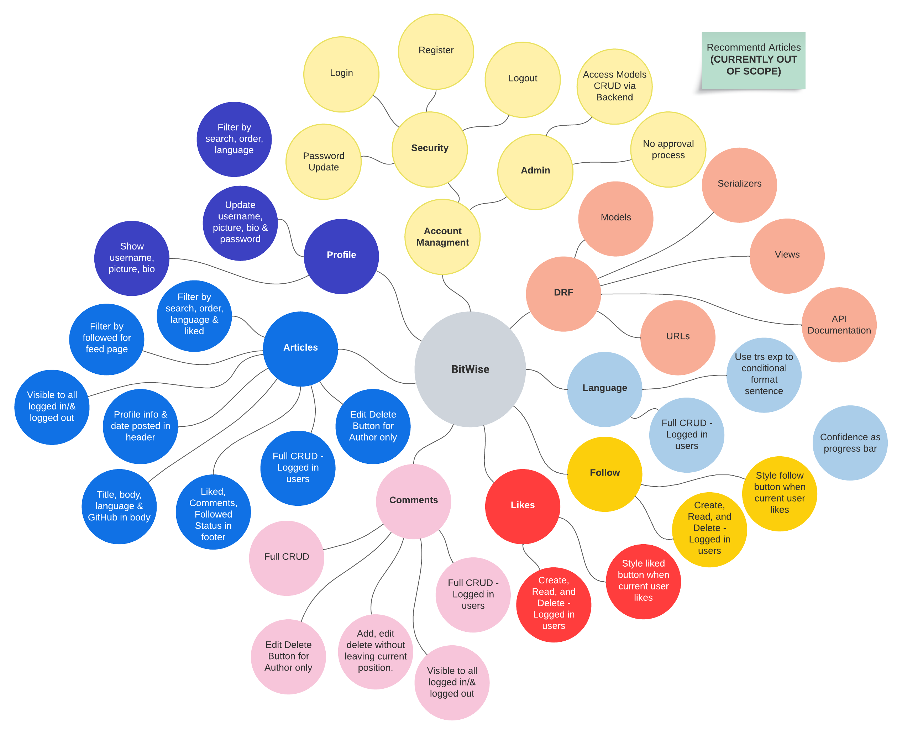
 

If you have a LucidChart account, you can also view this Mind-Map [here](https://lucid.app/lucidspark/92bb6c34-c508-4ed3-81f9-8e426a018834/edit?viewport_loc=-424%2C-51%2C1937%2C2060%2C0_0&invitationId=inv_e1afcf88-79d6-418d-b020-bca52437b6bf).

---

    
Mind Map - Enhancement Feature 1

 
Following completion of the core functionality an additional mind map was generated to consider the additional function of allowing users to recommend articles.

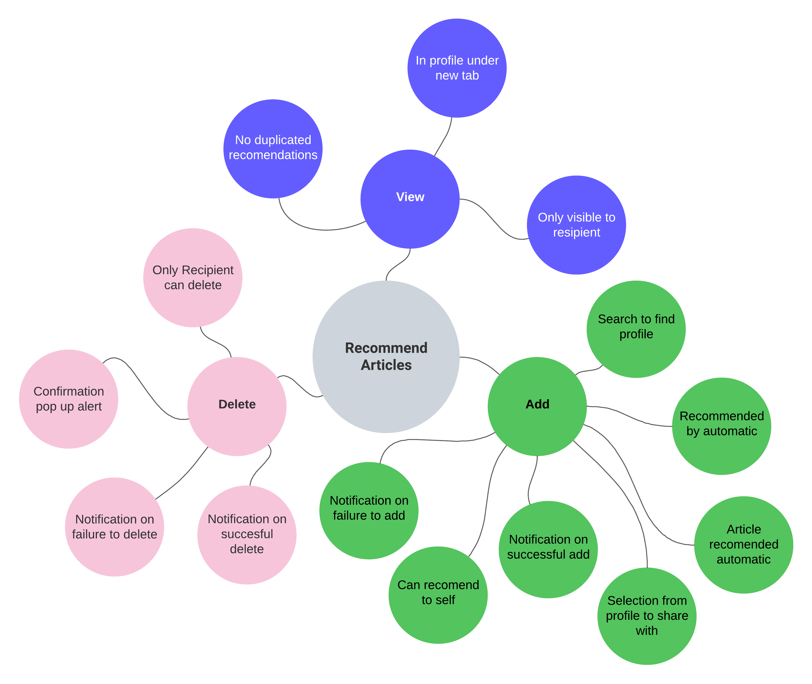
 

If you have a LucidChart account, you can also view this Mind-Map [here](https://lucid.app/lucidspark/34d434b2-010e-4246-ac39-269c2211bb0e/edit?viewport_loc=-462%2C-256%2C2039%2C2139%2C0_0&invitationId=inv_678e0c52-d0b2-432c-980d-6db61438c1e7).

---

    
Mind Map - Enhancement Feature 2

 
Following completion of the recommended article functionality an additional mind map was generated to consider the additonal function of allowing users to add multiple links to an article.

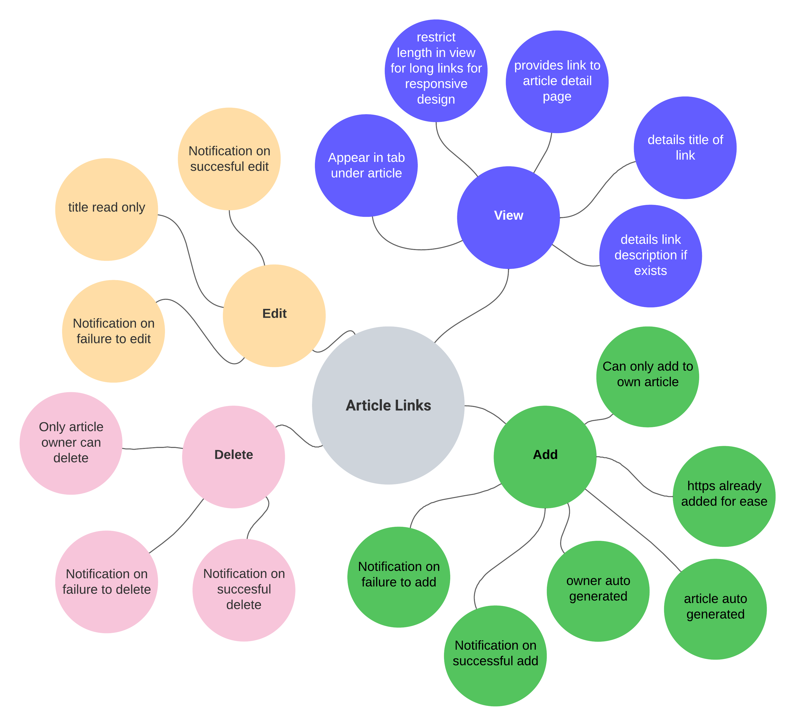
 

If you have a LucidChart account, you can also view this Mind-Map [here](https://lucid.app/lucidspark/1137056a-e0e7-43be-9649-326ac726632b/edit?viewport_loc=-510%2C-81%2C1856%2C1942%2C0_0&invitationId=inv_65d9edd0-81f1-443d-845b-b797ab20628a).

---

## Website Objectives

    
Client Goals

 
The client wants a simple and engaging website that is easy to use and will result in users returning to the site.

- Sleek yet simple UX design.
- Easy to use functionality.
- Responsive for any device size to encourage mobile use as well as desktop use.
- Encourages the development of a friendly programming community helping each other through the sharing of knowledge.
- Provide a base site to later introduce video sharing, streaming, transaction functionality for premium content.

---

    
Visitor Goals

 
The visitor should have a clear understanding of what the website purpose is and the site functions should encourage regular use.

- Immediately engaged by the UX design.
- Understand the purpose of the site.
- Simple intuitive menu navigation.
- Intuitive content and links.
- Ability to write and view programming articles.
- Opportunity to feedback on articles via comments and likes.
- Ability to filter articles to meet needs.
- Able to follow profiles.
- Ability to filter profiles to meet needs.
- Can provide profile info including competency and experience in programming languages.
- Readable and aesthetically pleasing on all devices.
- Able to recommend articles.
- Can add multiple links to articles.

---

## User Stories

All User Stories are detailed on my GitHub account as issues [here](https://github.com/Joe-Collins-1986/BitWise-Front-End/issues?q=is%3Aissue+is%3Aclosed). 

These also breakdown:

- Tasks required for each User Story completion.
- Acceptance Criteria for each User Story.

    
Example

### Summary of User Stories

    
NavBar

    
 

- [Link](https://github.com/Joe-Collins-1986/BitWise-Front-End/issues/1): As a **user** I can **always view the Navbar regardless of which page I am on or where I am on that page** so that **I can navigate the site efficiently.**
- [Link](https://github.com/Joe-Collins-1986/BitWise-Front-End/issues/2): As a **user** I can **switch the application between light and dark mode** so that **the aesthetics and readability better suit my needs**.
- [Link](https://github.com/Joe-Collins-1986/BitWise-Front-End/issues/3): As a **user** I can **only view the links in the Navbar that I have access to** so that **I understand immediately what options are available to me**.

---

    
Routing

 

- [Link](https://github.com/Joe-Collins-1986/BitWise-Front-End/issues/4): As a **user** I can **navigate to various page components without a page refresh** so that **I have a better user experience**.
- [Link](https://github.com/Joe-Collins-1986/BitWise-Front-End/issues/5): As a **user** I will be taken **to an error page if the page component fails to render or does not exist** so that **I understand what went wrong**.

---

    
Authentication

 

- [Link](https://github.com/Joe-Collins-1986/BitWise-Front-End/issues/6): As a **user** can **register an account** so that my **account details are stored, a profile is set up for me and I can login to the site**.
- [Link](https://github.com/Joe-Collins-1986/BitWise-Front-End/issues/7): As a **user** I can **login to my registered account** so that **I can use the sites full functionality**.
- [Link](https://github.com/Joe-Collins-1986/BitWise-Front-End/issues/8): As a **user** I can **logout of my account** so that **I can keep my account safe from others accessing it in my absence**.
- [Link](https://github.com/Joe-Collins-1986/BitWise-Front-End/issues/9): As a **user** I can **stay logged into my account for up to 24h** so that **I do not have to continuously have to log back in while using the site**.

---

    
Articles

 

- [Link](https://github.com/Joe-Collins-1986/BitWise-Front-End/issues/10): As a **user** I can **create articles** so that **I can share my knowledge with others on the site.**
- [Link](https://github.com/Joe-Collins-1986/BitWise-Front-End/issues/11): As a **user** I can **view all articles on the home page** so that **I can browse for content that might interest me.**
- [Link](https://github.com/Joe-Collins-1986/BitWise-Front-End/issues/12): As a **user** I can **like other people posts** so that **I can show my approval.**
- [Link](https://github.com/Joe-Collins-1986/BitWise-Front-End/issues/13): As a **user** I can **filter articles** so that **I can find the ones that meet my desired criteria.**
- [Link](https://github.com/Joe-Collins-1986/BitWise-Front-End/issues/14): As a **user** I can **continuously scroll on the grid component** so that **I can see all available articles.**
- [Link](https://github.com/Joe-Collins-1986/BitWise-Front-End/issues/15): As a **user** I can **edit my own articles** so that **I can update info or correct mistakes where required.**
- [Link](https://github.com/Joe-Collins-1986/BitWise-Front-End/issues/16): As a **user** I can **delete my own articles** so that **I can remove articles I am no longer happy with.**

---

    
Comments

 

- [Link](https://github.com/Joe-Collins-1986/BitWise-Front-End/issues/17): As a **user** I can **create comments on an article** so that **I can share my thoughts on it.**
- [Link](https://github.com/Joe-Collins-1986/BitWise-Front-End/issues/18): As a **user** I can **view comments that have been added to an article** so that **I can see what other people have posted.**
- [Link](https://github.com/Joe-Collins-1986/BitWise-Front-End/issues/19): As a **user** I can **delete my own comments** so that **I can remove information I no longer wish to share with the site audience.**
- [Link](https://github.com/Joe-Collins-1986/BitWise-Front-End/issues/20): As a **user** I can **edit my own comments** so that **I can fix mistakes I made in my original posts.**

---

    
Profiles

 

- [Link](https://github.com/Joe-Collins-1986/BitWise-Front-End/issues/21): As a **user** I can **view a list of article author profiles** so that **I can see who is making contributions.**
- [Link](https://github.com/Joe-Collins-1986/BitWise-Front-End/issues/22): As a **user** I can **filter and order the list of profiles** so that **I can locate the ones most interesting to me.**
- [Link](https://github.com/Joe-Collins-1986/BitWise-Front-End/issues/23): As a **user** I can **follow or unfollow profiles** so that **my feed page represents articles that interest me.**
- [Link](https://github.com/Joe-Collins-1986/BitWise-Front-End/issues/24): As a **user** I can **edit my own profile data** so that **I can reflect new information.**
- [Link](https://github.com/Joe-Collins-1986/BitWise-Front-End/issues/25): As a **user** I can **update my login password** so that **I can improve security if required.**

---

    
Languages

 

- [Link](https://github.com/Joe-Collins-1986/BitWise-Front-End/issues/26): As a **user** I can **view all the languages a profile author is experienced in** so that **I can follow people who are most relevant to my interests.**
- [Link](https://github.com/Joe-Collins-1986/BitWise-Front-End/issues/27): As a **user** I can **add languages that I am experienced in to my profile** so that **I can encourage others to follow me if they are interested in languages I know.**
- [Link](https://github.com/Joe-Collins-1986/BitWise-Front-End/issues/28): As a **user** I can **update languages that have added to my profile** so that **I can update my level of experience or correct mistakes.**
- [Link](https://github.com/Joe-Collins-1986/BitWise-Front-End/issues/29): As a **user** I can **delete languages that have added to my profile** so that **I can remove info I am not happy with.**

---

    
Recommend Articles

 

- [Link](https://github.com/Joe-Collins-1986/BitWise-Front-End/issues/30): As a **user** I can **view all the recommended articles other users have sent to me** so that **I can access them directly from my profile.**
- [Link](https://github.com/Joe-Collins-1986/BitWise-Front-End/issues/31): As a **user** I can **recommended articles to other users** so that **I can share interesting articles.**
- [Link](https://github.com/Joe-Collins-1986/BitWise-Front-End/issues/32): As a **user** I can **remove recommendations from my profile** so that **I am left with only articles I am interested in.**

---

    
Article Links

 

- [Link](https://github.com/Joe-Collins-1986/BitWise-Front-End/issues/33): As a **user** I can **view all the links related to an article** so that **I can access them directly from the article.**
- [Link](https://github.com/Joe-Collins-1986/BitWise-Front-End/issues/34): As a **user** I can **add links to an article I wrote** so that **I can provide useful resource to the audience.**
- [Link](https://github.com/Joe-Collins-1986/BitWise-Front-End/issues/35): As a **user** I can **delete links on an article I wrote** so that **I can remove link I no longer want associated with the article.**
- [Link](https://github.com/Joe-Collins-1986/BitWise-Front-End/issues/36): As a **user** I can **edit links on an article I wrote** so that **I can fix inaccuracies.**

---

## Priority Matrix

The below graphs map out the feasibility of the frontend features considered against the user value they provide to help establish the priority they have as part of the build.

    
Priority Matrix

 

---

If you have a LucidChart account, you can also view this priority matrix [here](https://lucid.app/lucidspark/406a3984-0347-45eb-8e45-a5e3f08144ba/edit?viewport_loc=-2166%2C-751%2C3880%2C5038%2C0_0&invitationId=inv_cb50c34a-94ea-4124-99fa-ac9da55318a3).

## Agile Methodology

An Agile methodology was applied to the development and implementation of this project.

The project development was run in multiple iterations/sprints each targeting a number of User Stories.

Each User Story was moved out of a backlog and assigned to the iteration with a priority label (Must Have, Should Have, Could Have).

To manage the Agile iterations the Projects function within GitHub was used, pulling User Stories into a KanBan Board. (Links to each project iteration detailed in the iteration breakdown below.)

**Note:** It should be noted that the priority label was in relation to it's prioriry within the iteration, not the project as a whole.

    
Iteration 1

 

For Iteration 1 the key focus was to develop.

- General page layout.
- Navigation
- Routing
- Authorisation

For site of the project in GitHub detailing the completed User Stories in Iteration 1 please click [here](https://github.com/users/Joe-Collins-1986/projects/10).

---

    
Iteration 2

 

For Iteration 2 the key focus was to develop CRUD for Articles and set the ability to like them:

- Add
- View
- Like
- Update
- Delete

In addition to this some Comment user stories were also added in due to early completion of userstories within this iteration.

For site of the project in GitHub detailing the completed User Stories in Iteration 2 please click [here](https://github.com/users/Joe-Collins-1986/projects/11).

---

    
Iteration 3

 

For Iteration 3 the key focus was to develop finish of the comments functionality and address viewing and editing Profiles:

- Finishing comments with edit
- Adding profile lists
- Following profiles
- Filtering profiles
- Updating profiles

For site of the project in GitHub detailing the completed User Stories in Iteration 3 please click [here](https://github.com/users/Joe-Collins-1986/projects/12).

---

    
Iteration 4

 

For Iteration 4 the key focus was to finalise Profile updates with password reset and build CRUD functionality for Languages:

- Finish profile with password reset.
- CRUD functionality for languages.

For site of the project in GitHub detailing the completed User Stories in Iteration 4 please click [here](https://github.com/users/Joe-Collins-1986/projects/13).

---

    
Iteration 5

 

Iteration 5 was added after all the other core functionality was built with the intention of adding functions to enhance the site. The key focus was to add functionality to allow users to recommend articles to each other(and themselves) as well as a funcition to allow users to add multiple links to their articles as opposed to just a single github link:

- CRD functionality for recommendations.
- CRUD functionality for links.

For site of the project in GitHub detailing the completed User Stories in Iteration 5 please click [here](https://github.com/users/Joe-Collins-1986/projects/16).

---

# User Experience (UX)

## Website Design

After discussions with the client and reviewing the available React styling libraries a decision was reached to adopt Charkra UI as the components lined up nicely with the aesthetic the client wished to achieve.

    
Colour Scheme

 
Client requested the site to be built from shades of grey with a bold purple for emphasising key elements. This consideration was made to not pull focus or negatively impact the readability of the site due to its information nature.

In addition to this the client requested that there be a dark and light mode to better tailor to user preferences and give a coding aesthetic.

To achieve this look Chakra Theme was applied to allow a switch from light to dark mode. Then a purple theme was interwoven with the standard theme to hightlight key elements and add a dynamic exciting look to the site.

The themes utilise the same colors but reverse the shade on the dark mode switch.

- Main colours:

- Highlighing purple:

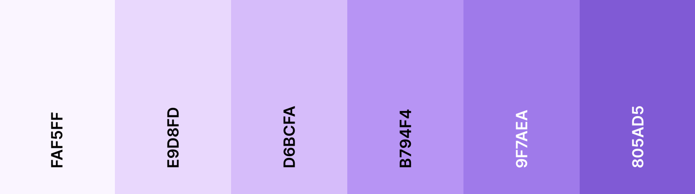

In addition to this a red was applied wo certain buttons to indicate a level of risk:

---

    
Typography

 
After extending the Chakra Theme to test various fonts and styles it was deemed appropriate to revert to the default typography which was easy to read and styled nicely against the Dark/Light theme.

---

    
Imagery

 
Imagery was kept intentionally sparce in this site being used in a limited capacity to offset forms.

The images used where taken from unsplash:

- [Add Article](https://unsplash.com/photos/npxXWgQ33ZQ)
- [Update Profile](https://unsplash.com/photos/IcclLmLQuw8)
- [Password Reset](https://unsplash.com/photos/3wPJxh-piRw)

The icons for this project were taken from React-Icons:

- [React-Icons](https://react-icons.github.io/react-icons/)

---

    
Logo

 
The client is currently working on developing a logo that suits their needs. Until the is achieved they have requested that a simple coding sybol of some sort be used as a placeholder for prototyping the site.

After review the following icon was seleted from React-Icons

[Logo](https://react-icons.github.io/react-icons/search?q=RiCodeBoxFill)

---

## Wireframes

You can view the wireframes using this [Figma Link](https://www.figma.com/file/bViM8lmSanrjYBaFzLCzkm/BirWize-%2C?type=whiteboard&node-id=0%3A1&t=VJReX3c3OvMzXxcs-1)

   
Wireframe Screenshots

Register: 
 

---

Login: 
 

---

Home/Feed: 
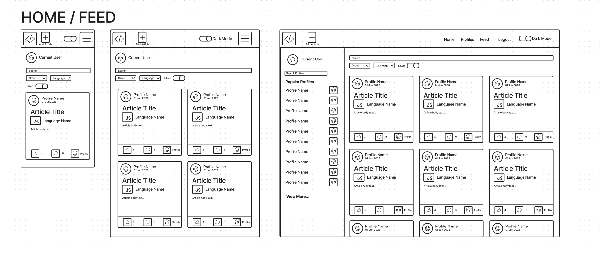 

---

Article: 
 

---

Profiles: 
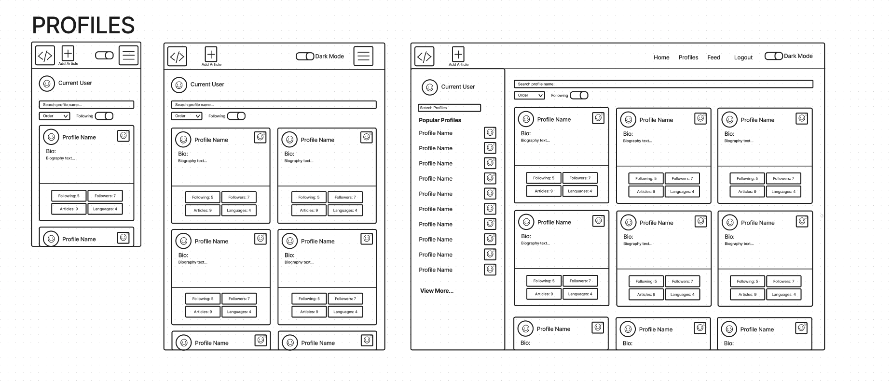 

---

Profile: 
 

---

Update Profile: 
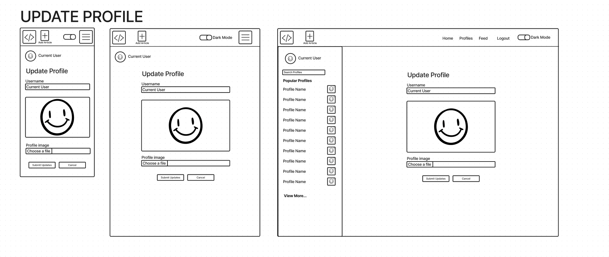 

---

Update Password: 
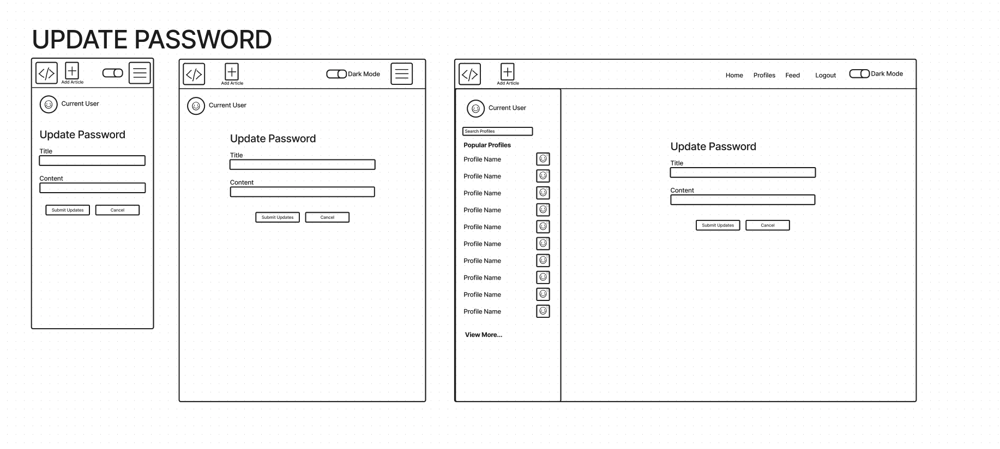 

---

Article Not Found: 
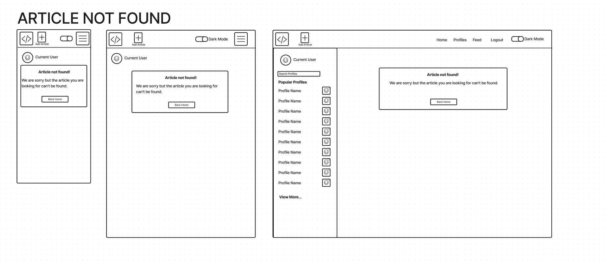 

---

Profile Not Found: 
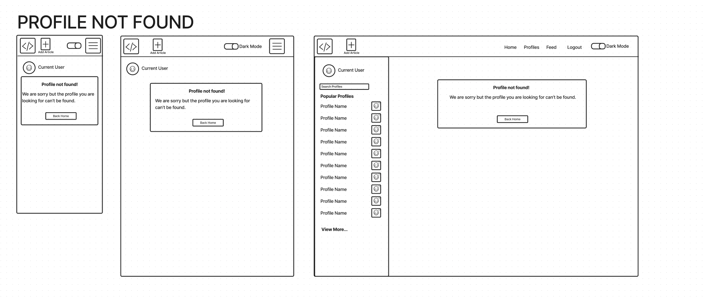 

---

404 Page 
 

   

---

**Note:** The structure and wireframes are only to act as a concept and are subject to change as the website development evolves in collaboration with the client.

# Site Features

Each section below will detail their specific function.

## Dark/Light Mode

Dark and Light mode options have been applied to all pages via the Colour Switch in the NavBar.

      
Dark Mode Screenshot Example

    

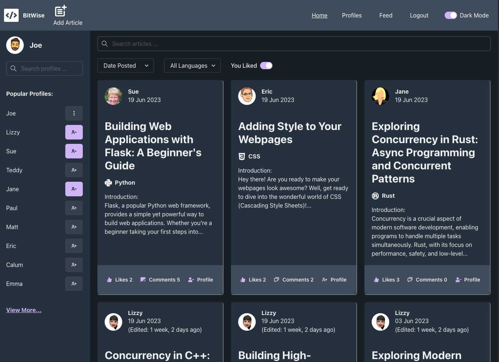 

      
Light Mode Screenshot Example

    

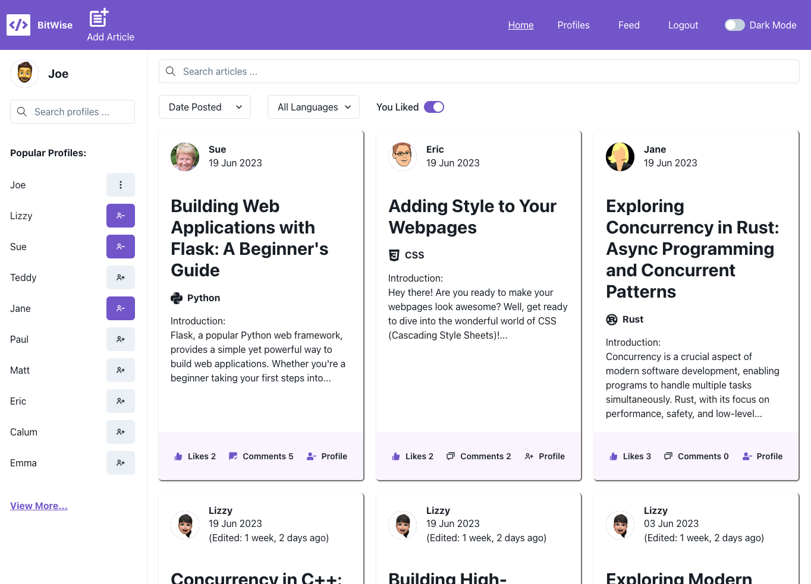 

 

All screenshots detailed in the features section of this Readme file have been taken in Dark Mode.

---

## Sign Up

Sign up is its own page. It utilizes the the [form validation feature](#form-validation) to allow the user to gererate a profile with a username and password. This page is not accessible to logged in users and will redirect them if the user were to use the url to try to access it.

On successful or failed registration a notification will be generated using the [notification feature](#notifications).

      
Sign Up Screenshot

    

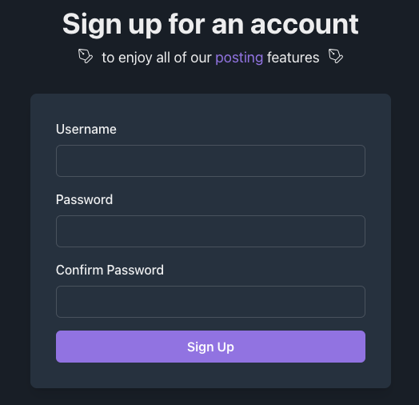 

 

---

## Login

Login is its own page. It utilizes the the [form validation feature](#form-validation) to allow the user to access the profile they created on the sign up page with their username and password. This page is not accessible to logged in users and will redirect them if the user were to the url to try to access it.

If a user is not logged in and tries to access a page which redirects to the login page after logging in they will be taken back to their original page.

On successful or failed login a notification will be generated using the [notification feature](#notifications).

      
Login Screenshot

    

 

 

---

## Logout

Logout is a feature that logs the user out when it is selected.

A confirmation popup was considered however due to the fact that there is no real negative impact to the user by logging out this was dismissed and only added to features where the impact would be more substantial.

On loggout the user stays on the same page assuming it is available to logged out users (e.g. feed). If the user is on a page that a logged out user can't access it will redirect to the home page.

---

## NavBar

The navbar has been fixed to the top of the page to allow the user easy access to all key pages.

A colour switch is provided as part of the navbar to allow users to change the colour scheme from light to dark.

      
Colour Switch Screenshots

    

**Dark Mode:** 
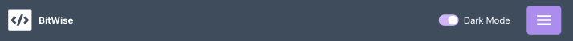 

**Light Mode:** 
 

 

The navbar page links have been provided as text only (with the exception of create article and the logo). This was an intentional decision. These links were tested with icons but feedback indicated this looked to cluttered and was not as intuative. The current page is indicated with an underline as is the hover. Despite slight duplication where one page is visited and another is hovered over this was deemed the best visual and caused no confusion with the test users.

The navbar has conditional formating to only show links relevent to the user based on their logged in status. It also shows less on smaller screens to not extend past available space and impact the sites responsive design.

      
Not Logged In Screenshots

    

**Large Screen:** 
 

**Medium Screen:** 
 

**Small Screen:** 
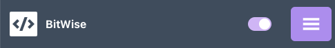 

**Extra Small Screen:** 
 

**Hamburger Menu:** 
 

      
Logged In Screenshots

    

**Large Screen:** 
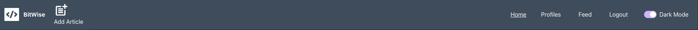 

**Medium Screen:** 
 

**Small Screen:** 
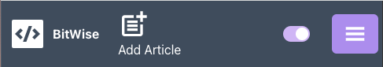 

**Extra Small Screen:** 
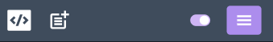 

**Hamburger Menu:** 
 

 

---

## Sidebar

### Responsive

The Sidebar is a responsive element that only appears on large screens.

      
Small Screen Screenshot

    

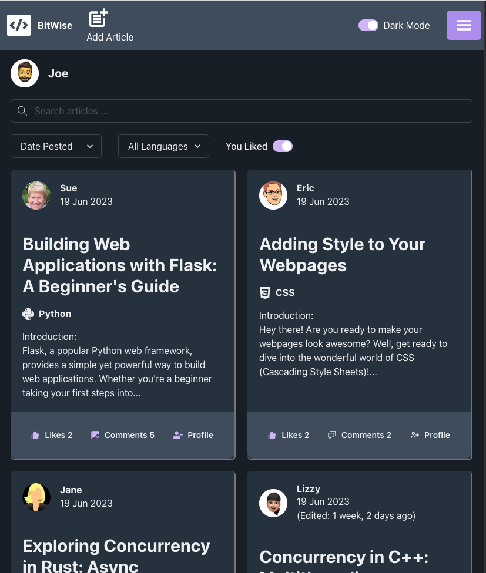 

      
Large Screen Screenshot

    

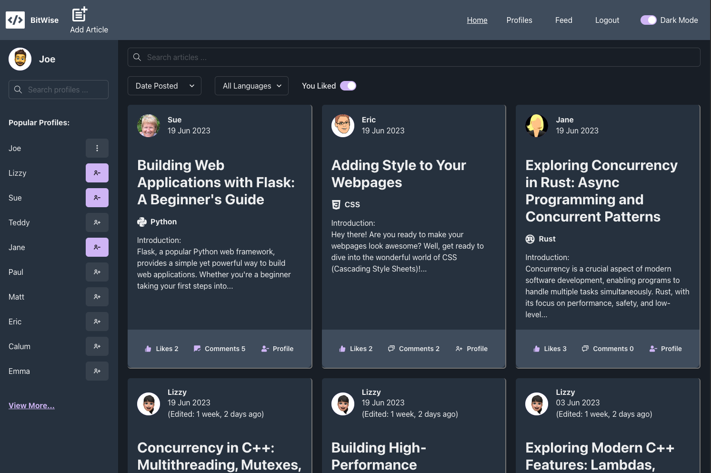 

 

### Sidebar Logged In Avatar

The [Logged In Avatar feature](#logged-in-avatar) appears at the top of the sidebar when present for logged in users.

### Load Sidebar Profiles

When the sidebar is loaded it obtains the 10 most followed profiles and displays them in order. These will display with the users profile avatar and will act as links to the users individual profile page.

This is followed by a View More... link that directs the user to the profiles page.

      
Sidebar More Than 10 Profiles Screenshot

    

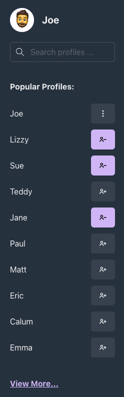 

 

If there are not more than 10 profiles registered on the site the View More... link will not appear.

      
Sidebar Only 10 Profiles Screenshot

    

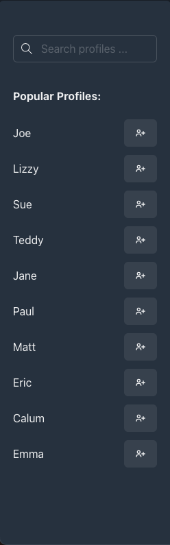 

 

Whilst the profiles are loading a spinner will display to show the user that the site is obtaining information.

      
Sidebar Spinner Screenshot

    

 

 

### Sidebar Profile Search

A search bar has been added to the sidebar to allow users to search profiles which may not be present on the oringinal 10 displayed.

      
Search J Screenshot

    

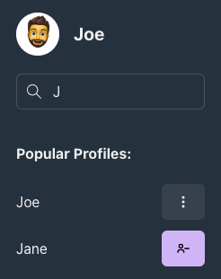 

      
Search Joe Screenshot

    

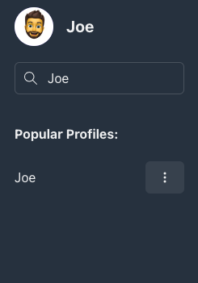 

 

### Sidebar Follow

The sidebar profiles will have an icon to the right of the profile name and avatar that will allow a user to follow them if they are logged in.

If the user is not logged in they will get a pop up message telling them to login first.

      
Login To Follow Screenshot

    

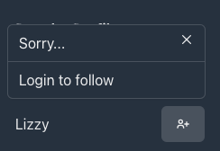 

 

If the user is logged in the icon will update to show they are now following the selected profile. This will update the state to show immediately and will also update the state in the profiles page and individual profile page without the requirement to refresh.

      
Follow - Update Profiles Page Screenshot

    

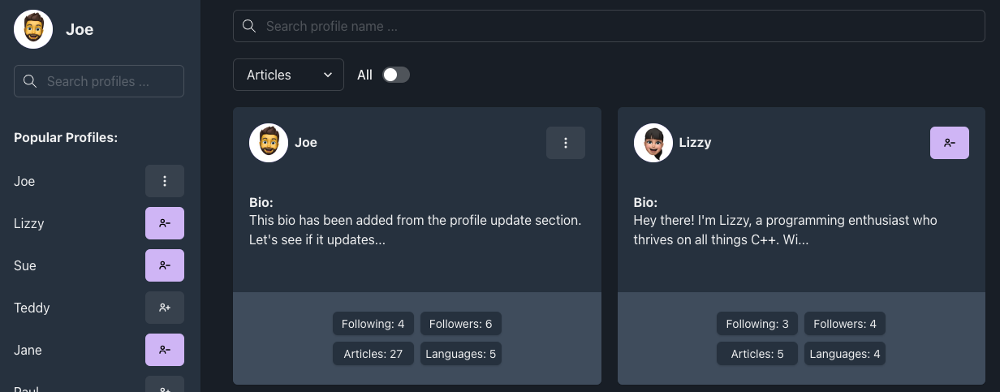 

      
Follow - Update Individual Profile Page Screenshot

    

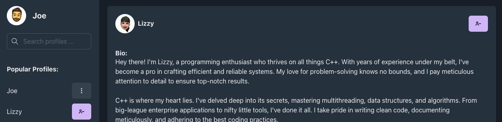 

 

If a user selects an already followed profile it will unfollow and update the states in the profiles page and individial profile page accordingly.

      
Unfollow - Update Profiles Page Screenshot

    

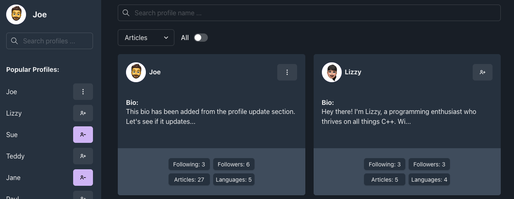 

      
Unfollow - Update Individual Profile Page Screenshot

    

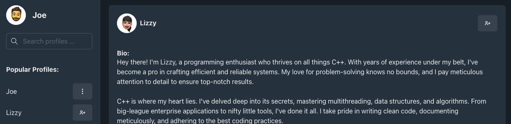 

 

When a profile is followed or unfollowed the article pages will update their components. This requires a loading period however it was important to do as it could effect the search criteria being applied. For example this would add the profiles of the followed individual to the feed.

On successful or failed following attempts a notification will be generated using the [notification feature](#notifications).

### Sidebar Profile Edit

If the currently logged in user has their profile displaying in the sidebar they will be given the opportunity to updated their profile information and/or password by selecting the icon next to their name.

      
Update Profile Screenshot

    

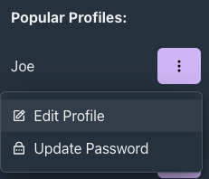 

 

---

## Logged In Avatar

When a user logs in they will be presented with their avatar in the top left corner of whatever page they are on. This provides a quick way of checking who they are logged in as and a easy way to navigate to their profile as this acts as a link.

On small screens this will appear in the body element of the page. On large screens it will appear at the top of the sidebar.

      
Not Logged In Screenshot

    

 

      
Logged In Large Screenshot

    

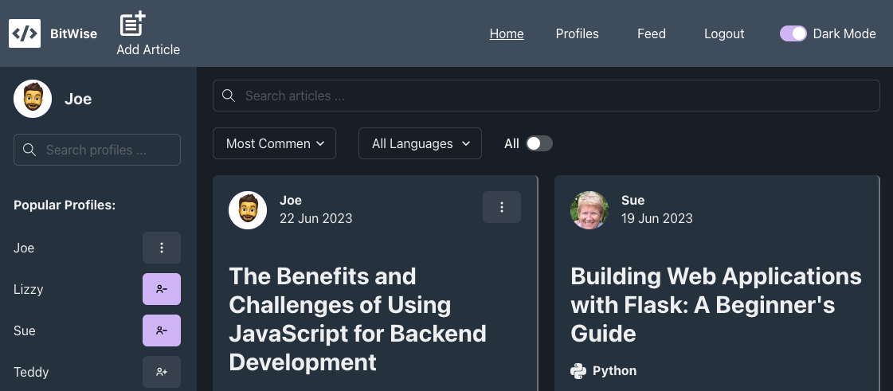 

      
Logged In Small Screenshot

    

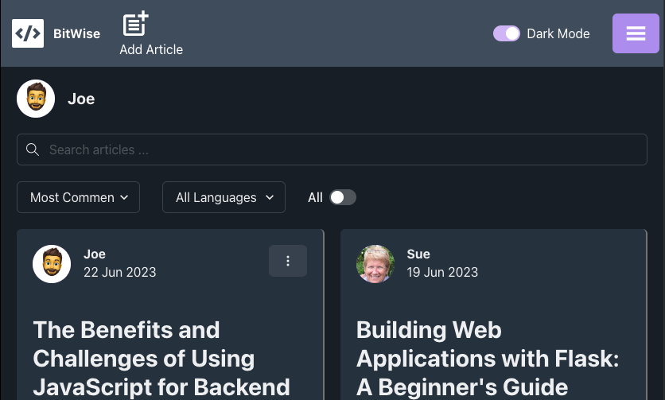 

 

---

## Article Search Bar

The article search bar is designed to help the user quickly and easy retrieve articles where they know the title or name of the author.

**Note** This filter works in combination with all other article filters.

### This is applied to the home page.

      
Home Article Search Bar Screenshot

    

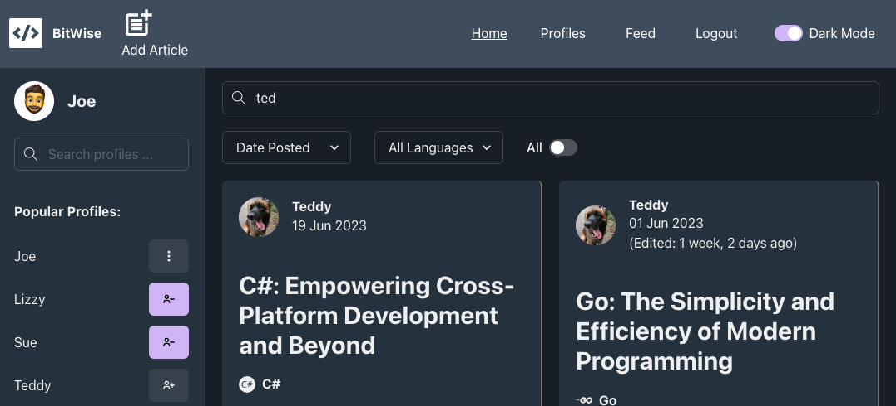 

 

### This is applied to the feed page.

**Note** In the feed search the same filter is used but the current user does not follow Teddy and no articles have ted in the title so no results are returned. This is because all article searches on the feed page are restricted to those followed by the current user.

      
Feed Article Search Bar Screenshot

    

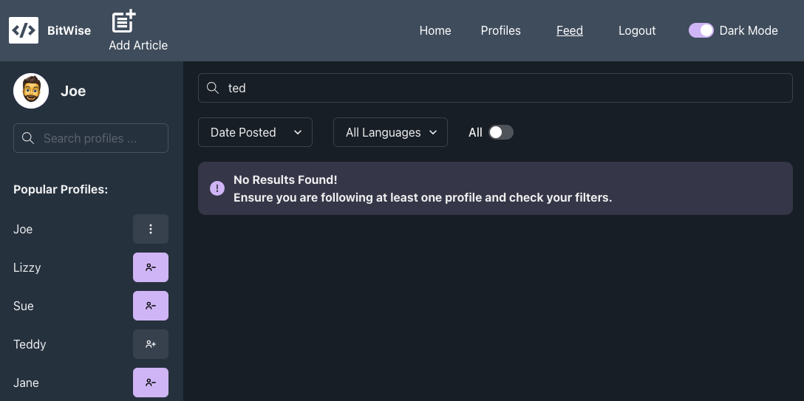

 

### This is applied to the article page.

**Note** In the article page all article searches are restricted to those written by the profile owner.

      
Article Page Article Search Bar Screenshot

    

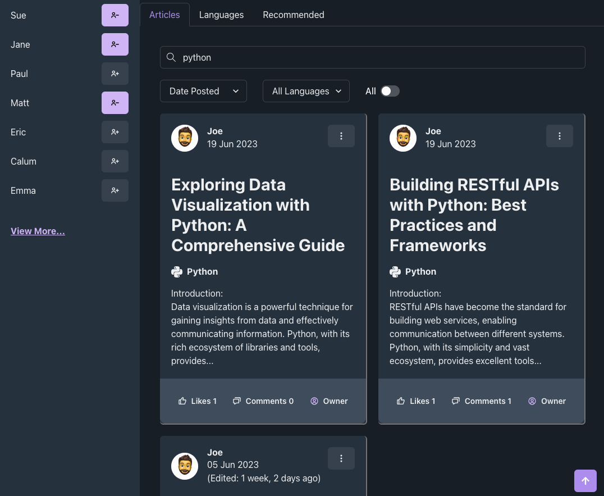

 

---

## Article Order Dropdown

The article order dropdown is designed to help the users order articles by what they are most interested in. The options for ordering are date posted, most liked and most commented.

**Note** This filter works in combination with all other article filters.

### This is applied to the home page.

      
Home Article Order Dropdown Screenshot

    

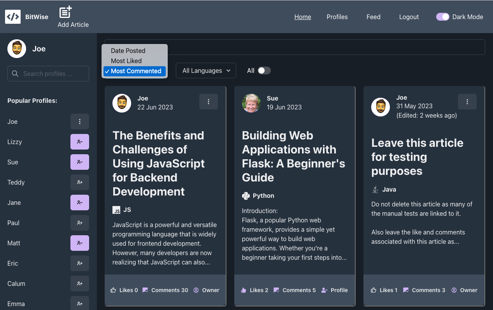 

 

### This is applied to the feed page.

**Note** In the feed dropdown the same option(commented) is used but in addition to this ordering the articles are restricted to those followed by the user.

      
Feed Article Order Dropdown Screenshot

    

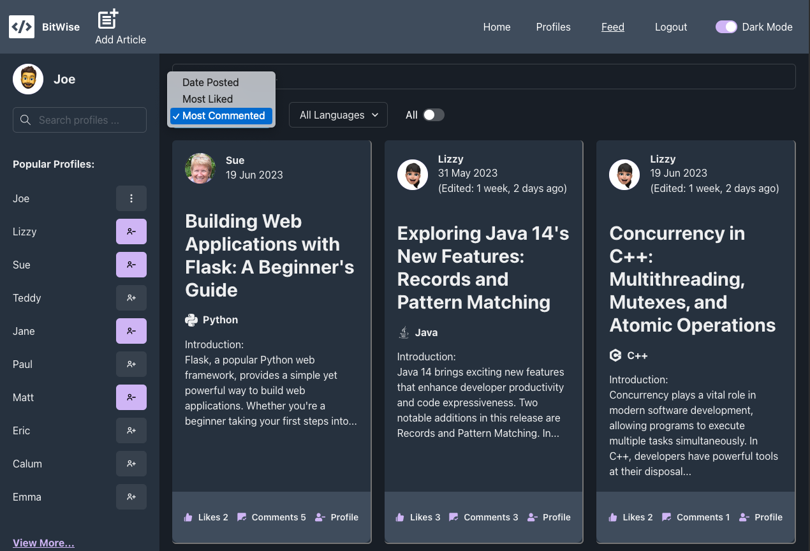

 

### This is applied to the article page.

**Note** In the article page dropdown the same option(commented) is used but in addition to this ordering the articles are restricted to those written by the user.

      
Article Page Article Order Dropdown Screenshot

    

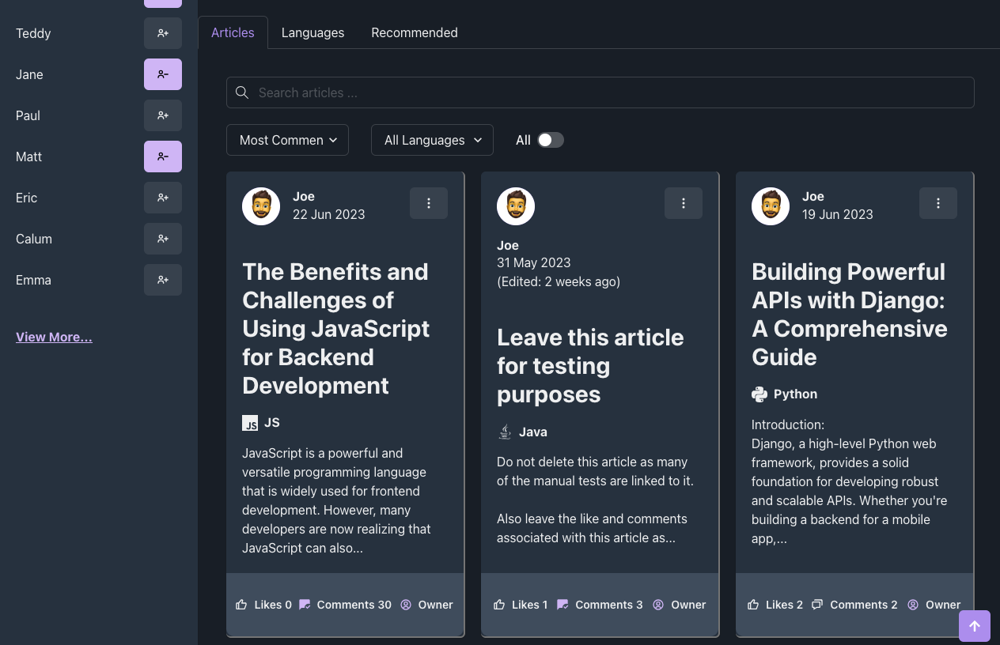

 

---

## Article Language Dropdown

The article language dropdown is designed to help the users search articles written about the selected primary language.

It should be noted that selecting 'no specific language' does not filter to articles where no language was selected but rather where users have selected 'no specific language' from the options when creating the article. This is to ensure this will pull articles that are not specific to a language and not just ones where the user has forgotten or not bothered to select a language.

**Note** This filter works in combination with all other article filters.

### This is applied to the home page.

      
Home Article Language Dropdown Screenshot

    

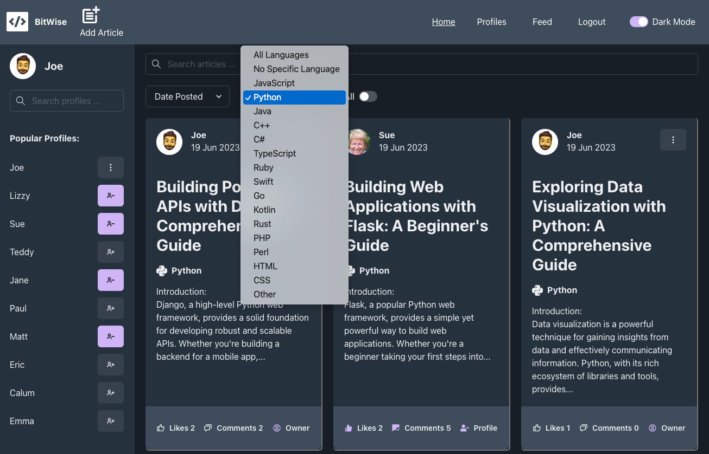 

 

### This is applied to the feed page.

**Note** In the feed dropdown the same option(python) is used but in addition to this ordering the articles are restricted to those followed by the user.

      
Feed Article Language Dropdown Screenshot

    

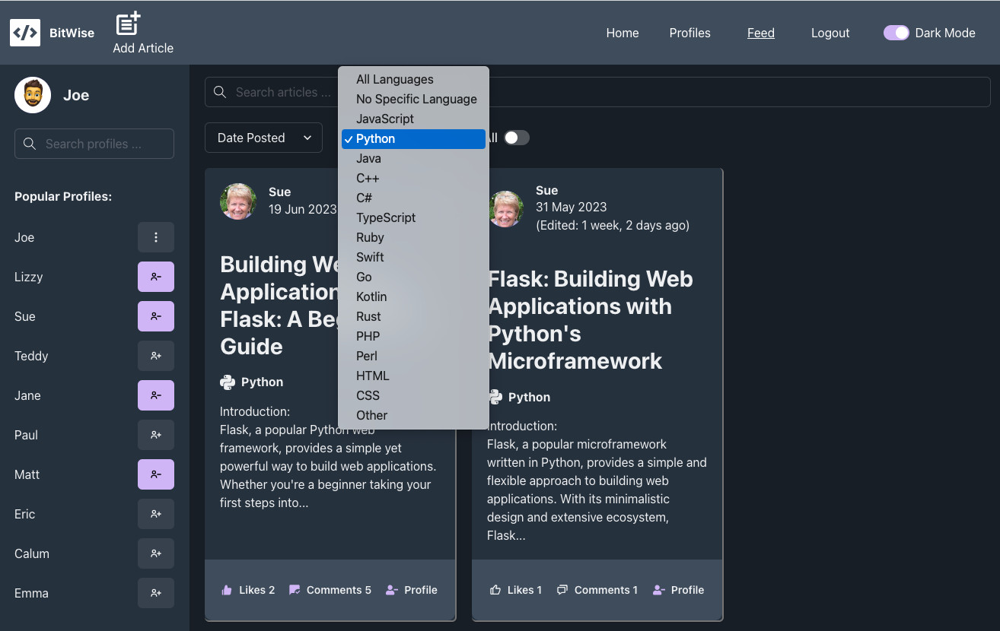

 

### This is applied to the article page.

**Note** In the article page dropdown the same option(python) is used but in addition to this ordering the articles are restricted to those written by the user.

      
Article Page Article Language Dropdown Screenshot

    

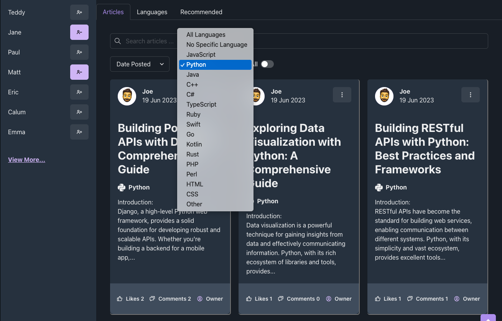

 

---

## Article Liked Switch

The article liked switch is designed to filter the articles to only ones the currently logged in user has liked. All articles will show if the switch is not selected.

If the user is not logged in the switch will not appear.

**Note** This filter works in combination with all other article filters.

### Not Logged In.

      
Not Logged In Screenshot

    

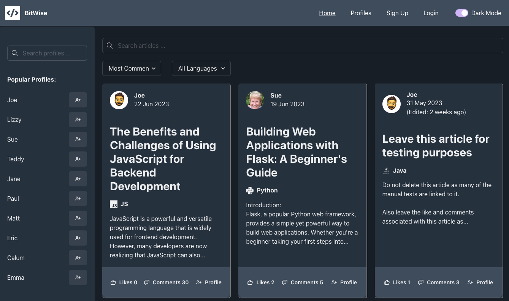 

 

### This is applied to the home page.

      
Home Article Liked Switch Screenshot

    

 

 

### This is applied to the feed page.

**Note** On the feed page the liked switch is applied in addition to the articles being restricted to those followed by the user.

      
Feed Article Liked Switch Screenshot

    


 

### This is applied to the article page.

**Note** On the artcile page the liked switch is applied in addition to the articles being restricted to those written by the user.

In this example the profile selected is that of the current user therefore no articles in the profile are liked. This is because a user can't like their own articles.

      
Article Page Liked Switch Screenshot

    


 

---

## Profile Search Bar

The profile search bar is designed to help the user quickly and easily search profile where they know the profile name.

**Note** This filter works in combination with all other profile filters.

      
Profile Search Bar J Screenshot

    

 

      
Profile Search Bar Joe Screenshot

    


 

---

## Profile Order Dropdown

The profiles order dropdown is designed to help the users order profiles by what they are most interested in. The options for ordering are date joined, articles posted, number of followers and number of languages known.

**Note** This filter works in combination with all other profile filters.

      
Porfiles Order Dropdown Screenshot

    

 

 

---

## Profiles Following Switch

The profiles following switch is designed to filter the profiles to only ones the currently logged in user is following. All profiles will show if the switch is not selected.

If the user is not logged in the switch will not appear.

**Note** This filter works in combination with all other profile filters.

### Not Logged In.

      
Not Logged In Screenshot

    

 

 

### Following Switch Applied.

      
Following Switch Applied Screenshot

    

 

 

---

## Grid

A grid layout has been applied to the articles and the profiles where multiple cards are displayed. This is responsive and will reduce the number of columns as the screen size gets smaller.

### Aricles.

This grid is applied to the Home page, Feed Page and Profile page(bottom).

      
Large Screenshot

    

 

      
Medium Screenshot

    

 

      
Small Screenshot

    

 

 

### Profiles.

This grid is applied to the Profiles page.

      
Large Screenshot

    

 

      
Medium Screenshot

    

 

      
Small Screenshot

    

 

 

---

## Skeleton

To demonstrate that profiles and articles are being loaded in an aesthetic manner skeletons have been applied to show where they will appear and in what format.

      
Grid Skeleton Screenshot

    

 

      
Article Page Skeleton Screenshot

    

 

      
Profile Page Skeleton Screenshot

    

 

 

---

## Infinite Scroll

Inifinite Scroll has been applied to articles, profiles and comments to retrieve more data once all the paginated information has been viewed.

Comments have been paginated to 10 rather than the default 20.

This has not been applied to all emements because they do not require it.

- Languages (there is a max of 17 that can be listed)
- Recommended (pulled as objects within a profile. This may not be the most efficient from a performance perspective and in future I would amend this to call recommendations from their own API endpoint to improve scalability)
- Links (not realistic for users to list more than 20 links to a article)

In future given more time I would apply skeletons to the infinite scroll loading instead of the spinner.

      
Infinite Scroll Screenshot

    

 

 

---

## Arrow To Top

To improve useability of the site an arrow appears when the user scrolls down the page. This arrow appears in the bottom right corner and on selection takes the user back to the top of the page they are on.

      
Arrow To Top Screenshot

    

 

 

---

## Add Article

When a user selects to add an article they will be taken to a form page with the standard [form validation feature](#form-validation).

Here they will detail the information they wish to populate the article with. This page is responsive and will show a image on the right for large screens.

On successful or failed article creation a notification will be generated using the [notification feature](#notifications).

      
Add Article Form Screenshot

    

 

In testing it was identified that if the internet conection was slow a user may try to hit the submit button again. This would result in creating 2 articles. To stop this the button was disabled during the axios request.

      
Disable Submit Screenshot

    

 

 

---

## Edit Article

When a user selects to edit an article they will be taken to a form page the same as the add article form. The only difference will be that it is pre-populated with article data. As with the add article form it will have the standard [form validation feature](#form-validation).

On successful or failed article update a notification will be generated using the [notification feature](#notifications).

      
Edit Article Form Screenshot

    

 

 

---

## Article Card

An article card was built for re-usability across the different pages. This card provides the information recorded in an article.

### Article Card Header

The card header will detail:

- profile name that created it along with it's avatar.
- the date it was created.
- when it was edited (only shows if it was edited).
- if the current user is the article author it will show a button with edit delete options.

      
Article Card Header Screenshot

    

 

      
Artcile Card Edit/Delete Screenshot

    

 

 

### Article Card Body

The card body will detail:

- article title.
- language if one has been selected along with the language icon.
- article content on grid view will truncate, on article page will show in full.
- recommend button if the user is logged in. This will activate the [add recommendation feature](#add-recommended-article).
- login to recommend button if user is not logged in. This will navigate to the login page.

      
Body In Grid Screenshot

    

 

      
Body In Article Page Screenshot

    

 

      
Login To Recommend Screenshot

    

 

 

### Article Card Footer

The card footer will detail:

- Likes icon:
  - This will show an outline if the article has not been liked by the current user.
  - Purple solid icon if the article has been liked by the current user.
  - If selected by the author of the article pop-up will say can't like own post.
  - If selected by not logged in user article pop-up will say login to like post.
- Likes count.
- Comment icon:
  - This will show an outline if it has not been commented on by the current user.
  - Purple solid icon if the article has been commented on by the current user.
  - This icon links the user to the article page where they can add comments.
- Comment count.
- Profile/Owner icon:
  - This will show a outline with a plus option if the article is by a profile the current user is not following.
  - This will show a purple solid icon with a minus if the article has been written by a profile that is followed by the current user.
  - This will show a purple outline icon if the article has been written by the current user.
  - The icon will like to the article authors profile page.
- The words next to the icon will be:
  - profile if the article is not written by the current user
  - owner if the article is written by the current user

      
Footer Screenshot

    

 

      
Can't Like Own Article Screenshot

    

 

      
Login To Like Screenshot

    

 

 

## Delete Article

When an author of the article selects the button to delete it a alert pop-up will be presented to confirm that they are happy to delete the article.

The articles state is then updated to immediately remove the article from the grid.

On successful or failed article deletion a notification will be generated using the [notification feature](#notifications).

      
Delete Confirmation Screenshot

    

 

 

---

## List Comments

At the bottom of the article page under the comments tab will be a list of comments related to the article. If there are no comments and the user is logged in it will invite the user to be the first to comment.

If the user is not logged in it will ask them to login to add a comment.

      
List Comments Screenshot

    

 

      
No Comments Screenshot

    

 

      
Not Logged In Screenshot

    

 

 

---

## Comment Card

The comment card will detail:

- profile name that created it along with it's avatar.
- how long ago it was created.
- if edited it will show how long ago it was edited in replacement of how long ago it was created.
- if the current user is the comment author it will show a button with edit and delete options.
- the body of the comment itself.

      
Comment Card Screenshot

    

 

 

---

## Add Comment

If the user is logged in a comment entry field will be found at the top of the comments tab on the article page.

The user can add a comment and use the button in the bottom right of the entry field to submit it. It utilizes the [form validation feature](#form-validation).

The state of the comments are updated to add a comment immediately. As is the profile state to update the comment count.

On successful or failed comment additon a notification will be generated using the [notification feature](#notifications).

      
Comment Entry Field Screenshot

    

 

 

---

## Edit Comment

If the user is logged in they can edit a comment they have made using the top right button on the comment.

This field will look like the comment but will allow the user to change the body. It utilizes the [form validation feature](#form-validation) and has a cancel button as well as a submission button.

The state of the comments are updated to amend the comment immediately in it current location.

On successful or failed comment edit a notification will be generated using the [notification feature](#notifications).

      
Comment Edit Screenshot

    

 

 

---

## Delete Comment

If the user is logged in they can delete a comment they have made using the top right button on the comment.

This will not produce a pop-up confirmation as there is little risk associated with deletion of comments.

The state of the comments are updated to remove the comment immediately. As is the profile state to update the comment count.

On successful or failed comment deletion a notification will be generated using the [notification feature](#notifications).

---

## List Links

At the bottom of the article page under the links tab will be a list of links related to the article. If there are no links it will show a message of no links for article.

If the user is logged in it also present them with an add link button.

      
Logged In Screenshot

    

 

      
Not Logged In Screenshot

    

 

 

---

## Link Card

The link card will detail:

- link title.
- a link description if added.
- if the current user is the link author it will show a button with edit and delete options.
- the link url truncated if it exceeds a set length.

      
Link Card Screenshot

    

 

 

---

## Add Link

If the user is logged in a add link button will be found at the top of the links tab on the article page.

The user can open an add link form by selecting the button and close it by selecting it again. This form utilizes the [form validation feature](#form-validation).

The state of the links are updated to add a link immediately.

On successful or failed link additon a notification will be generated using the [notification feature](#notifications).

      
Add Link Screenshot

    

 

 

---

## Edit Link

If the user is logged in they can edit a link they have made using the top right button on the link.

This field will look like the link addition form but will appear in the position of the link being updated and will be pre-populated. It utilizes the [form validation feature](#form-validation) and has a cancel button as well as a submission button.

The state of the links are updated to amend the link immediately in it's current location.

On successful or failed link edit a notification will be generated using the [notification feature](#notifications).

      
Link Edit Screenshot

    

 

 

---

## Delete Link

If the user is logged in they can delete a link they have added using the top right button on the link.

This will not produce a pop-up confirmation as there is little risk associated with deletion of a link.

The state of the link are updated to remove the link immediately.

On successful or failed link deletion a notification will be generated using the [notification feature](#notifications).

---

## Profile Card

A profile card was built for re-usability across the different pages. This card provides the information related to a profile.

### Profile Card Header

The card header will detail:

- profile name that created it along with it's avatar.
- if the current user is the profile owner it will show a button with edit profile and update password options.
- if the current user is not the profile owner it will show a button to follow or unfollow the profile. This will update the profile state across the profiles, sidebar and article page immediately.

      
Header Screenshot

    

 

 

### Profile Card Body

The card body will detail:

- a profile bio if one has been added. Otherwise it will show no bio to the user.
- the bio will be truncated on the grid format but show in full on the profile page.

      
Body In Grid Screenshot

    

 

      
Body In Profile Page Screenshot

    

 

 

### Profile Card Footer

The card footer will detail:

- A count of those the profile is following.
- A count of those following the profile.
- A count of article posted by the profile.
- A count of languages known by the profile.

      
Footer Screenshot

    

 

 

---

## Edit Profile Or Update Password

If the user is logged in they can edit their profile or update their password using the top right button on the profile card.

### Edit Profile

When a user selects edit profile they will be taken to a form page with the standard [form validation feature](#form-validation).

Here they will detail the information they wish to populate their profile page including an avatar image. This page is responsive and will show a image on the right for large screens.

On successful or failed article creation a notification will be generated using the [notification feature](#notifications).

      
Edit Profile Screenshot

    

 

 

### Update Password

When a user selects update password they will be taken to a form page with the standard [form validation feature](#form-validation).

Here they will detail their new password and confirm it. This page is responsive and will show a image on the right for large screens.

On successful or failed article creation a notification will be generated using the [notification feature](#notifications).

      
Update Password Screenshot

    

 

 

---

## List Languages

At the bottom of the profile page under the languages tab will be a list of languages the profile owner knows. If the owner doesn't know any languages or has not recorded any it will show a message of no languages for profile owner.

If the user is the profile owner it will also present them with an add language button.

      
Profile Owner Screenshot

    

 

      
Not Profile Owner Screenshot

    

 

 

---

## Language Card

The language card will detail:

- language with appropriate icon.
- years of experience if it has been added.
- level of confidence in the language. This will show a confidence bar which is colour coded dependent on confidence level selected.
- if the current user is the profile owner it will show a button with edit and delete options.

      
Language Card Screenshot

    

 

 

---

## Add Language

If the user is on their own profile an add language button will be found at the top of the languages tab on the profile page.

The user can open an add language form by selecting the button and close it by selecting it again. This form utilizes the [form validation feature](#form-validation).

The state of the languages are updated to add a language immediately. As is the profile to show an updated language count.

On successful or failed language additon a notification will be generated using the [notification feature](#notifications).

      
Add Language Screenshot

    

 

 

---

## Edit Language

If the user is the profile owner they can edit their language using the top right button on the language card.

This field will look like the language addition form but will appear in the position of the language being updated and will be pre-populated. It utilizes the [form validation feature](#form-validation) and has a cancel button as well as a submission button.

The state of the languages are updated to amend the language immediately in it's current location.

On successful or failed language edit a notification will be generated using the [notification feature](#notifications).

      
Language Edit Screenshot

    

 

 

---

## Delete Language

If the user is the profile owner they can delete their languages using the top right button on the language card.

This will not produce a pop-up confirmation as there is little risk associated with deletion of a language.

The state of the languages are updated to remove the language immediately. As is the profile state which updates the languages count.

On successful or failed link deletion a notification will be generated using the [notification feature](#notifications).

---

## List Recommended Articles

If the current user navigates to their own profile an additional tab will be present for recommended articles. This will not be present on anyone elses profile as it is only for the benefit of the logged in user.

This tab will hold a list of articles that have been recommended to the user by other profiles (or the user themselves).

If there are no recommended articles it will show a message of no articles recommended.

      
Recommended List Screenshot

    

 

      
No Recommendations Screenshot

    

 

      
Not Profile Owner Screenshot

    

 

 

---

## Recommended Card

The recommended card will detail:

- the article title. This will act as a link to the article page.
- who the article was recommended by. This will act as a link to their profile.
- how long ago the article was recommended.
- if the current user is the profile owner it will show a button in the top right with a delete option. (this will always show as a user can only see this tab for their own profile)

      
Recommended Card Screenshot

    

 

 

---

## Add Recommended Article

To recommend an article the logged in user must navigate to the article page and go towards the bottom of the article selecting the recommmend article button.

This will activate a pop-up where a list of upto 20 profiles will appear to send the recommendation to. In addition to the available options the user can type the profile name into the available search bar to locate the specific profile that may not be in the initially provided options.

Duplicate profiles can't be recomended and a [notification feature](#notifications) will inform the user trying to make the recommendation that the recipient already has that article in their recommended list.

On successful or failed recommendatons a notification will be generated using the [notification feature](#notifications).

      
Recommended Options Screenshot

    

 

      
Search Recommended Options Screenshot

    

 

      
Duplicate Article Recommendation Screenshot

    

 

 

---

## Delete Recommendation

If the user is the profile owner they can delete their received recommendations using the top right button on the recommendaton card.

This will produce a confirmation pop-up to check the user is happy to remove it from their recommended list.

The state of the recommendatons are updated to remove the recommendation immediately.

It should be noted that only the recipient of the recommendation can delete it, not the creator (unless they are the same person).

On successful or failed link deletion a notification will be generated using the [notification feature](#notifications).

      
Delete Confirmation Screenshot

    

 

 

---

## Form Validation

All the forms on this site use a validation feature to check the validity of the fields completed. Any mandatory missing field, miss matching passwords, unacceptable entry types will be highlighted back to the user as feedback.

Some examples of validation in action (this doesn't cover all potential validation errors).

      
Empty Field Screenshot

    

 

      
Need Both Fields Screenshot

    

 

      
Bad Credentials Screenshot

    

 

      
Invalid Entry Screenshot

    

 

      
Passwords Don't Match Screenshot

    

 

 

---

## Notifications

On completion of Create, Update, and Delete functionality as well as Login notificatons will be presented to inform the user of the success or failure of their axios request.

The following screenshots are just 2 examples of the notifications in action. These are applied to all hooks in the application.

      
Example Success Notification Screenshot

    

 

      
Example Fail Notification Screenshot

    

 

 

---

## Page Not Found (404)

A 404 page was developed for any urls that do not exist.

This screen navigates the user back to the home page.

      
Page Not Found Screenshot

    

 

 

---

## Items Not Found

A page was developed for any urls that meet the routing criteria but do not house any data.

This screen navigates the user back to the home page.

      
Items Not Found Screenshot

    

 

 

---

# Further Development

## Tidy Up

- Given more time I would ensure that were possibe hooks and components where consolidated for file reduction.
- Introduce ReactQuery to:
  - manage and cache data for better performance.
  - simplify context.
  - reform prop drilling that is currently present.
- Add additional automated testing to front end.
- Add skeleton to infinite scroll.
- Move Recommended from profile objects to specified API call for improved performance and better scalability.

## Updates Reliant On Backend

- Add restriction option to the articles which the author could apply. This would restrict users who are not following the author from reading the articles.
- Add video uploads as well as articles - storing to AWS.
- Potential for live streaming - would require third party integration with a service such as Wowza, Vimeo, YouTube Live, etc.
- Add a payment method so authors can make restricted content for purchase only.

    

# Technologies Used

## Languages Used

- HTML
- CSS
- JavaScript
- JSX

## Libraries Used

| Package                         | Description                                                         |
| ------------------------------- | ------------------------------------------------------------------- |
| chakra-ui/react                 | UI component library for React applications.                        |
| axios                           | Promise-based HTTP client for making API requests in JavaScript.    |
| react                           | JavaScript library for building user interfaces.                    |
| react-dom                       | Entry point for rendering React components in the DOM.              |
| react-icons                     | Library for including popular icon sets in React applications.      |
| react-infinite-scroll-component | Component for creating infinite scrolling in React applications.    |
| react-router-dom                | Routing library for React applications.                             |
| vite                            | Fast development server and build tool for modern web applications. |

## Developer Tools

| Tool                | Description                                                                           |
| ------------------- | ------------------------------------------------------------------------------------- |
| Git                 | Used for version control and to push code to GitHub.                                  |
| GitHub              | Used to store, share, and publish code as well as host live websites.                 |
| Figma               | Used to plan out the website format and design.                                       |
| Web Developer       | Used to analyze HTML, CSS, JavaScript, and JSX output and make necessary corrections. |
| tabletomarkdown.com | Used to quickly convert data to Markdown tables for the TESTING.md document.          |
| Heroku              | Hosting platform for deploying API sites.                                             |
| Vercel              | Hosting platform for deploying websites.                                              |

    

# Testing

## Testing Document

Testing documentation found [here](TESTING.md).

## Further Testing

- Tested across Google Chrome, Safari, Microsoft Edge, Fire Fox browsers on both Mac and Windows.
- Viewed on a variety of devices using Web Developer Tools as well as several live desktop, iPad and mobile devices.
- Each page tested by developer and friends to ensure functionality worked as expected.
- Issued to Slack community to review and provide feedback on.

## Development Bugs

   

      
BT Email

    
   
   On testing of the website it was identified that due to BT's strict spam policies users with a BT email address did not always receive their reset password emails.

If this site was to be push commercially BT have a contact for businesses to register with them and allow emails to be sent without restriction.

All other email proviers tested received reset password emails without issue.

---

   

   

      
Parallax Effect On Home Screen

    

On testing it was identified by multiple users accross a range of devices that the parallax image on the home page was not loading correctly.

On reviewing the Lighthouse score for this it became apparent that this was due to the image size and resolution. To resolve this issue the image was converted to a webp format.

Users confirmed this resolved the issue and Lighthouse gave good performance scores to confirm.

**Note:** There was one instance where the image still failed to load correctly. This was run on a mac using Parallels to validate a microsoft machine usage in Edge. However, on request 2 users ran the website on seperate microsoft machines using Edge and no issue occured.

---

   

   

      
Image Orientation

    

In development it was identified that certain images were rotating when they where uploaded to the AWS account.

To resolve this issue I updated the settings.py to manage the image orientation:

      DJANGORESIZED_DEFAULT_NORMALIZE_ROTATION = False

---

   

   

      
Line Break

    
   
   In development when reviewing the site update posts it became apparent that line breaks were not being implemented into the posts.

    

To resolve this a |linebreaksbr was added to the required fields. This was implemented accross the entire site:

      
{{ update.content|linebreaksbr }}

    

---

   

   

      
Tags Duplication

    
   
   In testing it was identified that tags were case sensitive and that this was causing duplication of the same tags.

    

    

To resolve this issue I converted the tags to uppercase where the exclude duplication code could take effect for these instances:

      def form_valid(self, form):
         country = get_object_or_404(Country, pk=self.kwargs['pk'])
         form.instance.author = self.request.user
         form.instance.country = country

         tag_names = form.cleaned_data.get('tags')
         if tag_names:
            for i, tag_name in enumerate(tag_names):
                  tag, created = Tag.objects.get_or_create(name=tag_name.upper())
                  tag_names[i] = tag.name

         response = super().form_valid(form)

         tags = form.instance.tags.all()
         if not tags.exists():
            no_tags = Tag.objects.get_or_create(name='NO TAGS')[0]
            form.instance.tags.add(no_tags)

         return response

    

---

   

   

      
Pagination

    
   
   In testing it was identified that when pagination was used on a filtered page it would reset the filter. This is because it was assigned its own value to the end of the URL which was being used to define the filter criteria.

To resolve i added a variable (search_query) into the view to get the value of the search criteria (q) and then passed this back to the template as context.

This variable could then be applied to the end of the pagination href to navigate back and forth but retain the search criteria:

      <a class="page-link" href="?page={{ diary_posts.next_page_number }}&q={{search_query}}" aria-label="Next Page">

---

   

   

      
Filter By Topic

    
   
   In testing it was identified that when filtering by topic in the Site Updates the spacing in the topic names was causing HTML validation errors:

To resolve this I applied |urlencode to remove URL spacing.

      <a href="?q={{ topic.topic_catagory|urlencode }}" aria-label="filter to topic selected">{{ topic }}</a>

---

   

   

      
Admin CORS Console Errors

    
   
   When using the Django Admin pages it was identified that CORS errors were being displayed on the console. This was due to the CORS policy I had set on my AWS account.

I updated the policy and this removed the errors.

---

   

   

      
Long Username

    
   
   During final testing it was identified that is a user used a extremely long username it would negatively impact the formatting for the home page, comments and profile.

A long term solution to this issue would be to override the Django User model to restrict the username character allowance. However, at this stage in the delopment I did not want to impact the existing models. As a result I insead updated the CSS with word-wrap: break-word. This stopped long usernames exceeding their containers.

Home Update:

Profile Update:

Comment Update:

---

   

## Key Learns

This project proved to be by far the most challenging and exciting project I have completed. Django did not come naturally to me and my understanding needed to be developed and enhanced by a number of really great online resources (see credits).

I had an almost endless list of things I learned from this project ranging from basic Django functionality to implementation strategies.

Below list some of the key factors I would try to improve upon for my next project.

- As I developed my Django knowledge, I became more capable of writing smaller blocks of more efficient code. Given more time I would revisit earlier blocks of code to refine them further and improve their readability.
- At times in this project, I showed an inconsistency of methods used to achieve the same tasks. Although these methods worked as expected, I would aim to be more consistent in future.
- Throughout the project I gained a better understanding of class-based views vs function views. I frequently used class-based views where in some instances the development might have been better served and simplified using function-based views.
- In some of my code, especially the earlier functions I tried to achieve too many things with a single function. In future I would use the html blocks to write more concise, tailored, and reusable code.
- I need to be more efficient with the use of CSS. In future projects I will look to break the required components down into reusable elements for styling.

    

# Deployment

## Deployment Document

Deployment doumentation found [here](DEPLOYMENT.md).

    

# Credits

## Development Resources

The following sources acted as guidance for understanding. No code was taken directly for use in this project:

- [Dennis Ivy](https://www.youtube.com/@DennisIvy) – Youtube Instructor – Helped develop basic Django functionality knowledge.
- [Corey Schafer](https://www.youtube.com/@coreyms) – Youtube Instructor – Helped develop basic Django functionality knowledge.
- [thenewboston](https://www.youtube.com/@thenewboston) – Youtube Instructor – Helped develop basic Django functionality knowledge.
- [B Learning Club](https://www.youtube.com/watch?v=zwBKm8xp9V0&t=6s) – Youtube tutorial video – Helped develop understanding of Django taggit usability.
- [developedbyed](https://www.youtube.com/watch?v=Nt70Ld0dJCM) - Youtube tutorial video – How to build Parallax image effect.
- Code Institute Slack Community Support – Aided in the testing of the project and discussions regarding issues and features.
- Code Institute Tutor Support – Code Institute for queries on issues I required clarification on.
- Stack Overflow used for generalised queries during development.

## Media and Content Resources

- Images - See Website Design Imagery for links to the image/icon sites used within this project [here](#website-design).
- Map SVG – The original SVG map was taken and tailored from the following source [here](https://simplemaps.com/resources/svg-world).
- Countries JSON – The JSON used to populate the Country Info was taken from [here](https://gist.github.com/keeguon/2310008?permalink_comment_id=4255990#gistcomment-4255990).

## Acknowledgements

- Thank to my Mentor (Spencer Barriball) for his feedback and guidance.
- To all my friends and family that have taken the time to test this site and listen to me rant.
- The Code Institute Slack community for helping with any and all queries.
