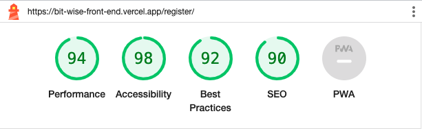

# Testing

Back to Readme [here](README.md)

# Table Of Contents

- [HTML Validation Testing](#html-validation-testing)
- [CSS Validation Testing](#css-validation-testing)
- [JS Validation Testing](#js-validation-testing)
- [Jest Unit Testing](#python-validation-testing)
- [Lighthouse Testing](#lighthouse-testing)
- [User Testing](#user-testing)
- [User Story Acceptance Criteria](#user-story-acceptance-criteria)

 

---

## HTML Validation Testing

Due to this being a React appication there is only one html page which calls the other JSX components.

Only info points highlighted. No errors or warnings identified.

      
HTML Validation

    

 

 

---

## CSS Validation Testing

Add CSS Validation Testing

---

## JS Validation Testing

Prettier was used throughout this project to ensure the appropriate JS Lint standards were met.

---

## Jest Unit Testing

Add Jest Unit Testing

---

## Lighthouse Testing

Lighthouse scores were taken to ensure that the accessability, SEO, performance and best practices achieved to a high level. Each page achieved 90+ scores on all of the 4 catagories.

It was noted that the SEO score was 100% in dev but dropped slightly in the live env due to the Vite set up of the main.jsx being called by the index.html. This was deemed acceptable as it still achieved a green score, however given more time I would investigate this further to resolve the issue.

      
Sign Up

    

 

      
Sign In

    

 

      
Home

    

 

      
Feed

    

 

      
Create Article

    

 

      
Edit Article

    

 

      
Profile

    

 

      
Profiles

    

 

 

---

## User Testing

Each feature detailed on the README.md file has been manaully tested thoroughly as shown in the tables below.

### Dark/Light Mode

| Test Case Description | Expected Result                                                                                                                 | Passed/Failed |
| --------------------- | ------------------------------------------------------------------------------------------------------------------------------- | ------------- |
| Dark Mode - Toggle    | Click on the Colour Switch in the NavBar and ensure that the page appearance has changed to Dark Mode                           | ✅            |
| Light Mode - Toggle   | Click on the Colour Switch again to switch back to Light Mode to ensure that the page appearance has changed back to Light Mode | ✅            |

---

### Sign Up

| Test Case Description                                                                      | Expected Result                                                                                                                                                                             | Passed/Failed |
| ------------------------------------------------------------------------------------------ | ------------------------------------------------------------------------------------------------------------------------------------------------------------------------------------------- | ------------- |
| Access Sign Up Page and Redirect for Logged-In Users                                       | Attempt to access the Sign Up page using its URL while logged in                                                                                                                            | ✅            |
| Fill in Valid User Information and Verify Successful Registration                          | Enter a valid username and password in the Sign Up form and ensure that the user receives a success notification and is redirected to the login page                                        | ✅            |
| Fill in Existing User Information and Verify Failed Registration - Existing User           | Enter a username that already exists in the system and valid password in the Sign Up form and verify that the user receives a failure notification indicating the username is already taken | ✅            |
| Fill in Invalid User Information and Verify Failed Registration - Invalid User Information | Enter an invalid username and password in the Sign Up form and verify that the user receives a failure notification indicating the invalid input                                            | ✅            |

---

### Login

| Test Case Description                                                          | Expected Result                                                                                                                                     | Passed/Failed |
| ------------------------------------------------------------------------------ | --------------------------------------------------------------------------------------------------------------------------------------------------- | ------------- |
| Access Login Page and Redirect for Logged-In Users                             | Attempt to access the Login page using its URL while logged in and verify that the user is redirected to another page                               | ✅            |
| Fill in Valid User Credentials and Verify Successful Login                     | Enter valid username and password in the Login form and ensure that the user receives a success notification and is redirected to a designated page | ✅            |
| Fill in Invalid User Credentials and Verify Failed Login - Invalid Credentials | Enter invalid username and password in the Login form and verify that the user receives a failure notification indicating invalid credentials       | ✅            |
| Redirect After Login                                                           | Attempt to access a page that requires login, and after successful login, verify that the user is redirected back to the original page              | ✅            |

---

### Logout

| Test Case Description           | Expected Result                                                                                                                         | Passed/Failed |
| ------------------------------- | --------------------------------------------------------------------------------------------------------------------------------------- | ------------- |
| Select Logout and Verify Logout | Click on the Logout option in the application and ensure that the user is logged out                                                    | ✅            |
| Verify Redirect                 | If the user is on a page that is not accessible to logged-out users, ensure that they are redirected to the home page after logging out | ✅            |

---

### NavBar

| Test Case Description                             | Expected Result                                                                                                            | Passed/Failed |
| ------------------------------------------------- | -------------------------------------------------------------------------------------------------------------------------- | ------------- |
| Verify NavBar Position                            | Ensure that the NavBar is fixed to the top of the page for easy access                                                     | ✅            |
| Toggle Color Scheme                               | Click on the Color Switch in the NavBar and verify that the color scheme changes from light to dark, or vice versa         | ✅            |
| Verify Current Page Highlight                     | Ensure that the current page is indicated with an underline, and hovering over other pages shows an underline hover effect | ✅            |
| Verify Conditional Formatting for Logged-In Users | Test the NavBar's conditional formatting to show only relevant links based on the user's logged-in status                  | ✅            |
| Verify Responsive Design                          | Test the NavBar on smaller screens to ensure it adjusts to show fewer links and maintains responsive design                | ✅            |

---

### Sidebar

| Test Case Description                      | Expected Result                                                                                                                                                                                                              | Passed/Failed |
| ------------------------------------------ | ---------------------------------------------------------------------------------------------------------------------------------------------------------------------------------------------------------------------------- | ------------- |
| Verify Sidebar Appearance                  | Ensure that the Sidebar is responsive and only appears on large screens                                                                                                                                                      | ✅            |
| Verify Logged-In Avatar                    | Check that the Logged-In Avatar appears at the top of the Sidebar for logged-in users                                                                                                                                        | ✅            |
| Load Sidebar Profiles and View More        | Verify that the Sidebar loads the 10 most followed profiles and displays them with avatars and links to individual profile pages. Additionally, ensure that a "View More..." link appears if there are more than 10 profiles | ✅            |
| Sidebar Spinner                            | Test the loading spinner functionality to show that it displays while the profiles are being loaded                                                                                                                          | ✅            |
| Sidebar Profile Search                     | Use the search bar in the Sidebar to search for profiles and verify that the search functionality works properly                                                                                                             | ✅            |
| Sidebar Follow - Logged Out                | Test the follow feature in the Sidebar for logged-out users and ensure that a pop-up message prompts them to log in first                                                                                                    | ✅            |
| Sidebar Follow - Logged In                 | Verify that the follow feature in the Sidebar updates the state immediately for logged-in users and reflects the change in the profiles and individual profile pages without requiring a refresh                             | ✅            |
| Sidebar Unfollow - Logged In               | Test the unfollow feature in the Sidebar and ensure that it updates the state in the profiles and individual profile pages accordingly for logged-in users                                                                   | ✅            |
| Verify Component Update on Follow/Unfollow | Check that the article pages refresh their components when a profile is followed or unfollowed                                                                                                                               | ✅            |
| Verify Notification Generation             | Ensure that successful and failed follow/unfollow attempts generate the appropriate notifications using the notification feature                                                                                             | ✅            |
| Sidebar Profile Edit                       | If the currently logged-in user's profile is displayed in the Sidebar, verify that they can update their profile information and/or password by selecting the corresponding icon                                             | ✅            |

---

### Logged In Avatar

| Test Case Description                     | Expected Result                                                                                                       | Passed/Failed |
| ----------------------------------------- | --------------------------------------------------------------------------------------------------------------------- | ------------- |
| Verify Logged In Avatar - Small Screens   | Log in as a user and ensure that the logged-in user's avatar appears in the body element of the page on small screens | ✅            |
| Verify Logged In Avatar - Large Screens   | Log in as a user and check that the logged-in user's avatar appears at the top of the sidebar on large screens        | ✅            |
| Verify Avatar as Link to Profile          | Click on the logged-in user's avatar and verify that it acts as a link to the user's profile                          | ✅            |
| Verify Avatar Not Present - Not Logged In | Ensure that the avatar is not displayed when the user is not logged in                                                | ✅            |

---

### Article Search Bar

| Test Case Description                    | Expected Result                                                                                                                                                                                                                  | Passed/Failed |
| ---------------------------------------- | -------------------------------------------------------------------------------------------------------------------------------------------------------------------------------------------------------------------------------- | ------------- |
| Verify Article Search Bar - Home Page    | Enter a known article title or author name in the search bar on the home page and ensure that relevant articles are retrieved based on the search filter                                                                         | ✅            |
| Verify Article Search Bar - Feed Page    | Enter a known article title or author name in the search bar on the feed page and verify that relevant articles are retrieved based on the search filter, considering the restriction to articles followed by the current user   | ✅            |
| Verify Article Search Bar - Article Page | Enter a known article title or author name in the search bar on the article page and check that relevant articles are retrieved based on the search filter, considering the restriction to articles written by the profile owner | ✅            |

---

### Article Order Dropdown

| Test Case Description                        | Expected Result                                                                                                                                                                                                                              | Passed/Failed |
| -------------------------------------------- | -------------------------------------------------------------------------------------------------------------------------------------------------------------------------------------------------------------------------------------------- | ------------- |
| Verify Article Order Dropdown - Home Page    | Select each option (date posted, most liked, most commented) from the order dropdown on the home page and verify that the articles are reordered based on the selected option                                                                | ✅            |
| Verify Article Order Dropdown - Feed Page    | Select each option (date posted, most liked, most commented) from the order dropdown on the feed page and ensure that the articles are reordered based on the selected option, considering the restriction to articles followed by the user  | ✅            |
| Verify Article Order Dropdown - Article Page | Select each option (date posted, most liked, most commented) from the order dropdown on the article page and check that the articles are reordered based on the selected option, considering the restriction to articles written by the user | ✅            |

---

### Article Language Dropdown

| Test Case Description                           | Expected Result                                                                                                                                                                                                      | Passed/Failed |
| ----------------------------------------------- | -------------------------------------------------------------------------------------------------------------------------------------------------------------------------------------------------------------------- | ------------- |
| Verify Article Language Dropdown - Home Page    | Select each programming language option from the language dropdown on the home page and verify that the articles are filtered based on the selected language                                                         | ✅            |
| Verify Article Language Dropdown - Feed Page    | Select each programming language from the language dropdown on the feed page and ensure that the articles are filtered based on the selected language, considering the restriction to articles followed by the user  | ✅            |
| Verify Article Language Dropdown - Article Page | Select each programming language from the language dropdown on the article page and check that the articles are filtered based on the selected language, considering the restriction to articles written by the user | ✅            |

---

### Article Liked Switch

| Test Case Description                       | Expected Result                                                                                                                                                                                                        | Passed/Failed |
| ------------------------------------------- | ---------------------------------------------------------------------------------------------------------------------------------------------------------------------------------------------------------------------- | ------------- |
| Verify Article Liked Switch - Not Logged In | Ensure that the liked switch does not appear on the page when the user is not logged in                                                                                                                                | ✅            |
| Verify Article Liked Switch - Home Page     | Toggle the liked switch on the home page and verify that only the articles liked by the currently logged in user are displayed, while all articles are shown when the switch is not selected                           | ✅            |
| Verify Article Liked Switch - Feed Page     | Toggle the liked switch on the feed page and ensure that only the articles liked by the currently logged in user and followed by the user are displayed, while all articles are shown when the switch is not selected  | ✅            |
| Verify Article Liked Switch - Article Page  | Toggle the liked switch on the article page and check that only the articles liked by the currently logged in user and written by the user are displayed, while all articles are shown when the switch is not selected | ✅            |

---

### Profile Search Bar

| Test Case Description                              | Expected Result                                                                                                | Passed/Failed |
| -------------------------------------------------- | -------------------------------------------------------------------------------------------------------------- | ------------- |
| Verify Profile Search Bar - Search by Profile Name | Enter a profile name in the search bar and ensure that the profiles matching the search criteria are displayed | ✅            |

---

### Profile Order Dropdown

| Test Case Description                                     | Expected Result                                                                                                                                                                        | Passed/Failed |
| --------------------------------------------------------- | -------------------------------------------------------------------------------------------------------------------------------------------------------------------------------------- | ------------- |
| Verify Profile Order Dropdown - Date Joined               | Select the "Date Joined" option from the profile order dropdown and verify that the profiles are displayed in the order of their join dates                                            | ✅            |
| Verify Profile Order Dropdown - Articles Posted           | Select the "Articles Posted" option from the profile order dropdown and ensure that the profiles are displayed in the order of the number of articles posted by each profile           | ✅            |
| Verify Profile Order Dropdown - Number of Followers       | Select the "Number of Followers" option from the profile order dropdown and check that the profiles are displayed in the order of the number of followers for each profile             | ✅            |
| Verify Profile Order Dropdown - Number of Languages Known | Select the "Number of Languages Known" option from the profile order dropdown and ensure that the profiles are displayed in the order of the number of languages known by each profile | ✅            |

---

### Profiles Following Switch

| Test Case Description                                  | Expected Result                                                                                                                       | Passed/Failed |
| ------------------------------------------------------ | ------------------------------------------------------------------------------------------------------------------------------------- | ------------- |
| Verify Profiles Following Switch - Not Logged In       | Confirm that when not logged in, the following switch is not displayed in the profiles page                                           | ✅            |
| Verify Profiles Following Switch - Switch Not Selected | Log in with a user account and navigate to the profiles page. Ensure that the following switch is present but not selected by default | ✅            |
| Verify Profiles Following Switch - Switch Selected     | Select the following switch and verify that only the profiles the user is currently following are displayed                           | ✅            |
| Verify Profiles Following Switch - Switch Unselected   | Deselect the following switch and check that all profiles are displayed, regardless of whether the user is following them or not      | ✅            |

---

### Grid

| Test Case Description                              | Expected Result                                                                                                                                                          | Passed/Failed |
| -------------------------------------------------- | ------------------------------------------------------------------------------------------------------------------------------------------------------------------------ | ------------- |
| Verify Grid Layout - Home Page (Large Screen)      | Open the Home page on a large screen and confirm that the articles are displayed in a grid layout with multiple cards per row.                                           | ✅            |
| Verify Grid Layout - Home Page (Medium Screen)     | Resize the screen to a medium size and ensure that the grid layout adapts by reducing the number of columns while maintaining the card display.                          | ✅            |
| Verify Grid Layout - Home Page (Small Screen)      | Resize the screen to a small size and verify that the grid layout further adjusts by reducing the number of columns to fit the smaller screen size.                      | ✅            |
| Verify Grid Layout - Feed Page                     | Open the Feed page and check that the articles are displayed in a grid layout with multiple cards per row, adapting to different screen sizes as described above.        | ✅            |
| Verify Grid Layout - Profile Page (Bottom Section) | Navigate to the Profile page and scroll to the bottom section where articles are displayed. Confirm that the grid layout is applied, adjusting based on the screen size. | ✅            |
| Verify Grid Layout - Profiles Page (Large Screen)  | Open the Profiles page on a large screen and ensure that the profiles are displayed in a grid layout with multiple cards per row.                                        | ✅            |
| Verify Grid Layout - Profiles Page (Medium Screen) | Resize the screen to a medium size and check that the grid layout adjusts by reducing the number of columns while maintaining the card display.                          | ✅            |
| Verify Grid Layout - Profiles Page (Small Screen)  | Resize the screen to a small size and verify that the grid layout further adapts by reducing the number of columns to fit the smaller screen size.                       | ✅            |

---

### Skeleton

| Test Case Description          | Expected Result                                                                                                                                          | Passed/Failed |
| ------------------------------ | -------------------------------------------------------------------------------------------------------------------------------------------------------- | ------------- |
| Verify Skeleton - Grid         | Open the page where the grid layout is displayed and check that skeleton placeholders are shown in the positions where articles or profiles will appear. | ✅            |
| Verify Skeleton - Article Page | Open an article page and observe that skeleton placeholders are displayed to indicate where the article card will appear.                                | ✅            |
| Verify Skeleton - Profile Page | Navigate to a profile page and verify that skeleton placeholders are shown to represent where the profile information and articles will be displayed.    | ✅            |

---

### Infinite Scroll

| Test Case Description             | Expected Result                                                                                                                                                                                                                                                                                                                  | Passed/Failed |
| --------------------------------- | -------------------------------------------------------------------------------------------------------------------------------------------------------------------------------------------------------------------------------------------------------------------------------------------------------------------------------- | ------------- |
| Verify Infinite Scroll - Articles | Scroll through the articles section (Home page, Feed page, Profile page) until all the paginated articles have been loaded. Then, continue scrolling and confirm that more articles are dynamically loaded and appended to the existing list. The scrolling experience should be smooth and seamless.                            | ✅            |
| Verify Infinite Scroll - Profiles | Scroll through the profiles section (Profiles page) until all the paginated profiles have been loaded. Keep scrolling and ensure that additional profiles are fetched and displayed without interrupting the user experience. The new profiles should be seamlessly added to the existing list.                                  | ✅            |
| Verify Infinite Scroll - Comments | Open an article page with multiple comments. Scroll through the comments section and reach the end of the initial pagination. Verify that more comments are automatically loaded as you continue scrolling, allowing you to view additional comments without any disruption. The loading process should be smooth and efficient. | ✅            |

---

### Arrow To Top

| Test Case Description | Expected Result                                                                                                                                                                                   | Passed/Failed |
| --------------------- | ------------------------------------------------------------------------------------------------------------------------------------------------------------------------------------------------- | ------------- |
| Verify Arrow To Top   | Scroll down any page until the arrow to top button becomes visible in the bottom right corner of the screen. Click on the arrow button and verify that the page smoothly scrolls back to the top. | ✅            |

---

### Add Article

| Test Case Description                  | Expected Result                                                                                                                                                                                                                                                                                                                                                                         | Passed/Failed |
| -------------------------------------- | --------------------------------------------------------------------------------------------------------------------------------------------------------------------------------------------------------------------------------------------------------------------------------------------------------------------------------------------------------------------------------------- | ------------- |
| Verify Add Article Form - Large Screen | Open the Add Article form page on a large screen and verify that the form is displayed with appropriate input fields, labels, and validation messages. Confirm that the image preview is shown on the right side of the form. Fill in the required fields with valid data and click the submit button. Verify that the article is successfully created and a notification is displayed. | ✅            |
| Verify Add Article Form - Small Screen | Resize the screen to a small size and repeat the above test case to ensure that the Add Article form is responsive and adapts to the smaller screen size. Verify that all form elements and functionality remain intact.                                                                                                                                                                | ✅            |
| Verify Disable Submit Button           | Choke the internet connection. Fill in the required fields with valid data and quickly click the submit button twice. Verify that the submit button is disabled during the backend request to prevent duplicate article creation. Only one article should be created, and a notification should be displayed accordingly.                                                               | ✅            |

---

### Edit Article

| Test Case Description                   | Expected Result                                                                                                                                                                                                                                                                                                                                                                            | Passed/Failed |
| --------------------------------------- | ------------------------------------------------------------------------------------------------------------------------------------------------------------------------------------------------------------------------------------------------------------------------------------------------------------------------------------------------------------------------------------------ | ------------- |
| Verify Edit Article Form - Large Screen | Open the Edit Article form page on a large screen and verify that the form is displayed with appropriate input fields, labels, and validation messages. Confirm that the form is pre-populated with the existing article data. Make necessary changes to the article details and click the submit button. Verify that the article is successfully updated and a notification is displayed. | ✅            |
| Verify Edit Article Form - Small Screen | Resize the screen to a small size and repeat the above test case to ensure that the Edit Article form is responsive and adapts to the smaller screen size. Verify that all form elements and functionality remain intact.                                                                                                                                                                  | ✅            |

---

### Article Card

| Test Case Description                              | Expected Result                                                                                                                                                                                                                                                                                                                                                         | Passed/Failed |
| -------------------------------------------------- | ----------------------------------------------------------------------------------------------------------------------------------------------------------------------------------------------------------------------------------------------------------------------------------------------------------------------------------------------------------------------- | ------------- |
| Verify Article Card Header - Display               | Display an article card with the profile name and avatar of the article creator, the creation date, and an indication if the article has been edited. If the current user is the author, verify that an edit/delete button is displayed.                                                                                                                                | ✅            |
| Verify Article Card Body - Display in Grid View    | Display an article card in grid view with the article title, language (if selected) along with the language icon, and truncated content. Verify that the "Recommend" button is not displayed.                                                                                                                                                                           | ✅            |
| Verify Article Card Body - Display in Article Page | Display an article card in the article page with the article title, language (if selected) along with the language icon, and the full content of the article. Check that the "Recommend" button is displayed for logged-in users and the "Login to Recommend" button is displayed for non-logged-in users.                                                              | ✅            |
| Display Likes Icon                                 | The likes icon in the article card footer should show the correct outline or solid style based on whether the article has been liked by the current user or not.                                                                                                                                                                                                        | ✅            |
| Display Likes Count                                | The likes count in the article card footer should accurately reflect the number of likes the article has received.                                                                                                                                                                                                                                                      | ✅            |
| Display Comment Icon                               | The comment icon in the article card footer should show the correct outline or solid style based on whether the article has been commented on by the current user or not.                                                                                                                                                                                               | ✅            |
| Display Comment Count                              | The comment count in the article card footer should accurately reflect the number of comments the article has received.                                                                                                                                                                                                                                                 | ✅            |
| Display Profile/Owner Icon                         | The profile/owner icon in the article card footer should show the appropriate style (plus, minus, or circled profile) based on the relationship between the article author and the current user.                                                                                                                                                                        | ✅            |
| Click on Likes Icon                                | When the likes icon is clicked, verify that the like status of the article is updated accordingly. If the current user is the author of the article, check that a pop-up message appears stating that the author can't like their own post. If the user is not logged in, verify that clicking on the likes icon generates a pop-up with instructions to login to like. | ✅            |
| Click on Comment Icon                              | When the comment icon is clicked, verify that the user is redirected to the article page where they can add comments.                                                                                                                                                                                                                                                   | ✅            |
| Click on Profile/Owner Icon                        | When the profile/owner icon is clicked, verify that the user is taken to the article author's profile page.                                                                                                                                                                                                                                                             | ✅            |

---

### Delete Article

| Test Case Description            | Expected Result                                                                                                                                                                                                  | Passed/Failed |
| -------------------------------- | ---------------------------------------------------------------------------------------------------------------------------------------------------------------------------------------------------------------- | ------------- |
| Verify Delete Confirmation       | When the author of the article clicks on the delete button, a confirmation pop-up should appear to confirm their intention to delete the article.                                                                | ✅            |
| Confirm Deletion                 | After clicking the delete button, confirm the deletion by selecting the appropriate option in the confirmation pop-up. Ensure that the article is deleted from the system and removed from the grid immediately. | ✅            |
| Cancel Deletion                  | If the author cancels the deletion by selecting the cancel option in the confirmation pop-up, the article is not deleted.                                                                                        | ✅            |
| Successful Deletion Notification | After successfully deleting an article, a notification should be generated to inform the user that the deletion was successful.                                                                                  | ✅            |
| Failed Deletion Notification     | If the article deletion fails due to any error, a notification should be generated to inform the user about the failure.                                                                                         | ✅            |

---

### List Comments

| Test Case Description                          | Expected Result                                                                                                      | Passed/Failed |
| ---------------------------------------------- | -------------------------------------------------------------------------------------------------------------------- | ------------- |
| Verify List of Comments - Display              | Open the article page and navigate to the comments section. Verify that the list of comments is displayed correctly. | ✅            |
| Verify No Comments - Display                   | If there are no comments related to the article, ensure that the appropriate message is displayed.                   | ✅            |
| Verify Logged In User - Add Comment Invitation | If the user is logged in and there are no comments, verify that an invitation message to add a comment is displayed. | ✅            |
| Verify Not Logged In User - Login Invitation   | If the user is not logged in ensure that a message inviting the user to log in is shown.                             | ✅            |

---

### Comment Card

| Test Case Description             | Expected Result                                                                                                                                                                    | Passed/Failed |
| --------------------------------- | ---------------------------------------------------------------------------------------------------------------------------------------------------------------------------------- | ------------- |
| Verify Comment Card - Display     | Open the article page and locate a comment card. Verify that the card displays the profile name, avatar, creation time, edit time (if applicable), and the comment body correctly. | ✅            |
| Verify Comment Card - Edit/Delete | If the current user is the comment author, ensure the edit and delete buttons are present.                                                                                         | ✅            |

---

### Add Comment

| Test Case Description          | Expected Result                                                                                                                                                                                              | Passed/Failed |
| ------------------------------ | ------------------------------------------------------------------------------------------------------------------------------------------------------------------------------------------------------------ | ------------- |
| Verify Comment Entry Field     | Open the article page and locate the comment entry field. Add a comment and click the submit button. Verify that the comment is successfully added to the comments section and the comment count is updated. | ✅            |
| Verify Successful Notification | After successfully adding a comment, a notification should be generated indicating the success of the comment addition.                                                                                      | ✅            |
| Verify Failed Notification     | If the comment submission fails, the appropriate error notification should be displayed.                                                                                                                     | ✅            |

---

### Edit Comment

| Test Case Description  | Expected Result                                                                                                                                                                                                                                             | Passed/Failed |
| ---------------------- | ----------------------------------------------------------------------------------------------------------------------------------------------------------------------------------------------------------------------------------------------------------- | ------------- |
| Verify Comment Edit    | Open the article page and locate a comment that the user has made. Click on the edit button and make changes to the comment body. Click the submit button to save the edited comment. Verify that the comment is successfully updated with the new content. | ✅            |
| Verify Successful Edit | After successfully editing a comment, a notification should be generated indicating the success of the comment edit.                                                                                                                                        | ✅            |
| Verify Failed Edit     | If the comment edit fails, the appropriate error notification should be displayed.                                                                                                                                                                          | ✅            |

---

### Delete Comment

| Test Case Description      | Expected Result                                                                                                                                                       | Passed/Failed |
| -------------------------- | --------------------------------------------------------------------------------------------------------------------------------------------------------------------- | ------------- |
| Verify Comment Deletion    | Open the article page and locate a comment that the user has made. Click on the delete button to remove the comment. Verify that the comment is successfully deleted. | ✅            |
| Verify Successful Deletion | After successfully deleting a comment, a notification should be generated indicating the success of the comment deletion.                                             | ✅            |
| Verify Failed Deletion     | If the comment deletion fails, the appropriate error notification should be displayed.                                                                                | ✅            |

---

### List Links

| Test Case Description                  | Expected Result                                                                                                          | Passed/Failed |
| -------------------------------------- | ------------------------------------------------------------------------------------------------------------------------ | ------------- |
| Verify Display of Links                | Open the article page and navigate to the links tab. Verify that the list of links is displayed.                         | ✅            |
| Verify No Links Message                | If there are no links associated with the article, a message indicating "No links for this article" should be displayed. | ✅            |
| Verify Add Link Button (Logged In)     | If the user is logged in, an "Add Link" button should be present in the links tab.                                       | ✅            |
| Verify Add Link Button (Not Logged In) | If the user is not logged in, the "Add Link" button should not be displayed.                                             | ✅            |

---

### Link Card

| Test Case Description    | Expected Result                                                                                           | Passed/Failed |
| ------------------------ | --------------------------------------------------------------------------------------------------------- | ------------- |
| Verify Link Card Details | The link card should display the link title, description (if available), and truncated URL.               | ✅            |
| Verify Link Card Actions | If the current user is the link author, the link card should display buttons for edit and delete actions. | ✅            |
| Verify Truncated URL     | The link URL should be truncated if it exceeds a set length to ensure it fits within the card.            | ✅            |

---

### Add Link

| Test Case Description      | Expected Result                                                                                | Passed/Failed |
| -------------------------- | ---------------------------------------------------------------------------------------------- | ------------- |
| Verify Add Link Button     | If the user is logged in, an "Add Link" button should be present in the links tab.             | ✅            |
| Verify Open Add Link Form  | Clicking on the "Add Link" button should open the add link form for the user to enter details. | ✅            |
| Verify Close Add Link Form | Clicking on the "Add Link" button again should close the add link form.                        | ✅            |
| Verify Form Validation     | Ensure that the add link form validates the required fields and displays appropriate errors.   | ✅            |
| Verify Successful Link Add | After successfully adding a link using the form, the link should be added to the links list.   | ✅            |
| Verify Failed Link Add     | If the link addition fails, an error notification should be displayed.                         | ✅            |

---

### Edit Link

| Test Case Description                   | Expected Result                                                                                       | Passed/Failed |
| --------------------------------------- | ----------------------------------------------------------------------------------------------------- | ------------- |
| Verify Edit Link Form                   | The edit link form should appear when the user selects the edit button on the link card.              | ✅            |
| Verify Edit Link Fields                 | The edit link form should have fields for link title, description, and URL.                           | ✅            |
| Verify Edit Link Cancel                 | If the user cancels the edit, the form should be closed without making any changes to the link.       | ✅            |
| Verify Edit Link Submit - Success       | When the user submits the edited link successfully, the link details should be updated on the page.   | ✅            |
| Verify Edit Link Submit - Failed        | If the user submits the edited link with invalid input, an appropriate error message should be shown. | ✅            |
| Verify Edit Link Notification - Success | On successful link edit, a success notification should be generated using the notification feature.   | ✅            |
| Verify Edit Link Notification - Failed  | On failed link edit, an error notification should be generated using the notification feature.        | ✅            |

---

### Delete Link

| Test Case Description                     | Expected Result                                                                              | Passed/Failed |
| ----------------------------------------- | -------------------------------------------------------------------------------------------- | ------------- |
| Verify Delete Link                        | If the user selects the delete button on the link, the link should be deleted from the page. | ✅            |
| Verify Delete Link Notification - Success | On successful link deletion, a success notification should be generated.                     | ✅            |
| Verify Delete Link Notification - Failed  | On failed link deletion, an error notification should be generated.                          | ✅            |

---

### Profile Card

| Test Case Description                             | Expected Result                                                                                                                                                                                                 | Passed/Failed |
| ------------------------------------------------- | --------------------------------------------------------------------------------------------------------------------------------------------------------------------------------------------------------------- | ------------- |
| Verify Profile Card Header                        | The profile card header should display the profile name and avatar.                                                                                                                                             | ✅            |
| Verify Profile Card Header - Edit/Update Password | If the current user is the profile owner, the header should display a button for editing the profile and updating the password.                                                                                 | ✅            |
| Verify Profile Card Header - Follow/Unfollow      | If the current user is not the profile owner, the header should display a button to follow or unfollow the profile. The profile state should be updated across profiles, sidebar, and article page immediately. | ✅            |
| Verify Profile Card Body                          | The profile card body should display the profile bio if available, or show "No bio" if no bio is provided.                                                                                                      | ✅            |
| Verify Profile Card Body - Truncation             | In the grid format, the bio should be truncated. On the profile page, the full bio should be displayed.                                                                                                         | ✅            |
| Verify Profile Card Footer                        | The profile card footer should display the counts of profiles followed, followers, articles posted, and languages known by the profile.                                                                         | ✅            |

---

### Edit Profile or Update Password

| Test Case Description                            | Expected Result                                                                                                                  | Passed/Failed |
| ------------------------------------------------ | -------------------------------------------------------------------------------------------------------------------------------- | ------------- |
| Verify Edit Profile Button                       | The profile card should display a button for editing the profile.                                                                | ✅            |
| Verify Update Password Button                    | The profile card should display a button for updating the password.                                                              | ✅            |
| Verify Edit Profile Form                         | When the user selects the Edit Profile button, they should be taken to a form page with the standard form validation feature.    | ✅            |
| Verify Edit Profile Form Fields                  | The Edit Profile form should have fields for entering profile information, including an avatar image.                            | ✅            |
| Verify Edit Profile Form Submission - Success    | When the user submits the Edit Profile form successfully, the profile page should be updated with the new information.           | ✅            |
| Verify Edit Profile Form Submission - Failed     | If the user submits the Edit Profile form with invalid input, an appropriate error message should be shown.                      | ✅            |
| Verify Edit Profile Form Notification            | On successful or failed profile update, a notification should be generated using the notification feature.                       | ✅            |
| Verify Update Password Form                      | When the user selects the Update Password button, they should be taken to a form page with the standard form validation feature. | ✅            |
| Verify Update Password Form Fields               | The Update Password form should have fields for entering the new password and confirming it.                                     | ✅            |
| Verify Update Password Form Submission - Success | When the user submits the Update Password form successfully, the password should be updated.                                     | ✅            |
| Verify Update Password Form Submission - Failed  | If the user submits the Update Password form with invalid input, an appropriate error message should be shown.                   | ✅            |
| Verify Update Password Form Notification         | On successful or failed password update, a notification should be generated using the notification feature.                      | ✅            |

---

### List Languages

| Test Case Description                      | Expected Result                                                                                                                        | Passed/Failed |
| ------------------------------------------ | -------------------------------------------------------------------------------------------------------------------------------------- | ------------- |
| Verify List Languages Display              | The profile page should display a list of languages known by the profile owner under the languages tab.                                | ✅            |
| Verify No Languages Message                | If the profile owner doesn't know any languages or hasn't recorded any, a message of "No languages for profile owner" should be shown. | ✅            |
| Verify Add Language Button (Profile Owner) | If the user is the profile owner, the profile page should display an "Add Language" button under the languages tab.                    | ✅            |
| Verify Not Profile Owner View              | If the user is not the profile owner, the profile page should not display the "Add Language" button.                                   | ✅            |

---

### Language Card

| Test Case Description                      | Expected Result                                                                                                         | Passed/Failed |
| ------------------------------------------ | ----------------------------------------------------------------------------------------------------------------------- | ------------- |
| Verify Language Card Display               | The language card should display the language with its appropriate icon, years of experience, and confidence level bar. | ✅            |
| Verify Edit/Delete Options (Profile Owner) | If the current user is the profile owner, the language card should display a button with edit and delete options.       | ✅            |
| Verify Not Profile Owner View              | If the current user is not the profile owner, the language card should not display the edit and delete options button.  | ✅            |

---

### Add Language

| Test Case Description                    | Expected Result                                                                                                     | Passed/Failed |
| ---------------------------------------- | ------------------------------------------------------------------------------------------------------------------- | ------------- |
| Verify Add Language Button               | If the user is on their own profile, an "Add Language" button should be displayed at the top of the languages tab.  | ✅            |
| Verify Add Language Form                 | When the user selects the "Add Language" button, an add language form should appear for inputting language details. | ✅            |
| Verify Add Language Submission - Success | When the user submits the language details successfully, the language should be added to the profile immediately.   | ✅            |
| Verify Add Language Submission - Failed  | If the user submits invalid or incomplete language details, an appropriate error message should be shown.           | ✅            |
| Verify Add Language Notification         | On successful or failed language addition, a notification should be generated using the notification feature.       | ✅            |

---

### Edit Language

| Test Case Description                     | Expected Result                                                                                                     | Passed/Failed |
| ----------------------------------------- | ------------------------------------------------------------------------------------------------------------------- | ------------- |
| Verify Edit Language Button               | If the user is the profile owner, an "Edit Language" button should be displayed on the language card.               | ✅            |
| Verify Edit Language Form                 | When the user selects the "Edit Language" button, an edit language form should appear with pre-populated data.      | ✅            |
| Verify Edit Language Cancel               | If the user cancels the edit, the form should be closed without making any changes to the language.                 | ✅            |
| Verify Edit Language Submission - Success | When the user submits the edited language successfully, the language details should be updated on the profile page. | ✅            |
| Verify Edit Language Submission - Failed  | If the user submits invalid or incomplete language details, an appropriate error message should be shown.           | ✅            |
| Verify Edit Language Notification         | On successful or failed language edit, a notification should be generated using the notification feature.           | ✅            |

---

### Delete Language

| Test Case Description            | Expected Result                                                                     | Passed/Failed |
| -------------------------------- | ----------------------------------------------------------------------------------- | ------------- |
| Verify Delete Language Button    | If the user is the profile owner, a "Delete Language" button should be displayed.   | ✅            |
| Verify Delete Language           | When the user selects the "Delete Language" button, the language should be deleted. | ✅            |
| Verify Delete Language - Success | On successful language deletion, a success notification should be generated.        | ✅            |
| Verify Delete Language - Failed  | On failed language deletion, an error notification should be generated.             | ✅            |

---

### List Recommended Articles

| Test Case Description                         | Expected Result                                                                                       | Passed/Failed |
| --------------------------------------------- | ----------------------------------------------------------------------------------------------------- | ------------- |
| Verify Recommended Articles Tab               | If the current user navigates to their own profile, a "Recommended Articles" tab should be displayed. | ✅            |
| Verify Recommended Articles List              | When the "Recommended Articles" tab is selected, a list of recommended articles should be displayed.  | ✅            |
| Verify No Recommended Articles                | If there are no recommended articles, a message stating "No articles recommended" should be shown.    | ✅            |
| Verify Recommended Articles on Other Profiles | The "Recommended Articles" tab should not be displayed on other profiles.                             | ✅            |

---

### Recommended Card

| Test Case Description                  | Expected Result                                                                                                                                        | Passed/Failed |
| -------------------------------------- | ------------------------------------------------------------------------------------------------------------------------------------------------------ | ------------- |
| Verify Recommended Card Details        | The recommended card should display the article title, the recommender's name (linked to their profile), and how long ago the recommendation was made. | ✅            |
| Verify Delete Recommended Article      | If the user selects the delete button on the recommended card, the article should be deleted from the list.                                            | ✅            |
| Verify Delete Recommended Notification | On successful deletion of a recommended article, a notification should be generated using the notification feature.                                    | ✅            |

---

### Add Recommended Article

| Test Case Description                         | Expected Result                                                                                                                                                 | Passed/Failed |
| --------------------------------------------- | --------------------------------------------------------------------------------------------------------------------------------------------------------------- | ------------- |
| Verify Recommend Article Button               | The article page should display a recommend article button at the bottom of the article card body.                                                              | ✅            |
| Verify Recommend Article Pop-up               | When the user selects the recommend article button, a pop-up should appear with a list of profiles to recommend the article to.                                 | ✅            |
| Verify Search Recommended Options             | The pop-up should have a search bar to allow the user to search for specific profiles to recommend the article to.                                              | ✅            |
| Verify Duplicate Article Recommendation       | If the user tries to recommend an article to a profile that already has the article in their recommended list, an appropriate notification should be displayed. | ✅            |
| Verify Successful Recommendation Notification | On successful recommendation of an article, a success notification should be generated using the notification feature.                                          | ✅            |
| Verify Failed Recommendation Notification     | On failed recommendation of an article, an error notification should be generated using the notification feature.                                               | ✅            |

---

### Delete Recommendation

| Test Case Description                     | Expected Result                                                                                       | Passed/Failed |
| ----------------------------------------- | ----------------------------------------------------------------------------------------------------- | ------------- |
| Verify Delete Recommendation Button       | The recommendation card should display a delete button in the top right corner for the profile owner. | ✅            |
| Verify Delete Confirmation Pop-up         | When the user selects the delete button, a confirmation pop-up should appear to confirm the deletion. | ✅            |
| Verify Successful Recommendation Deletion | The recommendation should be deleted from the profile's list after successful deletion.               | ✅            |
| Verify Success Notification               | A success notification should be generated if the deletion of the recommendation succeeds.            | ✅            |
| Verify Failed Notification                | An error notification should be generated if the deletion of the recommendation fails.                | ✅            |

---

### Form Validation

| Test Case Description         | Expected Result                                                                                                                                                           | Passed/Failed |
| ----------------------------- | ------------------------------------------------------------------------------------------------------------------------------------------------------------------------- | ------------- |
| Verify Empty Field Validation | If a mandatory field is left empty, an error message should be displayed to the user.                                                                                     | ✅            |
| Verify Required Fields        | When submitting a form, all required fields must be filled in to proceed.                                                                                                 | ✅            |
| Verify Bad Credentials        | If the user enters incorrect credentials, an error message should be displayed.                                                                                           | ✅            |
| Verify Invalid Entry          | If the user enters invalid data in a field, such as an invalid email format, an error message should be displayed.                                                        | ✅            |
| Verify Passwords Matching     | When setting or updating a password, the confirmation password field should match the original password field. If they don't match, an error message should be displayed. | ✅            |

---

### Notifications

| Test Case Description       | Expected Result                                                                                                                              | Passed/Failed |
| --------------------------- | -------------------------------------------------------------------------------------------------------------------------------------------- | ------------- |
| Verify Success Notification | After successful completion of an action (create, update, delete, login), a success notification should be displayed to the user.            | ✅            |
| Verify Failure Notification | If an action (create, update, delete, login) fails due to an error or invalid input, a failure notification should be displayed to the user. | ✅            |

---

### Page Not Found (404)

| Test Case Description | Expected Result                                                                                             | Passed/Failed |
| --------------------- | ----------------------------------------------------------------------------------------------------------- | ------------- |
| Verify 404 Page       | When a user navigates to a non-existent URL, the 404 page should be displayed with a link to the home page. | ✅            |

---

### Items Not Found

| Test Case Description       | Expected Result                                                                                                                                              | Passed/Failed |
| --------------------------- | ------------------------------------------------------------------------------------------------------------------------------------------------------------ | ------------- |
| Verify Items Not Found Page | When a user navigates to a URL that meets the routing criteria but has no data, the "Items Not Found" page should be displayed with a link to the home page. | ✅            |

---

## User Story Acceptance Criteria

Add User Story Acceptance Criteria

---
